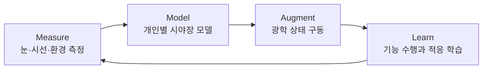
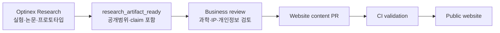
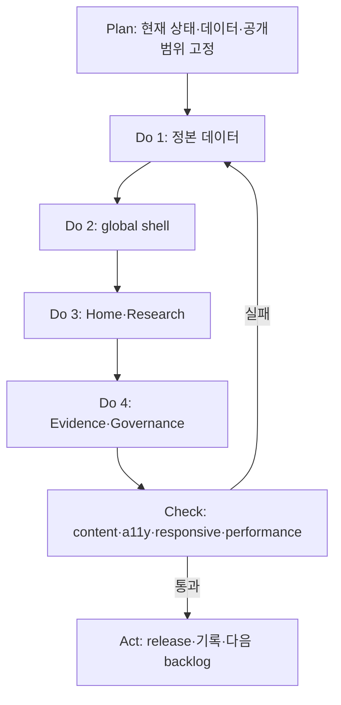

# Optinex 광학·시각증강 회사 웹사이트 마스터 블루프린트

> 문서 버전: 1.1
> 작성일: 2026-08-26 (개정 2026-08-27)  
> 개정 근거: 창업자 인터뷰 `conversation_2026-08-26_myoung906_interview.md`, 창업자 검토 회신 2026-08-27, 저장소 실측 감사, `test-optinex-p0` 구현 감사와 단순·스크롤 중심 UX 확정
> 기준 저장소: [`myoung906/MasVisio_Research`](https://github.com/myoung906/MasVisio_Research), `master@08696a6`, 구현 감사 `test-optinex-p0@528f165` 및 해당 작업 트리
> 기준 공개 사이트: <https://myoung906.github.io/MasVisio_Research/ko/index.html?v=5.0>  
> 내부 연구 기반: `optinex-station:/home/jmseo/Documents/Optinex_Research`의 구조·운영 문서 및 사용자 인터뷰  
> 문서 성격: 회사 전략, 과학 커뮤니케이션, 정보구조, UX, 콘텐츠 모델, 개발 아키텍처를 하나로 묶은 구현 기준서
> 구현 우선순위: 전략·거버넌스는 §0–26, 실제 화면·파일·데이터·검수 절차는 §27–35를 따른다. 두 범위가 충돌하면 최신 확정 결정이 반영된 §27–35가 우선한다.

---

## 0. 이 문서가 내리는 핵심 결정

현재 사이트는 버릴 대상이 아니다. 실험 결과, 연구 사진, 논문·학술발표, 프로토타입, 주변부 시야에 관한 오랜 문제의식이 이미 축적되어 있다. 개편의 목적은 이 자산을 줄이는 것이 아니라 **하나의 회사 방향 아래 재배열하고, 각각의 근거 수준과 전략적 의미를 더 정확히 보여주는 것**이다.

### 0.1 결정의 3계층

이 문서의 모든 항목은 다음 세 등급 중 하나다. 등급을 섞어 읽으면 창업자의 확정 사항과 문서 작성자의 의견이 구분되지 않는다.

- **`[확정]`** — 창업자가 이미 결정했다. 이 문서는 실행 방법만 제안한다. 변경하려면 창업자 승인과 §26 의사결정 로그 기재가 필요하다.
- **`[제안]`** — 이 문서가 새로 제안한다. 승인 대기 상태이며 거부될 수 있다.
- **`[가설]`** — 아직 검증되지 않았다. 결정이 아니며, 공개 표현에서는 `Hypothesis` 배지를 붙인다.

### 0.2 `[확정]` — 창업자 결정 사항

출처: 인터뷰 2026-08-26, 검토 회신 2026-08-27.

| # | 확정 내용 | 확정일 |
|---|---|---|
| C1 | 목적지는 **(b) 정상 시각을 인간 표준 이상으로 끌어올리는 증강**이다. (a) 회복은 진입 발판이다. | 2026-08-26 |
| C2 | 북극성은 **주변부 망막 완전교정**이다. | 2026-08-26 |
| C3 | 1호 탐사선은 **주변부 프로그래머블 튜닝블렌즈 안경**이다(포트폴리오 9개 중 선택 완료). | 2026-08-26 |
| C4 | 조직은 **핵심 1인 + 본업 병행 파트너**다. 임상 기관 접근권은 이미 확보되어 있다. | 2026-08-26 |
| C5 | **장비를 직접 양산·판매하지 않는다.** 검증된 결과물이 나오면 **기술이전 또는 특허 보유**로 간다. SaaS·앱 형태를 병행 가능성으로 둔다. | 2026-08-27 |
| C6 | **현재 가용 자본은 0이다.** 자본 집약적 경쟁에 참여하지 않는 것을 전제로 모든 계획을 세운다. | 2026-08-27 |
| C7 | 웹사이트는 **Track A(기존 정적 사이트 유지·보수)**로 간다. Track B(전면 재구축)는 수익 발생 이후 검토한다. | 2026-08-27 |
| C8 | 상표는 **`Optinex Research`**로 하며 출원 시점은 **2027년경**이다. | 2026-08-27 |
| C9 | 논문·발표 저자는 본인이다. 민감정보 레코드(§22 구 24번)는 **공개 목록에서 삭제**한다. | 2026-08-27 |
| C10 | 공개 웹사이트는 **단순한 세로 스크롤 문서형 구조**로 만든다. 핵심 서사는 클릭 없이 읽혀야 하며, 과학적 근거와 데이터 성격이 명시된 동적 시각화는 **최대 2개**만 둔다. 대시보드·과도한 3D·스크롤 가로채기는 사용하지 않는다. | 2026-08-27 |

C5는 인터뷰 시점의 답변(본선 = 자작 저가 장비 + 구독 SW)을 2026-08-27자로 갱신한 것이다. 하드웨어 역량은 여전히 해자이지만, **그 해자를 수익화하는 방식이 자체 양산이 아니라 IP 이전**으로 바뀌었다. 이 변경의 최대 파급은 §10이다. **기술이전 회사에서는 특허가 곧 제품이므로, 자기공지 감사(§10.0)가 이 문서 전체에서 가장 시급한 항목이 된다.**

### 0.3 `[제안]` — 이 문서가 제안하는 것

1. **Optinex의 범주를 `Adaptive Vision Platform`으로 정의한다.** 단순 연구소, AI 안질환 진단회사, 안경 판매회사 중 하나로 좁히지 않는다.
2. **`Optinex`와 `Optinex Research`를 구분한다.** Optinex는 회사·플랫폼 브랜드이고, Optinex Research는 그 주장을 만들어내고 검증하는 연구 엔진이다. (C8에 따라 대외 상표는 `Optinex Research`가 된다.)
3. **기존 연구결과는 보존한다.** 현재 데이터의 논문·학술발표와 도전과제의 내부 실험, 장치, 원본 결과 이미지를 근거 데이터베이스로 이관한다. 단 홈에 모두 펼치지 않고 프로그램·증거 단계·연도·유형으로 탐색하게 한다. **예외: 민감정보에 해당하는 레코드는 이관하지 않는다(§3.1, §22).**
4. **연구결과와 제품성능을 혼동하지 않는다.** 직접 수행한 내부 연구는 `Investigator-conducted study`로 당당하게 공개하되, 탐색 연구의 AUC나 정밀도가 상용 의료기기의 확정 성능처럼 읽히지 않도록 표본·프로토콜·검증 범위를 붙인다.
5. **`기술이전 가능 단위(licensable unit)`를 새 콘텐츠 타입으로 만든다.** C5에 따라 사이트의 1차 전환 목표가 기술이전 문의이므로, "무엇을 알아냈는가"(Evidence)와 별개로 "무엇을 가져갈 수 있는가"를 보여주는 페이지가 필요하다(§5.3).

### 0.4 `[가설]` — 검증 대상

- H1. 성인의 주변부 굴절을 능동 교정하면 **탐지 역치·저대비 해상·주변부 대비감도**가 개선된다. **주의: 고대비 해상시력은 망막 신경 샘플링 한계로 개선되지 않는다(§4.2).**
- H2. H1의 광학·지각 개선이 보행·탐색·반응시간 등 **기능 성능**으로 전이된다.
- H3. 개인별 wide-field 모델의 예측 오차가 실용 허용범위 안에 든다.

---

## 1. 회사의 거시적 그림

### 1.1 한 문장 정의

**Optinex는 개인의 눈, 시선, 환경을 측정해 시야 전체에 필요한 광학 상태를 모델링하고, 이를 적응형 광학계로 구현하려는 시각증강 플랫폼 회사다.**

짧은 표현은 다음 중 하나를 사용한다.

- 한국어: **시야 전체를 위한 적응형 광학 플랫폼**
- 영어: **Adaptive optics for the whole visual field**
- 비전 문구: **Vision, beyond correction.**

`Vision OS`는 투자자·연구자에게 장기 아키텍처를 설명하는 비유로는 강력하지만, 현재 출시된 운영체제처럼 오해될 수 있다. 따라서 대외 카테고리는 `Adaptive Vision Platform`, 장기 비전 설명 안에서만 `a personalized vision operating layer`를 사용한다.

#### 상표·도메인 실사 `[확정 C8 + 제안]`

대외 상표는 **`Optinex Research`**이며 출원 시점은 **2027년경**이다. 다만 **한국 상표법은 선출원주의**이므로, 먼저 사용했다는 사실은 타인의 선출원을 막지 못한다. 출원을 2027년으로 미루더라도 **조사와 도메인 확보는 지금 해야 한다.**

확인된 명칭 충돌(2026-08-27 기준): `OptiNex`(엔터프라이즈 SEO 에이전시), [`OPTINEX SYSTEM LTD`](https://find-and-update.company-information.service.gov.uk/company/16048596)(영국 법인), `OPTINEX DIGITAL LIMITED`. 모두 광학·의료 분야가 아니므로 아래 류(類)는 열려 있을 가능성이 있으나 실사가 필요하다.

| 항목 | 지금 (비용 거의 없음) | 2027년 |
|---|---|---|
| KIPRIS 선등록 조사 | 제9류(측정기기)·제10류(의료기기)·제42류(연구개발)·제44류(의료업) | — |
| 도메인 | `optinex.co.kr`, `optinexresearch.com` 등 **즉시 확보**(연 수만 원) | — |
| 상표 출원 | — | 조사 결과에 따라 류 선택 후 출원 |
| 대체안 | 충돌 발견 시 대체 후보 2개 미리 확보 | — |

`MasVisio`는 저장소·기존 학술 인용에 남아 있으므로 삭제하지 않고 **역사명(former name)**으로 처리한다(§12.7 URL 보존과 연동).

### 1.2 Optinex가 바꾸려는 문제의 정의

현재 일반적인 시력교정은 한 사람의 눈을 대체로 몇 개의 정적 숫자로 표현한다.

```text
SPH / CYL / AXIS / ADD
```

하지만 실제 시각은 다음 조건에 따라 계속 달라지는 시공간 함수다.

```text
필요 광학상태 P* = f(시야각 θ·φ, 주시거리 z, 동공 p, 파장 λ,
                    시간 t, 눈의 광학모델 E, 과제·사용자 의도 U)
```

Optinex가 제안하는 패러다임 전환은 다음과 같다.

| 기존 패러다임 | Optinex가 지향하는 패러다임 |
|---|---|
| 중심시 중심의 처방 | 중심과 주변부를 포함한 시야장 전체의 광학 프로파일 |
| 한 번 측정한 정적 도수 | 시간·주시거리·동공·과제에 적응하는 상태 |
| 평균 눈을 전제로 한 렌즈 | 개인별 형상과 수차를 반영한 눈 모델 |
| 선명도 하나의 최적화 | 대비, 탐지, 이동, 피로, 적응을 포함한 기능 최적화 |
| 장치 단품 | 측정–모델–구동–학습의 폐루프 플랫폼 |

### 1.3 회사의 핵심 루프



이 루프는 사이트의 가장 중요한 시각 문법이자 제품 아키텍처가 되어야 한다.

### 1.4 브랜드 구조

| 이름 | 역할 | 웹에서의 위치 |
|---|---|---|
| **Optinex** | 회사·플랫폼·장기 비전 | 최상위 브랜드와 도메인 |
| **Optinex Research** | 논문, 내부 실험, 프로토타입, 방법론을 만드는 연구 엔진 | `/research`, `/evidence` |
| **Measure** | 주변부 굴절, 망막 형상, 동공, 대비감도, 안축·생체계측 | 플랫폼 1층 |
| **Model** | 개인별 wide-field eye model, retinal conjugate map, optical profile | 플랫폼 2층 |
| **Augment** | 가변초점·공간가변 광학, 시선추적, 제어 | 플랫폼 3층 |
| **Learn** | 종단 데이터, 사용자 적응, 기능 성능 최적화 | 플랫폼 4층 |

#### 1호 탐사선 `[확정 C3]`

가상의 제품 계층명을 만들지 않는다. 창업자는 9개 포트폴리오를 검토해 **4번을 이미 선택**했다.

> **주변부 프로그래머블 튜닝블렌즈 안경**
> 중심부 자동초점 + 주변부 링존 굴절력 앱 제어.
> 북극성(주변부 완전교정)을 **직접 탐사하는 유일한 장치**이며, 웨어러블 형태의 주변부 능동 교정 실험 플랫폼이다.
> 현재 단계: `Concept → Bench` (역설계 엔진 `ret_prof` 보유)

#### 백로그 — 선택되지 않았으나 부산물의 재료

| # | 계층 | 아이디어 |
|---|---|---|
| 1 | 측정 | 주변부 굴절 가정용 매트 — 하루 30초 RPRE 추적 |
| 2 | 측정 | melanopic 도즈미터 안경 클립 |
| 3 | 측정 | 수면 중 안축장 변화 리더기 |
| 5 | 제어 | 개인 melanopic 응답 기반 맞춤 스펙트럼 필터 코팅 엔진 |
| 6 | 제어 | 양안 비대칭 가변 디옵터 훈련 고글 |
| 7 | 출력 | 개인 눈 모델 기반 AR/VR 캘리브레이션 API |
| 8 | 출력 | 개인 조절력 곡선 피팅 노안 동적 독서 렌즈 처방 엔진(B2B) |
| 9 | 데이터 | 개인 시각 프로파일 플랫폼 |

백로그는 사이트에 제품으로 노출하지 않는다. §8.3 프로그램 페이지의 `해결되지 않은 문제`와 `실험 로드맵`에서만 언급한다.

#### 플랫폼 4층에 대응하는 실존 자산

Measure–Model–Augment–Learn은 미래형 구상이 아니다. **각 층에 이미 동작하는 코드가 있다.** 사이트는 이 대응을 명시해야 한다(§3.5 `Software artifact` 배지와 연동).

| 층 | 실존 저장소 | 상태 |
|---|---|---|
| Measure | `openaxis-biometer`(OCT DSP·안축장), `rtAR`(자작 자동굴절계), `pupil_dynamics`(동공 동역학) | 명세·코드 보유 |
| Model | `ret_prof`(광선추적·역설계, 테스트 102 통과), `Panretinal-Refractometer` | 엔진 동작 |
| Augment | `electronics`, `led_vision_tester` | 펌웨어·시제품 |
| Learn | `GaborPatch`(심리물리), `bino_rehab`(웹캠 양안시) | 검사 도구 동작 |

---

## 2. 현재 GitHub 사이트 구현 감사

### 2.1 어떻게 만들어져 있는가

2026-08-26 확인 기준 GitHub `master`의 최신 커밋은 `e1519d5df680d74d7786c755e4cc690836228076`이다.

| 항목 | 현재 상태 |
|---|---|
| 호스팅 | GitHub Pages용 정적 파일 |
| 프레임워크 | 없음. HTML, CSS, JavaScript 직접 작성 |
| 개발 서버 | `python3 -m http.server 8080` |
| 주요 스타일 | `assets/css/main.css`, `responsive.css`, `components.css`, `v2.css` |
| 주요 스크립트 | `assets/js/main.js`, `assets/js/v2.js` |
| 콘텐츠 데이터 | `assets/data/content_v5.json` 약 178 KB |
| 페이지 | HTML 27개, 한국어·영어 파일 병렬 복제 |
| 인라인 구현 | HTML 내 `style=` 142회, `<script>` 33개 |
| 테스트 | 브라우저를 눈으로 확인하는 Playwright 스크립트 3개. 자동 assertion·CI 게이트 없음 |
| 버전 무효화 | `?v=4.0`, `?v=5.0`가 파일마다 혼재 |

현재 구조의 장점은 서버 없이 배포가 쉽고, 실제 연구자가 직접 빠르게 내용을 추가할 수 있다는 점이다. 단점은 같은 수정이 한국어·영어·여러 페이지에 반복되고, 데이터 JSON과 하드코딩 HTML 중 어느 쪽이 정본인지 불분명해졌다는 점이다.

### 2.2 현재 사이트의 강점

- 연구실·기기·실험 결과를 보여주는 실제 자산이 있다.
- 어두운 계측실, 망막 좌표, reticle, 모노스페이스 수치로 이어지는 시각 언어가 광학 회사와 잘 맞는다.
- 2009–2025년에 걸친 논문·학술발표 59건이 이미 구조화되어 있다.
- 주변부 망막, 대비감도, 동공반응, 안구 형상, 저시력 재활, 자동굴절계, 프로토타입이 한 연구자의 장기 궤적을 보여준다.
- 한국어와 영어를 모두 제공하고 기본 반응형 레이아웃이 있다.
- 단순 콘셉트 회사가 아니라 “직접 측정하고 장치를 만들어온 연구자”라는 진정성이 있다.

### 2.3 지금 가장 큰 구조적 문제

#### 문제 A — 하나의 큰 질문보다 프로젝트 목록이 먼저 보인다

현재 방문자는 정밀 계측, AI 바이오마커, 개인맞춤 솔루션을 각각 별도 사업으로 인식하기 쉽다. 사이트가 답해야 할 첫 질문은 “무엇을 많이 연구했는가?”가 아니라 “이 모든 연구가 어떤 하나의 미래를 만들기 위해 연결되는가?”다.

대비감도 연구는 주변부 기능 최적화의 기반이고, 동공 연구는 눈 상태 센싱의 기반이며, 망막 형상과 자동굴절계는 개인별 눈 모델의 기반이고, 시제품 연구는 광학 개입의 기반이다. 이 연결을 먼저 보여주어야 한다.

#### 문제 B — `연구 단계`와 `연구 프로그램`이 혼재한다

현재 도전과제의 “시각 신경과학 → 시광학 계측 → 시제품 → AI·소프트웨어”는 순차적인 Phase라기보다 병행되는 역량 축이다. 이를 네 개의 연구 프로그램으로 바꾸고, 각 프로그램 안에서 실제 성숙 단계를 별도로 표시해야 한다.

권장 성숙 단계:

```text
Concept → Bench → Simulation → Internal Study → External Replication
        → Clinical Study → Regulatory → Deployed
```

#### 문제 C — 직접 수행 연구와 상용 제품 주장의 경계가 약하다

사용자가 직접 수행한 연구결과는 삭제할 이유가 없다. 다만 다음과 같이 표현의 주어를 명확히 해야 한다.

- 좋은 표현: “성인 36명을 대상으로 수행한 내부 탐색 연구에서 이 프로토콜을 평가했다.”
- 좋은 표현: “이 연구에서는 47개의 후보 특징을 계산했다.”
- 좋은 표현: “내부 데이터셋의 해당 분석에서 AUC 0.92를 관찰했다.”
- 피해야 할 표현: “Optinex는 질환을 90% 이상 정확도로 진단한다.”

앞의 문장들은 실제 연구를 강하게 보여준다. 마지막 문장은 외부검증·임상 사용범위·규제 상태가 생략되어 제품 성능으로 읽힌다.

#### 문제 D — 연구결과 원본과 장식 이미지의 출처가 구분되지 않는다

사용자 확인에 따라 도전과제의 대비감도 등 결과 이미지는 직접 실험한 원본 자산이다. 따라서 전면 활용한다. 동시에 모든 이미지에 다음 메타데이터를 붙여 출처 혼동을 원천적으로 막는다.

```yaml
asset_id: result-motion-csf-2025-01
asset_type: experimental_result
study_id: study-motion-csf-2025
caption_ko: "속도 조건별 대비감도 결과"
caption_en: "Contrast sensitivity by motion condition"
created_by: "Optinex Research"
source_file: "..."
public_permission: true
personally_identifiable: false
alterations: "crop only"
```

허용 `asset_type`:

- `experimental_result`
- `apparatus_photo`
- `prototype_photo`
- `simulation_output`
- `scientific_diagram`
- `concept_illustration`

#### 문제 E — 유지보수와 품질 게이트가 약하다

- 한국어·영어 HTML이 중복되어 한쪽만 수정될 위험이 있다.
- 동일한 내비게이션과 footer가 여러 파일에 복사되어 있다.
- 스타일과 스크립트가 페이지 안에 많이 들어가 있다.
- 현재 테스트는 `headless: false`로 스크린샷과 로그를 확인하는 방식이며 실패를 자동 판정하지 않는다.
- route가 27개이고 dashboard v1/v2/v3가 공개 트리에 함께 남아 사용자·검색엔진이 어느 것이 정본인지 알기 어렵다.
- Google Fonts와 외부 파트너 로고 hotlink는 개인정보·성능·가용성 측면에서 불필요한 외부 의존성이다.

### 2.4 즉시 해결할 접근성 문제

`ko/research/overview.html`의 시간주파수 데모는 1–30 Hz를 자동 순환하며 `main.js`가 `requestAnimationFrame`으로 깜빡임을 계속 구동한다. 시각을 다루는 회사 사이트에서 자동 flicker는 특히 엄격하게 관리해야 한다.

조치:

1. 자동 실행을 즉시 중지한다.
2. 정적 썸네일과 `데모 시작` 버튼을 기본으로 둔다.
3. 사용자 시작 전 광과민성 경고를 제공한다.
4. 3 flashes 기준을 넘는 공개 데모는 웹에 직접 재생하지 않고 영상 설명·주파수 그래프로 대체한다.
5. `prefers-reduced-motion: reduce`에서 모든 비필수 애니메이션을 제거한다.
6. 접근성 floating widget보다 먼저 기본 HTML, 대비, 키보드 탐색, motion safety를 해결한다.

근거: [WCAG 2.2 Pause, Stop, Hide](https://www.w3.org/WAI/WCAG22/Understanding/pause-stop-hide), [WCAG 2.2 Three Flashes or Below Threshold](https://www.w3.org/WAI/WCAG22/Understanding/three-flashes.html).

---

## 3. 연구 자산 보존·재구성 원칙

### 3.1 “모두 포함”의 의미

모든 연구를 홈 화면에 같은 크기로 나열하는 것은 보존이 아니라 맥락 상실이다. 권장 방식은 다음과 같다.

- **홈:** 회사를 설명하는 대표 연구 4–6개
- **Research Programs:** 회사의 핵심 기술축으로 재배열한 연구
- **Evidence Library:** 현재 59건 전체와 내부 연구·프로토타입 전체
- **개별 Study 페이지:** 방법, 장치, 표본, 결과, 한계, 다음 실험
- **Journal:** 진행 과정과 실패·교정 기록

따라서 어떤 연구도 지우지 않되, “회사 핵심축과의 관련성”에 따라 노출 깊이를 달리한다.

**단, 전량 보존 원칙보다 민감정보 예외가 우선한다.** 개인정보 보호법 제23조상 민감정보(사상·신념, 건강, **성생활 등에 관한 정보**, 유전정보, 범죄경력, 생체인식정보)에 해당하는 연구주제는 연구 자체의 정당성과 무관하게 회사 웹사이트 공개 대상에서 제외한다. 사유는 두 가지다.

1. 소표본 연구에서 민감 속성이 공개되면 **참여자 재식별 위험**이 생긴다.
2. 학술대회 발표 동의와 **영리법인의 상시 대외 홍보물 게재 동의는 같은 동의가 아니다.**

해당 레코드는 `publicability: excluded_sensitive`로 표시하고 내부 `study_id`만 보존한다. §22 부록에서 실제로 1건이 이 규칙으로 제외되었다.

### 3.2 기존 59건 연구성과의 이관 규칙

현재 `content_v5.json`에는 다음과 같은 자산이 있다.

- 동료심사·학술지 성과: 시각 정책, 임상 시기능, 저시력, 대비감도, 양안시, 콘택트렌즈, 시재활, 시제품 등
- 학술발표: 주변부 망막, 망막 곡률, 초평면, 근시교정, 동공반응, 대비감도, 안굴절계, 3D scanner, 반맹 재활 등
- 총 레코드: 59건

#### 실측 베이스라인 (2026-08-27, `content_v5.json` 직접 파싱)

수용기준을 세우기 전에 현재 데이터의 실제 상태를 기록한다. 문서 초안의 `59 == 59` 기준은 아래 사실 때문에 **성립할 수 없었다.**

| 항목 | 실측값 |
|---|---|
| `ko.publications` / `en.publications` 레코드 수 | 59 / 59 |
| DOI 또는 KCI 링크 보유 | **21 / 59 (35.6%)** |
| 초록(abstract) 보유 | **22 / 59 (37.3%)** |
| 중복 제목 | **1건** — `경남 차상위계층의 시각적 삶의 실태 연구`가 #1(정책 논문)·#36(학술발표)로 이중 등재 |
| 민감정보 제외 대상 | **1건** (§3.1, §22) |
| 확인된 오탈자 | #38 `시각졍로`, #25 `조기 스크리팅` |

같은 연구의 논문과 학술발표가 함께 있을 수 있으므로 삭제하지 않고 `study_id`로 연결한다. **그런데 연결하면 공개 항목 수가 59보다 줄어든다.** 따라서 개수 일치가 아니라 **유실 0**을 기준으로 삼는다.

```text
Acceptance criteria (개정)

1. 원본 59개 레코드 전부가 새 시스템에서 ID를 갖는다.        loss == 0
2. 공개 목록 수 = 59 - (중복 병합 1) - (민감정보 제외 1) = 57
   병합·제외 각각에 사유와 승인자를 기록한다.
3. 모든 레코드가 검증 상태를 갖는다.
     verified_doi | verified_kci | conference_abstract_no_doi | unverifiable
4. `unverifiable` 레코드는 "총 N건" 같은 집계 주장에 산입하지 않는다.
5. "총 N건"이라는 표현 자체가 정량 주장이므로 CLM-COUNT-001로
   claim registry(§9.1)에 등록하고 자동 검증한다.
```

5번은 문서 초안의 자기모순을 교정한 것이다. §9.1에서 모든 정량 주장을 레지스트리로 관리하라고 규정해 놓고, 정작 문서가 반복해서 쓰는 "59건"에는 그 규칙을 적용하지 않았다.

### 3.3 네 개의 연구 프로그램으로 재배열

#### Program 1 — Wide-field Eye Modeling

개인별 망막 형상, 주변부 굴절, 경선별 곡률, 사광선의 초점, 안구 생체계측을 하나의 시야장 모델로 연결한다.

포함 자산:

- 전체망막 완전교정과 근시억제
- 굴절이상에 따른 주변부 망막의 경선별 변화
- 경선별 주변부 망막 교정을 위한 구면굴절력·각막곡률반경 연구
- 망막 초평면 profile 알고리즘
- 안광학계 광선추적
- 근시억제용 렌즈의 개인맞춤 가입도 설계
- 망막 곡률반경과 나이·굴절이상·각막굴절력 연구
- 공막 프로파일 3D scanner와 영상처리
- 자동안굴절계·검영법·기계학습 기반 측정

#### Program 2 — Visual Neuroperformance

광학적 선명도만이 아니라 실제 사람이 탐지하고 움직이고 적응하는 능력을 측정한다.

포함 자산:

- 좌우 시각경로의 모션 대비감도
- 주변시야 대비감도와 중심외주시 훈련
- 주변부 망막의 공간·시간 합산
- 입체시각의 시간 특성
- 버전스와 눈–손 협응
- 동체시각, 운동 자극, 반구·시각경로 비대칭
- 칼라필터·콘택트렌즈와 대비감도
- 저시력 환자의 기능·삶의 질·시보조기구

이 프로그램은 장기적으로 Adaptive Runtime의 목적함수를 정의한다. “PSF가 좋아졌는가?”만 묻지 않고 “주변부 탐지율, 보행, 대비, 반응시간, 피로가 좋아졌는가?”를 묻는다.

#### Program 3 — Adaptive Optical Systems

측정한 시야장 프로파일을 실제 광학 개입과 장치로 변환한다.

포함 자산:

- 동측성 반맹 재활용 시분할 장치와 shutter glasses
- 중심외주시 훈련 시스템
- 맞춤형 주변부 교정 렌즈 설계
- 근시억제용 광학 개입
- 자동안굴절계·LED 시각검사·구조화광 장치
- 향후 가변초점 렌즈, 시선·거리 추정, 공간가변 광학 제어

#### Program 4 — Longitudinal Eye Intelligence

동공·대비·행동·환경 데이터를 시간에 따라 분석해 눈의 상태와 기능 변화를 추적한다.

포함 자산:

- 동공 광반사 동역학
- 휘도·주시거리·조절랙·동공중심 이동
- 라이프스타일과 동공반응
- 통합 바이오메트릭 후보 특징 47개
- 내부 탐색 데이터의 질환·상태 분류 분석
- AI·소프트웨어 파이프라인과 대시보드

이 프로그램의 공개 표현은 `질환 진단 플랫폼`보다 `exploratory ocular signal research`와 `longitudinal eye-state modeling`을 우선한다. 진단 가능성을 숨기지는 않되, 임상 검증 단계와 연구 범위를 함께 표시한다.

### 3.4 개별 연구 페이지 표준

모든 Study 페이지는 같은 질문에 답해야 한다.

1. **Question** — 무엇을 알고 싶었는가?
2. **Why it matters** — Optinex의 장기 비전에 왜 필요한가?
3. **Study status** — 논문, 학술발표, 내부 연구, 파일럿, 시뮬레이션 중 무엇인가?
4. **Method** — 표본, 포함·제외, 장비, 자극, 프로토콜, 분석법
5. **Result** — 효과크기, 분산·신뢰구간, 통계, 원본 figure
6. **Interpretation** — 무엇을 의미하고 무엇을 의미하지 않는가?
7. **Limitations** — 표본·설계·외부타당도·재현성
8. **Next falsification test** — 다음에 어떤 조건이면 가설을 버리거나 수정할 것인가?
9. **Artifacts** — 논문, 초록, DOI, 데이터 사전, 코드, 장치 사진
10. **Contribution** — Measure / Model / Augment / Learn 중 어디에 연결되는가?

### 3.5 연구 상태 배지

| 배지 | 의미 | 사용 예 |
|---|---|---|
| `Peer-reviewed` | 동료심사 논문 출판 | DOI/KCI 링크 필수 |
| `Conference` | 학술대회 발표 | 학회·연도·초록 또는 프로그램 |
| `Investigator study` | 연구자가 직접 수행한 내부 연구 | 프로토콜·표본·분석 범위 공개 |
| `Validated prototype` | 정해진 시험을 통과한 프로토타입 | 시험 조건과 로그 |
| `Simulation` | 계산·광선추적·가상 실험 | 모델 가정과 파라미터 |
| `Hypothesis` | 아직 검증 전인 과학 가설 | 검증 계획 |
| `Roadmap` | 미래 제품·기능 | 현재 이용 불가 명시 |

`Internal`은 “가짜”나 “낮은 수준”을 뜻하지 않는다. 연구의 검증 범위와 재현 단계가 다르다는 뜻이다.

#### 3.5.1 소프트웨어·엔지니어링 자산 배지

**1인 딥테크 연구소가 가진 가장 강한 증거는 논문이 아니라 동작하는 코드다.** 위 7개 배지에는 이 자산을 담을 타입이 없어, §13.2가 권고한 `SoftwareSourceCode` 구조화 데이터를 붙일 대상 자체가 존재하지 않았다. 다음을 추가한다.

| 배지 | 의미 | 필수 첨부 | 해당 자산 예 |
|---|---|---|---|
| `Software artifact` | 공개 저장소의 동작 코드 | repo URL, 커밋 해시, 테스트 통과 수, 라이선스 | `ret_prof` (테스트 102 통과, JSON Schema 6종 데이터 계약, 오차예산·민감도 모듈) |
| `Engineering spec` | 성능지표·오차예산이 문서화된 설계 | 목표 사양, 검증 방법, **미달 항목 명시** | `openaxis-biometer` (PRD → Sw ≤ 0.02 mm, Bland–Altman LoA ±0.06 mm → BOM → WP/DoD) |
| `Bench validation` | 모델안·테스트렌즈 등 물리 검증 | 캘리브레이션 조건, 원본 로그 | `rtAR` 모델안·테스트렌즈 캘리브레이션 |
| `Dataset` | 공개 가능한 비식별 데이터 | 데이터 사전, 라이선스, 동의 범위 | 추후 |

이 배지들은 **기술이전 상대에게 논문보다 설득력이 크다.** 제조사 기술기획 담당자가 확인하려는 것은 "발표를 했는가"가 아니라 "재현 가능한 규율로 만들어졌는가"이기 때문이다. 미달 항목을 숨기지 않고 적는 것이 오히려 신뢰를 만든다.

---

## 4. 과학·공학 기반과 웹사이트에서의 설명 방식

### 4.1 필요한 도메인 지식

| 영역 | 핵심 지식 | Optinex에서의 역할 | 사이트에 보여줄 증거 |
|---|---|---|---|
| 기하광학·안광학 | 사광선, 비점수차, field curvature, pupil, retinal conjugacy | wide-field prescription | ray trace, 경선별 맵, 광학식 |
| 파면광학 | Zernike, PSF, MTF, HOA, wavefront sensing | 개인 수차 모델과 보정 한계 | wavefront/MTF 비교 |
| 시각신경과학 | 주변부 샘플링, crowding, 대비감도, 시간주파수 | 기능 목적함수 | 직접 수행 대비감도 연구 |
| 검안·임상 | 굴절, 조절, 양안시, 저시력, 근시관리 | 프로토콜과 사용자 안전 | 논문·검사 흐름 |
| 생체계측 | 안축장, 각막, 동공, 망막 형상, eye tracking | 개인 모델 입력 | 장비·반복성·오차 |
| 계산광학 | inverse optics, optimization, differentiable rendering | 측정→모델→처방 | 시뮬레이션과 코드 산출 |
| 제어공학 | 상태추정, latency, stability, fail-safe | 가변 렌즈 폐루프 | 제어 블록도·응답시간 |
| 임베디드·웨어러블 | 센서 동기, 전력, 열, 무게, calibration | 실제 안경형 구현 | prototype·BOM·test |
| HCI·인간공학 | 적응, 멀미, 시선전환, 과제 의존성 | 증강이 방해가 되지 않게 함 | 사용자 과제·기능 평가 |
| 데이터·ML | personalized model, uncertainty, longitudinal learning | 개인화와 추적 | 데이터 흐름·불확실성 |
| 규제·품질 | 위험관리, 소프트웨어 생명주기, 광방사 안전 | 제품화 경계 | stage·governance |

### 4.2 과학적 가능성과 아직 남은 불확실성

사이트는 과학적 야심을 약화시키지 않으면서도 다음을 정직하게 설명해야 한다.

- 주변부 굴절·수차는 중심부와 다르고 개인차가 크며, wide-field 측정과 모델링은 분명한 연구 가치가 있다. [Peripheral ocular aberrations review](https://pmc.ncbi.nlm.nih.gov/articles/PMC6973144/)
- 주변부 고위수차 보정이 특정 조건에서 대비와 탐지 성능을 높였다는 연구가 있지만, 모든 과제·편심도·피험자에서 시력 향상이 보장되는 것은 아니다. [PubMed 31044955](https://pubmed.ncbi.nlm.nih.gov/31044955/)
- 주변부 굴절과 근시 진행의 인과 관계는 임상적으로 완전히 확정된 단일 메커니즘이 아니다. 따라서 “완전교정이 근시를 차단한다”는 제품 확정문보다 검증 중인 가설과 실험 로드맵으로 표현한다. [IMI Clinical Management Guidelines](https://myopiainstitute.org/wp-content/uploads/2020/09/Clinical-Management-Guidelines-IMI.pdf)
- eye tracking, depth sensing, focus-tunable lens를 결합한 autofocus eyewear는 이미 기술적으로 시연되었지만 지연, 시선오차, FOV, 무게, 적응이 실제 제품의 병목이다. [Autofocals prototype](https://pmc.ncbi.nlm.nih.gov/articles/PMC6598771/)
- 디지털 트윈은 안과에서 떠오르는 개념이지만 아직 표준화된 성숙 제품 범주가 아니다. 현재 단계에서는 `digital eye profile` 또는 `personalized eye model`을 쓰고, 종단 데이터로 지속 갱신되며 실제 시스템과 양방향 연결될 때만 `twin`이라 부른다. [Digital twins in ophthalmology](https://pubmed.ncbi.nlm.nih.gov/40378962/)
- 동공반응은 신경계 상태와 관련된 유망 신호지만 프로토콜 이질성, 약물·조도·나이·피로 등의 교란이 크다. 내부 연구는 이 가능성을 탐색한 중요한 자산이며, 외부 임상검증과는 구분한다. [PLR and Parkinson's systematic review](https://pmc.ncbi.nlm.nih.gov/articles/PMC12071770/), [Chromatic pupillometry meta-analysis](https://pubmed.ncbi.nlm.nih.gov/38443213/)

#### 4.2.1 북극성의 물리적 상한 — 가장 중요한 과학적 경계

**주변부 완전교정으로 얻을 수 있는 것과 얻을 수 없는 것은 문헌상 이미 갈려 있다.** 이 경계를 문서와 사이트에 명시하지 않으면, 잘못된 종점으로 실험을 설계해 반드시 실패하게 된다.

> 건강한 눈에서 **탐지 역치(detection acuity)와 저대비 해상은 주변부 광학에 좌우되지만, 고대비 해상시력(resolution acuity)은 망막 신경 샘플링에 의해 제한된다.** 즉 주변부 굴절을 완전히 교정해도 고대비 해상시력은 원리적으로 개선되지 않는다.
> — [Atchison 2013](https://onlinelibrary.wiley.com/doi/10.1097/OPX.0000000000000033), [Lundström 2007](https://onlinelibrary.wiley.com/doi/10.1097/OPX.0b013e318159aa7a), [Lewis 2014](https://onlinelibrary.wiley.com/doi/10.1097/OPX.0000000000000301), [Wang·Thibos·Bradley 1997](https://pubmed.ncbi.nlm.nih.gov/9331277/)

이것은 북극성(§0.2 C2)을 부정하지 않는다. **오히려 반증 가능한 가설로 만들어 준다.**

| | 종점 설정 | 결과 |
|---|---|---|
| ❌ 잘못된 북극성 | "주변부를 완전교정하면 더 잘 보인다" — 고대비 시표로 측정 | 신경 샘플링 한계로 **반드시 실패** |
| ✅ 올바른 북극성 | 탐지 역치 · 저대비 해상 · 주변부 대비감도 · 시간주파수 응답 · 반응시간 | 광학 개입이 실제로 움직이는 지표 |

그리고 이 측정계는 **이미 보유 중이다** — 주변시야 대비감도 연구, 주변부 망막 공간·시간 합산, 좌우 시각경로 모션 대비감도, 그리고 `GaborPatch` 심리물리 플랫폼. §4.3의 성능 사다리와 정확히 맞물린다.

또한 [Atchison 2013](https://onlinelibrary.wiley.com/doi/10.1097/OPX.0000000000000033)은 **성인 대상 주변부 굴절 교정의 시기능 효과를 직접 시험한 선행연구**다. "아무도 해보지 않은 발견의 영역"이라는 서술에 대한 가장 가까운 반례이므로, §8.3 프로그램 페이지의 **첫 항목을 "무엇이 이미 시험되었고 무엇이 남았는가"**로 두어 선행연구를 먼저 정리한 뒤 남은 공백을 제시한다. 이 순서가 뒤집히면 사이트가 선행연구를 모르는 것처럼 읽힌다.

### 4.3 기능 성능을 최종 목표로 둔다

Optinex의 성능 계층은 다음 순서를 따라야 한다.

```text
광학 성능     PSF / MTF / RMS wavefront error
    ↓
지각 성능     contrast threshold / detection / crowding / motion
    ↓
행동 성능     reading / search / mobility / reaction time
    ↓
경험 성능     comfort / fatigue / adaptation / preference
    ↓
생활 성능     safety / participation / task success
```

웹사이트도 광학 맵만 아름답게 보여주는 데서 끝나지 않고, 직접 수행한 대비감도·저시력·재활 연구가 왜 이 성능 사다리에 필요한지 설명해야 한다.

---

## 5. 타깃 방문자와 전환 목표

### 5.1 우선순위 `[확정 C5 반영]`

사이트의 1차 전환 목표는 **기술이전·라이선싱 문의**다. 문서 초안은 `공동연구 제안`을 1순위로 두었으나, 창업자는 임상 기관 접근권을 **이미 확보**하고 있다(§0.2 C4). 해결된 병목에 사이트 최상단을 배정할 이유가 없다.

| 우선 | 방문자 | 알고 싶은 것 | 기본 CTA | 도달 페이지 |
|---:|---|---|---|---|
| 1 | 렌즈·광학 제조사, 안과기기사, XR 기업의 **기술기획·오픈이노베이션** | 무엇을 가져갈 수 있는가, IP 상태는 어떤가 | `기술이전·라이선싱 문의` | 기술요약 1p + NDA 데이터룸 |
| 2 | 공동검증 임상·연구 기관 | 어떤 가설을 함께 반증할 수 있는가 | `공동검증 제안` | Research Program |
| 3 | 앱·SaaS 초기 사용자, 검안 현장 | 지금 써볼 수 있는 것이 있는가 | `베타 참여` | 앱 랜딩 (준비 전에는 비노출) |
| 4 | 정부과제·초기 투자 | 장기 비전과 단계적 de-risking | `기술 로드맵 요청` | 비공개 |
| 5 | 일반 대중 | 왜 시야 전체가 중요한가 | `비전 알아보기` | Vision |

현재 상용 의료제품이 없으므로 환자 유입이나 진단 신청을 CTA로 두지 않는다. 마찬가지로 **자체 제품 구매·사전예약 CTA도 두지 않는다.** 양산하지 않기 때문이다(§0.2 C5).

### 5.2 방문자가 30초 안에 이해해야 하는 것

1. Optinex는 시야 전체를 개인화해 다루는 회사다.
2. 주변부 시야는 장식적 배경이 아니라 핵심 연구대상이다.
3. 연구자는 수년간 대비감도·주변부 망막·동공·장치를 직접 연구했다.
4. 현재는 연구·프로토타입 단계이며 공동검증 파트너를 찾는다.
5. 장기적으로 측정–모델–동적광학–학습을 하나의 플랫폼으로 연결한다.

---

### 5.3 `기술이전 가능 단위` — 신규 콘텐츠 타입 `[제안]`

C5에 따라 사이트가 반드시 답해야 하는 질문이 하나 늘었다. Evidence Library가 **"무엇을 알아냈는가"**라면, 이 타입은 **"무엇을 가져갈 수 있는가"**를 답한다. 이것이 없으면 제조사 담당자가 논문 59건을 읽고 스스로 판단해야 하는데, 실무에서 그런 일은 일어나지 않는다.

```yaml
id: LU-PERIPHERAL-PROFILE-001
title_ko: 경선·편심도별 주변부 처방장 산출 방법
what_it_does: 개인 안구 형상·굴절 실측에서 시야 전체의 목표 광학상태를 계산
applicable_to: [주변부 교정 렌즈 설계, 근시관리 렌즈 개인화, AR/VR 개인 캘리브레이션]
maturity: bench            # concept | bench | simulation | internal_study | external
underlying_evidence: [STUDY-..., ret_prof]
ip_status: 자기공지 감사 중   # §10.0 완료 전에는 이 값을 확정하지 않는다
what_partner_gets: 알고리즘 명세, 검증 프로토콜, 오차예산
what_partner_must_bring: 양산 공정, 인허가, 임상 검증 규모
disclosure_level: teaser_only   # 상세는 NDA 후
```

**주의: `ip_status`가 미확정인 상태에서 이 페이지를 공개하면 안 된다.** 자기공지 감사(§10.0) 완료가 이 콘텐츠 타입의 선행조건이다.

## 6. 권장 정보구조

> 아래 트리는 장기 콘텐츠 모델이다. **Track A의 실제 공개 라우트와 메뉴는 §28을 정본으로 사용한다.** Track A에서 이 트리를 그대로 새 URL 10여 개로 만들지 않는다. GitHub Pages의 기존 URL을 보존하면서 홈과 연구 개요 안에 내용을 순차 배치한다.

```text
/
├── /ko/                         한국어 홈
├── /en/                         영어 홈
├── /[lang]/vision/              왜 시야 전체인가
├── /[lang]/platform/            Measure–Model–Augment–Learn
│   ├── /measure/
│   ├── /model/
│   ├── /augment/
│   └── /learn/
├── /[lang]/research/            4개 연구 프로그램
│   └── /[program-slug]/
├── /[lang]/evidence/            전체 근거 라이브러리
│   └── /[study-or-publication]/
├── /[lang]/collaborate/         공동연구·기술검증
├── /[lang]/company/             설립자·팀·연혁·원칙
├── /[lang]/journal/             실험·개발 노트
├── /[lang]/governance/          claims, privacy, research ethics
└── /[lang]/contact/
```

기존 `Research / Publications / Gallery / Services / Partners`를 단순히 이름만 바꾸지 않는다.

- Gallery의 연구사진은 해당 Study와 Program 안으로 이동한다.
- Publications는 Evidence Library가 흡수한다.
- Services는 현재 가능한 협력 범위와 미래 플랫폼을 분리한다.
- Partners는 법적·홍보 동의가 확인된 관계만 공개한다.
- dashboard v1/v2/v3는 Evidence의 prototype archive로 옮기거나 비공개 preview로 둔다.

---

## 7. 홈 페이지 상세 명세

### 7.1 Hero

권장 한국어 카피:

> **교정은 중심시에서 멈췄습니다.  
> 우리는 시야 전체를 모델링합니다.**
>
> Optinex는 개인의 눈·시선·환경을 측정하고, 주변부까지 필요한 광학 상태를 계산해 적응형 광학계로 연결하는 시각증강 플랫폼을 연구합니다.

영문:

> **Correction stops at central vision.  
> We model the whole visual field.**
>
> Optinex is building an adaptive vision platform that measures the eye, models the field, and explores how personalized optics can augment human vision.

CTA:

- Primary: `플랫폼 아키텍처 보기`
- Secondary: `공동연구 제안`
- Tertiary: `연구 근거 탐색`

상태 문구:

> Research-stage platform. No commercial medical product is currently available.

### 7.2 Hero 인터랙션

랜덤한 3D 눈이나 AI 신경망 대신, 실제 회사 가설을 설명하는 **시야장 광학 지도**를 사용한다.

세 가지 설명 상태:

1. `Conventional` — 중심 처방만 적용된 단순 맵
2. `Personalized field` — 개인별 주변부 굴절·수차 분포
3. `Adaptive` — 주시거리와 시선에 따라 보정장이 변화

세 상태를 탭·토글로 숨기지 않는다. 방문자가 세 설명 문단을 세로로 스크롤하면 같은 SVG가 해당 상태로 바뀌는 **scroll-linked explanation**으로 구현한다. 휠 이벤트를 직접 가로채거나 페이지 위치를 강제로 이동시키지 않고, `IntersectionObserver`로 현재 문단만 감지한다. JavaScript가 없거나 reduced motion이면 세 상태의 정적 이미지를 문단 아래에 각각 표시한다.

필수 표기:

- `Conceptual simulation` 또는 실제 데이터면 `De-identified study data`
- 색상 범례와 단위
- 키보드 조작
- 정적 대체 이미지
- 자동 애니메이션 금지
- 숫자 입력, 슬라이더, 드래그, hover tooltip은 두지 않는다

### 7.3 Paradigm section

짧은 문장:

> 안경은 하나의 도수입니다. 시각은 하나의 장(field)입니다.

두 열 비교로 중심처방과 wide-field profile을 설명한다. 이 섹션에서 회사의 기술범주가 결정된다.

### 7.4 Measure–Model–Augment–Learn

각 단계에 기존 연구자산을 연결한다.

| 단계 | 설명 | 연결할 실제 자산 |
|---|---|---|
| Measure | 눈의 형상·굴절·동공·기능을 측정 | 자동굴절계, 망막 형상, PLR, CSF |
| Model | 개인별 retinal optical field를 계산 | 초평면, 광선추적, 주변부 곡률 |
| Augment | 렌즈·디스플레이·장치가 상태를 구현 | 반맹 장치, 맞춤형 렌즈, 시제품 |
| Learn | 사용자의 성능과 적응으로 모델을 갱신 | 대비감도, 반응시간, 종단 데이터 |

### 7.5 Research lineage

현재 연구를 “서로 다른 네 분야”가 아니라 다음 계보로 보여준다.

```text
Peripheral vision & rehabilitation
        ↓
Contrast and motion performance
        ↓
Wide-field retinal measurement
        ↓
Personalized optical modeling
        ↓
Adaptive optical augmentation
```

여기서 2009–2025 연구 연혁의 대표 6–8개를 노출하고 `전체 59건 보기`로 연결한다.

### 7.6 Evidence spotlight

홈에는 다음 네 사례를 추천한다.

1. 주변부 망막 곡률·초평면 연구
2. 좌우 시각경로 모션 대비감도 연구
3. 중심외주시·반맹 재활 연구와 시분할 프로토타입
4. 동공 동역학·통합 바이오메트릭 탐색 연구

각 카드에는 수치보다 질문·방법·단계를 먼저 둔다.

### 7.7 Collaboration

공개 가능한 협력 유형:

- wide-field optical measurement 공동연구
- 특수렌즈·주변부 광학 설계 검증
- eye tracking·tunable lens 통합 prototype
- 대비감도·주변부 기능평가 프로토콜
- 비식별 연구데이터 분석과 시각화

`진단 API 판매`처럼 제품상태를 앞지르는 표현은 현재 제공 가능성과 분리한다.

---

## 8. 하위 페이지 상세 명세

### 8.1 Vision — 왜 시야 전체인가

목적: 일반인과 투자자에게 기술을 물리학부터 설명한다.

모듈:

1. 중심시 처방이 압축하는 정보
2. 주변부에서 달라지는 굴절·수차·신경 샘플링
3. “더 선명함”과 “더 잘 봄”의 차이
4. 직접 수행한 주변부 대비감도·재활 연구
5. 장기 시나리오: 작업·거리·시선에 맞는 개인화 시야
6. 과학적 불확실성과 검증 질문

### 8.2 Platform — Measure / Model / Augment / Learn

목적: 회사가 무엇을 만드는지 시스템으로 설명한다.

각 레이어는 반드시 다음을 가진다.

- Inputs
- Core computation
- Outputs
- Current assets
- Missing capability
- Validation metric
- Current stage

예:

| Layer | Inputs | Output | 현재 자산 | 다음 검증 |
|---|---|---|---|---|
| Measure | 경선별 굴절, pupil, eye geometry | field profile | 주변부·망막·굴절 연구 | 반복성·재현성 |
| Model | geometry + wavefront + gaze | personalized optical map | ray tracing·초평면 | 실측과 model error |
| Augment | map + target distance + task | lens/control command | prototype lineage | latency·stability·FOV |
| Learn | functional result + comfort | updated profile/policy | CSF·행동 연구 | longitudinal benefit |

### 8.3 Research

네 프로그램을 큰 카드로 보여주고, 각 페이지에는 관련 연구를 자동 집계한다. `Phase 1–4` 표기는 없앤다.

프로그램 페이지 구성:

- 대표 질문
- 핵심 가설
- 수행한 연구
- 현재 보유 장치·데이터
- 해결되지 않은 문제
- 12–24개월 실험 로드맵
- 협력 요청

### 8.4 Evidence Library

필터:

- Type: peer-reviewed / conference / investigator study / prototype / simulation
- Program: 4개 프로그램
- Contribution: Measure / Model / Augment / Learn
- Year
- Status
- Author
- 공개자료 유무: paper / figure / code / data dictionary / demo

리스트 카드에는 제목, 연도, 상태 배지, 한 문장 결과, 회사 아키텍처와의 연결, DOI를 표시한다.

### 8.5 Company

연구자의 이력 나열보다 “왜 이 문제를 10년 이상 따라왔는가”를 이야기한다.

권장 설립자 서사:

> 저시력과 주변시야 재활을 연구하면서, 중심시력 하나가 사람의 실제 시각 능력을 설명하지 못한다는 문제를 보았다. 대비감도와 운동시각, 동공반응, 주변부 망막 형상, 자동굴절계와 시제품을 차례로 연구한 이유는 서로 다른 주제를 수집하기 위해서가 아니었다. 개인이 실제로 보는 시야 전체를 측정하고, 필요한 광학 상태를 계산하고, 다시 장치로 구현하기 위한 기술 조각을 축적하기 위해서였다.

팀·파트너는 역할과 공개 동의를 확인한 사람·기관만 싣는다. 과거 협업은 `Past collaboration`, 현재 계약·공동과제는 `Active collaboration`으로 구분한다.

### 8.6 Governance

최소 네 페이지:

- `Evidence & claims policy`
- `Research ethics & participant privacy`
- `Product and regulatory status`
- `Privacy policy`

이 페이지는 약점을 고백하는 곳이 아니라 deep-tech 회사의 신뢰 인프라다.

---

## 9. 콘텐츠·주장 거버넌스

### 9.1 Claim registry

모든 정량 주장과 진단·치료·예측 표현을 중앙 레지스트리에서 관리한다.

```yaml
claim_id: CLM-PLR-001
statement_ko: "내부 탐색 연구에서 47개의 동공·대비 관련 후보 특징을 분석했다."
statement_en: "An investigator-conducted exploratory study analyzed 47 candidate pupil and contrast-related features."
status: approved_with_context
evidence_type: investigator_study
study_id: STUDY-PLR-2025-01
population: "20–30대 성인 36명"
validation: internal
allowed_pages:
  - evidence
  - research
not_allowed:
  - product_hero
required_context: "표본, 프로토콜, 내부검증임을 함께 표시"
owner: research_lead
copyright_clearance: redrawn_from_own_data   # 아래 9.1.1 참조
author_list_shown: true                     # 공저자 전원 원문 표기 (필수)
last_reviewed: 2026-08-26
```

#### 9.1.1 저작권·공저자 규칙 (경량)

창업자 본인이 투고·게재한 결과물이므로 저작자 문제는 없다. 다만 국내 학회지는 통상 게재 시 저작권 이양 동의를 받으므로, **저작자인 것과 재사용권을 보유한 것은 별개**다. 학회와 협의하는 절차 자체를 없애는 우회로를 기본값으로 둔다.

| 값 | 의미 | 사용 상황 |
|---|---|---|
| **`redrawn_from_own_data`** | **원 데이터에서 figure를 새로 그림 — 기본값** | 대부분. 원 데이터는 명백히 본인 것이고 새 그림은 새 저작물이다. §11 디자인 시스템(범례·단위·불확실성 밴드)에 맞춰 다시 그리면 학회지 흑백 figure보다 나은 자산이 된다 |
| `author_retained` | 저자 재사용권이 명시적으로 확인됨 | 학회 정책 확인 후 |
| `publisher_permission_obtained` | 학회 서면 허락 취득 | 원본 스캔을 꼭 써야 할 때만 |
| `pending` | 미확인 | **공개 차단** |

공저자 규칙은 하나뿐이다. **모든 Evidence 카드에 저자 전원을 원문 순서 그대로 표기한다.** 저자를 생략하고 "Optinex Research 수행"으로만 쓰면, 의도와 무관하게 공저자(특히 학생)의 기여를 지운 것으로 읽힌다.

특허는 논문과 다르다. 발명이 기관 시설·과제비로 이루어졌다면 **직무발명으로 기관 귀속**일 수 있다. §10.0 자기공지 감사 때 변리사에게 함께 확인한다.

### 9.2 숫자를 지우는 대신 문맥을 추가한다

현재 사이트의 `47 biomarkers`, `90%+`, AUC 값, `±1 μm`, `100% correction` 같은 수치는 다음 절차로 다룬다.

1. 원 연구의 분석 코드·표·초록·발표자료와 연결한다.
2. 수치의 정확한 정의를 적는다.
3. 표본과 분석 단위를 적는다.
4. training / validation / test 구분을 적는다.
5. 내부·외부 검증 여부를 적는다.
6. 장비 사양인지 실제 시스템 반복성인지 구분한다.
7. 제품 페이지 사용 가능 여부를 승인한다.

근거가 확인된 수치는 Evidence 페이지에 그대로 남긴다. 홈·제품 페이지에서는 대표 수치만 맥락과 함께 사용한다.

### 9.3 표현 규칙 — 금지어가 아니라 획득 사다리

문서 초안은 `digital twin`과 `완전교정`을 금지어로 지정했다. **그런데 이 둘은 창업자가 확정한 해자 서사(눈의 디지털 트윈)와 북극성(주변부 망막 완전교정) 그 자체다.** 금지하면 문서가 채택되지 않고, 채택되어도 회사의 언어가 사라진다. 금지 대신 **조건을 충족하면 그 단어를 획득하는 사다리**로 바꾼다.

#### 9.3.1 획득 사다리

**"눈의 디지털 트윈"**

```text
현재 허용 표현:  personalized eye model / digital eye profile / 개인별 눈 모델

`digital twin` 승급 조건 — 셋 다 충족 시 사용 허가
  ① 동일 개인의 종단 데이터를 N회 이상, M개월 이상 갱신한 실적
  ② 모델 → 실제 광학 구동으로 이어지는 양방향 연결 실증
  ③ 모델 예측 대 실측 오차의 공개된 검증 지표

→ "지금은 쓰면 안 된다"가 아니라 "여기까지 하면 그 단어를 얻는다"
```

**"주변부 망막 완전교정"**

금지하지 않는다. `Hypothesis` 배지 + 정의 고정으로 사용한다.

```text
정의(사이트에서 항상 함께 노출):
  전 시야에서 잔여 구면대응치가 목표 허용범위 안에 들도록
  경선별·편심도별 굴절 상태를 능동 제어하는 것

측정 종점(§4.2.1):
  ✅ 탐지 역치 · 저대비 해상 · 주변부 대비감도 · 반응시간
  ❌ 고대비 해상시력 — 신경 샘플링 한계로 개선되지 않음

금지 대상은 단어가 아니라 결과 확정 표현:
  "100%" · "차단한다" · "완치" · "보장"
```

`전체망막 완전교정`은 창업자가 만든 개념이므로 검색 경쟁자가 없는 **유일한 고유 자산**이다. 폐기하지 않고 학술 검색어와 연결해 키운다(§13.1).

#### 9.3.2 실제로 피해야 할 표현

- `HIPAA certified`, `HIPAA secure` — HIPAA는 **한국 법인에 적용되지 않는 미국법**이며, 적용 주체·관계·BAA와 실제 통제가 필요한 제도지 인증 배지가 아니다. 한국에서 실제로 적용되는 것은 **개인정보 보호법**이다(§12.6). 현재 저장소에 `HIPAA` 문자열이 8회 존재하므로 전량 교체한다. [HHS covered entities](https://www.hhs.gov/hipaa/for-professionals/covered-entities/index.html), [HHS self-certification FAQ](https://www.hhs.gov/hipaa/for-professionals/faq/237/can-business-associates-self-certify/index.html)
- `조기 진단`, `스크리닝` — 임상 진단 성능이 외부검증·규제 범위 없이 단정되는 경우
- `실시간` — end-to-end latency 측정 없이 사용 (저장소 내 34회 사용 중, 전수 점검 필요)
- `마이크로미터 정밀도` — 센서 픽셀·제조 스펙과 시스템 정확도·반복성을 혼동하는 경우
- 확정 표현 `100%`, `차단`, `보장` — 개념적 목표와 임상 결과의 혼동

### 9.4 Evidence page에 반드시 남길 것

- 실제 원본 figure
- 실험장치 사진
- sample size
- 실험 조건
- 주요 분석 방법
- effect size와 uncertainty
- preregistration 여부
- 발표·논문·DOI
- 한계
- 데이터·코드 공개 가능 범위

---

## 10. 특허·경쟁 지형과 웹 표현

> 아래는 2026-08-26 기준 예비 지형조사다. 특허 자유실시(FTO)나 법률의견이 아니며, 출원·제품 결정 전 변리사 검토가 필요하다.

### 10.0 `[최우선]` 자기공지 감사 — 이 문서 전체에서 가장 시급한 항목

**기술이전 회사에서는 특허가 곧 제품이다(§0.2 C5). 따라서 이 절은 재고 실사에 해당한다.**

문서 초안은 "웹사이트에 미출원 방법을 자세히 쓰지 말라"고 했다. 방향이 반대다. **공개는 웹이 아니라 학회에서 이미 일어났다.** §22 부록 목록 자체가 공지(公知) 이력이다.

| # | 연도 | 발표 내용 | 대응 자산 |
|---|---:|---|---|
| 28 | 2024 | 망막 초평면 profile 알고리즘 설계를 위한 안광학계 광선추적 | `ret_prof` 코어 |
| 27 | 2024 | 경선별 주변부 교정을 위한 구면굴절력·각막곡률반경 상관관계 | 처방장 산출 |
| 34 | 2023 | 근시억제용 SCL 맞춤형 가입도 설계를 위한 전체망막 형상 계산 | 렌즈 역설계 |
| 33 | 2023 | 전체망막 완전교정을 위한 망막 초평면 pilot | 북극성 핵심 |
| 31·32 | 2023 | 검영법 기반 / 기계학습 기반 자동안굴절계 설계 | `rtAR` |
| 26 | 2025 | 굴절이상에 따른 주변부 망막의 경선별 변화 | 측정 프로토콜 |

**국가별 공지예외(grace period) 실태:**

| 관할 | 기간 | 통상 학회발표 구제 여부 |
|---|---|---|
| **한국** | 12개월 (출원 시 주장 + 30일 내 증명서류) | ✅ 가능 — [특허청 공지예외주장 제도](https://www.kipo.go.kr/ko/kpoContentView.do?menuCd=SCD0200239) |
| **미국** | 12개월 | ✅ 가능 |
| **유럽(EPO)** | 6개월, 사유가 **명백한 남용 또는 국제박람회로 한정** | ❌ **통상 학회발표는 구제 불가** |
| **중국** | 6개월, 지정 학술회의 한정 | △ 조건부 |

즉 **2023·2024년 발표분은 한국·미국의 12개월 창구도 이미 도과**했을 가능성이 높고, 유럽은 애초에 구제 대상이 아니다. §10.3의 차별화 후보 중 최소 3개가 이미 신규성을 상실했을 수 있다.

```text
[긴급] 변리사 의뢰 — 2주 내 착수, 비용은 이 문서의 다른 어떤 항목보다 우선

1. 59건 각각의 최초 공개일과 발표자료의 실제 개시 수준
   (초록 한 장인지, 청구항을 지지할 만큼 상세한지 — 이 차이가 결론을 바꾼다)
2. 2025년 발표분(#23·#25·#26)의 12개월 잔여 창구 확인 → 우선 출원 판단
3. EP/CN 진입 포기 vs KR/US 한정 전략 결정
4. 직무발명 여부 — 기관 시설·과제비 사용 시 기관 귀속 가능성 (§9.1.1)
5. 위 결과로 "남은 미공개 영역 = 실제 특허 가능 영역"을 재정의

산출물: §5.3 기술이전 가능 단위의 `ip_status` 확정
→ 이 감사가 끝나기 전에는 기술이전 페이지를 공개하지 않는다.
```

**이 감사가 왜 웹사이트 문서에 들어가는가:** 감사 결과가 사이트에서 무엇을 얼마나 상세히 말할 수 있는지를 결정하기 때문이다. 이미 공지된 것은 숨길 이유가 없고(오히려 기술이전 홍보 자산이다), 아직 공지되지 않은 것은 출원 전까지 `approval_required`로 묶어야 한다. **지금은 둘을 구분할 수 없는 상태다.**


### 10.1 경쟁 범주

| 범주 | 예 | 핵심 | Optinex가 달라야 하는 지점 |
|---|---|---|---|
| 정적 근시제어 렌즈 | DIMS/HAL/CARE 계열 | 주변부 defocus 구조 | 개인별 실측 field와 동적 업데이트 |
| Autofocus eyewear | [IXI](https://ixieyewear.com/), [Laclarée](https://www.laclaree-vision.com/) | 시선·거리 기반 초점 조정 | 단일 초점이 아닌 공간적 wide-field prescription |
| AR/varifocal | 대형 XR 기업 | vergence–accommodation, foveation | 실제 세계 시각과 개인 눈 모델의 폐루프 |
| 시각재활 디지털 장치 | field-loss assistive systems | 탐지·보행 보조 | 광학 모델과 기능훈련의 통합 |
| **적응광학 시각 시뮬레이션·IOL** | **[Voptica S.L.](https://voptica.com/about-voptica/) (스페인 무르시아, Pablo Artal 창업)** | **Hartmann–Shack 파면센서 + 액정 소자 기반 상용 적응광학 시각 시뮬레이터 `VAO`, 그리고 주변부 품질을 명시 표방하는 `ArtIOLs®`** | **가장 가까운 경쟁자. 측정→시뮬레이션까지 상용화됨. Optinex는 안경형 능동 제어와 종단 학습으로 구분** |

Optinex의 백색공간은 `autofocus glasses`라는 말만으로는 확보되지 않는다. 다음 세 요소의 결합이 핵심이다.

1. 개인별 whole-field optical model
2. 주변부를 포함한 공간적 광학 제어
3. 기능 성능으로 다시 학습하는 longitudinal closed loop

#### 10.1.1 자원 비대칭 — `internal_only`, 공개 사이트 게재 금지

| 경쟁자 | 자금 | 인력 | 출구 |
|---|---|---|---|
| IXI (핀란드) | 시리즈 A **$36.5M**, 누적 $40M+ (Amazon 참여) | **75명** | 자체 양산·판매 |
| Laclarée (프랑스) | 비공개 | — | 자체 양산 |
| Voptica (스페인) | 대학 스핀오프 | — | 자체 장비 판매 |
| **Optinex Research** | **0원** | **핵심 1인 + 본업 병행 파트너** | **IP 이전** |

**이 표는 내부 전략 문서에만 둔다. 공개 사이트에 자금 비교를 넣지 않는다.**

자본이 없는 것은 약점이 아니라 **출구 전략이 다르다는 사실의 결과**다. 양산 경쟁에 참여하지 않기 때문에 양산 자본이 필요 없다(§0.2 C5·C6). 대외적으로는 자금이 아니라 **축**을 다르게 잡는다.

| | IXI · Laclarée | Voptica | **Optinex Research** |
|---|---|---|---|
| 대상 | 중심시 노안 | 중심시 수차 시뮬레이션 | **주변부 시야장** |
| 광학 상태 | 단일 초점면 실시간 전환 | 진단·시뮬레이션 | **경선·편심도별 공간 분포** |
| 출구 | 자체 양산·판매 | 자체 장비 판매 | **측정·모델 IP 이전** |

공개 카피 권장:

> Optinex Research는 장비를 양산하지 않습니다. 시야 전체의 광학 상태를 측정하고 모델링하는 방법을 만들고, 그것을 구현할 제조사에 이전합니다.

또한 [무르시아대 Artal 그룹](https://voptica.com/about-voptica/)은 가장 가까운 **과학적** 경쟁자인 동시에 잠재 협력처다. §5.1의 2순위(공동검증) 대상으로 관리한다.


### 10.2 관련 특허 예비 지도

| 권리자·문헌 | 관련 범위 | 전략적 의미 |
|---|---|---|
| Apple [US11086143B1](https://patents.google.com/patent/US11086143B1/en) — *Tunable and Foveated Lens Systems*, 출원 2019-06-10 / 등록 2021-08-10 | 액정 렌즈에서 **시선 영역과 주변 영역의 광학 굴절력을 다르게** 제어 | **원문 확인 결과 청구 구조는 foveated다.** 시선 영역의 액정을 제어하고 주변부는 `optically unmodulated`로 두거나 `less spatially varied`로 처리한다 → §10.3-1 참조 |
| Dolby [US12326570B2](https://patents.google.com/patent/US12326570B2/en) | gaze/vergence와 focus-tunable lens | 시선+가변초점의 일반 결합은 차별화가 약함 |
| Focure [US20170123234A1](https://patents.google.com/patent/US20170123234A1/en) | structured light depth, gaze, tunable lens control | 거리추정 기반 autofocus 선행기술 |
| Hoya [US20240168313A1](https://patents.google.com/patent/US20240168313A1/en) | peripheral defocus region spectacle design | 주변부 영역 설계 자체도 혼잡함 |
| Zeiss [EP4006624B1](https://patents.google.com/patent/EP4006624B1/en) | ring-shaped focusing structures | 근시제어용 정적 구조와 구분 필요 |

### 10.3 특허 차별화 후보

> **선행조건: §10.0 자기공지 감사 완료 전에는 아래 항목의 출원 가능성을 확정할 수 없다.** 이미 발표된 것과 아직 발표되지 않은 것을 구분한 뒤에야 이 목록이 의미를 갖는다.

**1. `[최우선]` 주변부 능동 구동 — 대형 선행기술이 비워 둔 공간**

Apple US11086143B1을 원문 확인한 결과, 청구는 **foveated** 구조다. 시선 영역의 액정을 제어하고 **주변부는 광학적으로 변조하지 않거나(`optically unmodulated`) 공간 변화를 줄인다.** 창업자의 1호 탐사선(§1.4)은 **정확히 그 반대** — 중심부 자동초점 + **주변부 링존 능동 제어**다.

즉 문서 초안이 "foveated·공간가변 렌즈 청구가 혼잡함"이라고 요약하고 넘어간 그 특허가, 실제로는 **주변부 능동 구동이 대형 선행기술의 청구 범위 밖에 남아 있다는 증거**다. 이 대비를 변리사 검토의 첫 항목으로 올린다.

**2. 이하 후보 (자기공지 감사 후 재평가)**

- 개인별 처방장 `P(θ, φ, z, p, λ, t)`을 생성하는 측정·최적화 방법 ← **#27·#28·#33·#34로 이미 공지 가능성 높음**
- 주변부 retinal conjugate map과 실물 광학 구동기의 calibration
- 사카드·주시전환을 예측하는 지연 보상
- optical metric가 아니라 **기능 metric**로 제어 정책을 업데이트하는 방법 ← §4.2.1의 올바른 종점과 직결. 미공개 영역일 가능성이 높다
- 사용자의 적응 상태와 안전한 fallback을 포함한 제어
- 측정 불확실성을 반영해 보정량을 제한하는 방법
- 실험 프로토콜에서 wearable command로 이어지는 end-to-end traceability

**3. 국내(KR) 지형 조사 부재**

현재 인용 특허 5건이 모두 US/EP다. **한국 법인의 1차 관할은 KR**이므로 [KIPRIS](https://www.kipris.or.kr/)에서 주변부 디포커스·가변초점 안경렌즈·경선별 굴절 교정의 KR 등록·출원과, Essilor·Hoya·Zeiss의 **KR 패밀리**를 조사해야 한다. 상표 조사(§1.1)와 같은 세션에서 처리하면 비용이 절약된다.


웹사이트는 공개 전 특허 검토가 필요한 unpublished method를 자세히 설명하지 않는다. 원리는 공개하되 구현 파라미터·캘리브레이션 핵심은 `approval_required`로 관리한다.

---

## 11. 시각 디자인 시스템

### 11.1 디자인 원칙

1. **Instrument, not sci-fi.** 미래적이되 실제 계측기처럼 단위·범례·불확실성이 있어야 한다.
2. **Evidence before spectacle.** 장식용 눈보다 연구 figure가 더 중요한 시각 자산이다.
3. **Peripheral by design.** 화면 중심만 강조하지 않고 주변부에 정보의 흔적·field coordinate를 둔다.
4. **Darkroom with readable light.** 어두운 실험실 감성은 유지하되 본문 가독성과 대비를 희생하지 않는다.
5. **Motion must explain.** 움직임은 주시 이동·초점 변화·field update를 설명할 때만 쓴다.
6. **A vision company must be exemplary in accessibility.** 확대, 키보드, screen reader, motion safety를 기본 설계로 해결한다.

### 11.2 권장 시각 어휘

- retinal field map
- meridional contour
- wavefront phase map
- ray bundle and focal lines
- gaze vector
- confidence interval band
- calibration grid
- apparatus silhouette
- 실제 실험 figure와 장치 사진

피할 것:

- 출처 없는 뇌 신경망 렌더
- 가짜 실시간 숫자가 도는 HUD
- 임상 지표처럼 보이는 장식용 gauge
- 의미 없는 glowing particles
- 실제 연구결과처럼 보이는 AI 생성 chart

### 11.3 컬러 토큰 초안

```css
--surface-0: #071014;
--surface-1: #0b171d;
--surface-2: #11232b;
--text-strong: #f3f8fa;
--text-body: #c5d3d9;
--text-muted: #8fa4ad;
--line: #29414b;
--field-cyan: #62d6e8;
--optics-blue: #79aef8;
--retina-amber: #f1b35b;
--evidence-green: #72d49b;
--warning: #f3c56b;
--risk: #ef7d7d;
```

색만으로 상태를 표시하지 않는다. 모든 상태에는 텍스트·아이콘·패턴을 함께 쓴다.

### 11.4 타이포그래피

- 본문: 로컬 호스팅 가변 sans. 한국어는 Pretendard 또는 Noto Sans KR의 라이선스·용량을 검토해 subset 제공
- 수치·단위·좌표: IBM Plex Mono 또는 유사 mono
- display: 지나치게 SF풍인 폰트보다 기술문서와 연구기기의 중간
- 본문 최소 16 px, 기본 17–18 px 권장
- 긴 한국어 문단의 양쪽정렬 금지
- 영문 대문자 tracking 남용 금지

### 11.5 레이아웃

- 데스크톱: 최대 본문 1200–1320 px, 읽기 열은 680–760 px
- 모바일: 상단 compact header, 로고 높이 28–34 px
- 현재 280 px 고정 sidebar는 research tool 느낌은 강하지만 콘텐츠 사이트의 탐색과 모바일 일관성을 해친다. 상단 global nav + 페이지 내부 sticky subnav를 권장한다.
- 연구 figure는 작은 card thumbnail로만 소비하지 않고 확대, 캡션, 범례를 제공한다.
- **공개 페이지에는 고정 sidebar, 우측 실시간 패널, floating 접근성 위젯을 두지 않는다.** 본문을 가리는 고정 요소는 상단 헤더 하나뿐이다.
- 모든 핵심 섹션은 문서 흐름 안에 펼쳐 둔다. accordion, tabs, carousel, modal 안에 핵심 설명을 숨기지 않는다.
- 세로 스크롤은 브라우저 기본 동작을 유지한다. `wheel` 이벤트의 `preventDefault()`, 강제 snap, 자동 섹션 이동, 가로 스크롤 서사는 금지한다.

---

## 12. 기술 아키텍처

### 12.1 권장 스택

**Astro + TypeScript + MDX + Content Collections**를 권장한다.

이유:

- 대부분의 페이지는 정적 콘텐츠라 JavaScript를 거의 보내지 않아도 된다.
- field map 같은 인터랙션만 island로 분리할 수 있다.
- Markdown/MDX로 연구자가 내용을 수정하기 쉽다.
- 한국어·영어 스키마를 빌드 시 검증할 수 있다.
- GitHub Pages에 정적 출력이 가능하다.

Next.js는 로그인·대시보드·서버 액션이 핵심이 될 때 별도 app으로 사용한다. 회사 마케팅·연구 사이트까지 처음부터 서버 프레임워크로 만들 필요는 없다.

### 12.2 권장 디렉터리

```text
src/
├── components/
│   ├── global/
│   ├── evidence/
│   ├── optics/
│   └── accessibility/
├── content/
│   ├── studies/
│   ├── publications/
│   ├── prototypes/
│   ├── programs/
│   ├── people/
│   ├── partners/
│   ├── journal/
│   └── claims/
├── data/
│   ├── asset-manifest.yaml
│   └── navigation.yaml
├── layouts/
├── pages/
│   └── [lang]/
├── styles/
└── lib/
    ├── i18n.ts
    ├── evidence.ts
    ├── claims.ts
    └── seo.ts
public/
├── fonts/
├── images/
│   ├── studies/
│   ├── apparatus/
│   ├── prototypes/
│   └── brand/
└── downloads/
```

### 12.3 다국어 모델

한국어와 영어가 같은 `content_id`를 공유해야 한다.

```yaml
id: STUDY-MOTION-CSF-2025
slug: motion-contrast-visual-pathways
title:
  ko: 좌우 시각경로에서 모션 대비감도의 비교
  en: Motion contrast sensitivity across visual pathways
summary:
  ko: ...
  en: ...
```

번역이 없는 항목은 숨기지 말고 원문과 `Translation pending`을 표시할 수 있다. 내용이 다른 한국어·영어 페이지 두 벌을 유지하는 것보다 정직하다.

### 12.4 콘텐츠 스키마 예시

```yaml
id: STUDY-MOTION-CSF-2025
kind: investigator_study
programs: [visual-neuroperformance]
contributes_to: [learn, model]
stage: internal_study
year: 2025
authors: [seo-jaemyung]
question: ...
sample:
  n: 24
  population: 정상 시력 성인
method:
  stimulus: 1 cpd Gabor
  eccentricity_deg: 20
  speed_conditions_cm_s: [0, 10, 30]
results:
  - metric: contrast_sensitivity
    statement: 속도 증가에 따라 유의하게 감소
    p_value: "<.001"
limitations: ...
assets:
  - result-motion-csf-plot
links:
  conference: ...
publicability: public
last_reviewed: 2026-08-26
```

### 12.5 내부 Research → 공개 웹 흐름

스테이션 운영 경계를 유지한다.



Research 에이전트가 공개 사이트를 자동 수정하지 않는다. `public / teaser_only / approval_required / confidential` 등급을 전달하고, 사람이 승인한 콘텐츠만 PR로 들어간다.

### 12.6 폼·데이터·분석 — 개인정보 보호법(PIPA) 기준

문서 초안은 HIPAA를 비판하면서 **정작 실제로 적용되는 한국 법을 한 번도 언급하지 않았다.** 한국 법인·연구소에 적용되는 것은 **개인정보 보호법**이며, 웹사이트 운영에는 다음이 직접 걸린다.

| 조항 | 의무 | 이 사이트에서의 조치 |
|---|---|---|
| **제30조** | 개인정보처리방침 수립 및 **웹사이트 상시 게재** | 현재 링크는 있으나 내용이 실제 처리 현황과 일치하는지 검증 (Track A P0) |
| **제23조** | **민감정보**(사상·신념, 건강, 성생활, 유전, 범죄경력, 생체인식) 처리 제한 | 연구 데이터 파이프라인 전체에 적용. §3.1·§22 레코드 제외의 근거 |
| **제15·17·22조** | 수집·이용·제3자 제공 동의, 만 14세 미만 법정대리인 동의 | 문의 폼 동의 항목 정비 |
| **제28조의8** | 개인정보 **국외 이전** 고지·동의 | §12.7에서 Cloudflare·Vercel 이전 시 반드시 검토 |
| 정보통신망법 제50조의2 | 이메일 주소 무단수집 거부 문구 | footer에 명시 |

운영 규칙:

- 연락 폼에는 환자정보·건강정보를 받지 않는다.
- 명시: `환자 또는 연구참여자의 개인정보·의료정보를 제출하지 마십시오.`
- 연구 참여 모집이 필요하면 별도의 IRB 승인된 시스템을 사용한다.
- 분석은 Plausible 또는 Cloudflare Web Analytics를 쓴다. 이유는 "최소수집"이 아니라 **쿠키리스라서 PIPA 동의 트리거 자체가 발생하지 않기 때문**이다. 이 근거를 개인정보처리방침에 적어 둔다.
- 세션 replay와 keystroke 수집은 사용하지 않는다.
- 이메일은 서버리스 relay 또는 별도 비즈니스 메일로 전달한다.
- 개발 preview에는 검색엔진 차단과 접근제어를 적용한다.

### 12.7 호스팅 — GitHub Pages의 구조적 제약

**중요: GitHub Pages는 서버 사이드 301/302 리다이렉트를 지원하지 않는다.** 가능한 것은 `<meta http-equiv="refresh">`와 404 페이지 트릭뿐이며 둘 다 SEO 신호 이전이 불완전하다. 따라서 문서 초안의 두 서술은 양립하지 않았다.

- §12.7 "1단계: GitHub Pages 유지 가능"
- §17 Phase 3 / §13.3 "기존 URL redirect", "redirect map으로 기존 URL 보존"

27개 기존 URL의 링크 자산을 온전히 보존하려면 **커스텀 도메인 + Cloudflare Pages(`_redirects`) 이전이 재구축의 선행조건**이다.

또 하나의 함정: 저장소 기반 Pages는 `https://<user>.github.io/MasVisio_Research/` 하위경로로 서빙된다. **Astro `base` 설정 없이는 모든 절대경로 링크와 에셋이 깨지고, 커스텀 도메인으로 전환하는 순간 `base`를 되돌려야 한다.** 그러므로 **도메인 결정은 Phase 3이 아니라 Phase 0에서** 내려야 한다(§1.1 도메인 즉시 확보와 연동).

Track A(현행 유지) 기준 조치:

- 1단계: GitHub Pages 유지. **단 URL 구조를 지금 바꾸지 않는다.** 재구축 시점에 한 번만 바꾼다.
- 커스텀 도메인은 지금 확보하되(§1.1), 연결 시점은 Track B 착수와 맞춘다.
- `?v=4.0` / `?v=5.0` 혼재를 하나로 통일한다(Track A P0).
- 대용량 연구 영상·데이터는 Git 저장소가 아니라 승인된 object storage를 쓴다.
- 폼, preview auth, 보안 header가 필요해지는 시점이 곧 Cloudflare Pages 이전 시점이다. **이때 PIPA 제28조의8 국외 이전 검토가 발생한다**(§12.6).


## 13. SEO·구조화 데이터

### 13.1 검색 의도

핵심 주제 클러스터:

- peripheral vision optics
- wide-field eye model
- peripheral refraction measurement
- adaptive vision / tunable lens
- contrast sensitivity research
- pupil dynamics
- vision rehabilitation
- personalized optical correction

#### 13.1.1 고유어 전략 — 폐기가 아니라 육성

문서 초안은 `전체망막 완전교정`을 "고유어로만 밀지 말라"고 했는데, **방향이 반쯤 뒤집혀 있었다.**

- `전체망막 완전교정` / `주변부 망막 완전교정`은 **창업자가 만든 개념**이므로 정의상 검색 경쟁자가 0이다. 이 회사가 카테고리를 정의하려면 이 용어를 검색 가능한 자산으로 **키워야** 한다.
- 반대로 §1.1이 새로 제안한 `Adaptive Vision Platform`은 **검색량이 사실상 0인 조어**다. 조어를 밀면서 실존 고유어를 버리는 것은 순서가 반대다.

권장 구조 — **고유어를 허브로, 학술어를 스포크로:**

```text
허브 페이지 (고유어, 경쟁 0)
  "전체망막 완전교정이란 무엇인가"  ← 정의 + Hypothesis 배지 + §4.2.1 경계
      ↑ 내부링크 ↑
스포크 페이지 (학술·산업 검색어, 경쟁 있음)
  주변부 굴절 · 주변부 망막 곡률 · 시야장 · 대비감도 · 시재활
  peripheral refraction · wide-field eye model · tunable lens
```

**아직 없는 것: 실제 키워드 리서치.** 현재 8개 영어 클러스터에는 검색량 데이터가 한 건도 없고, 1차 독자가 한국어인데 한국어 키워드 조사가 없다. Track A 범위에서 무료 도구(네이버 검색광고 키워드도구, Google Keyword Planner)로 **한국어 20개 · 영어 20개의 실제 검색량을 측정해 이 절에 기입**한 뒤에야 SEO 계획이 계획이 된다.


### 13.2 구조화 데이터

- Organization
- Person
- ScholarlyArticle
- Dataset — 실제 공개 데이터가 있을 때만
- SoftwareSourceCode — 공개 repo가 있을 때
- BreadcrumbList

MedicalDevice/Product schema는 실제 제품 상태·판매 가능성이 갖춰지기 전 사용하지 않는다.

### 13.3 기본 SEO 요건

- 언어별 canonical과 hreflang 자동 생성
- sitemap에서 구버전 dashboard와 중복 publications 제외
- OpenGraph 이미지 로컬 제공
- favicon과 web manifest
- 모든 연구 figure에 의미 있는 alt와 긴 설명
- DOI·KCI 링크 유효성 정기 검사
- redirect map으로 기존 URL 보존

---

## 14. 접근성·안전·규제

### 14.1 웹 접근성 승인 기준

**국제 기준 (설계 기준)**

- WCAG 2.2 AA
- 키보드만으로 모든 인터랙션 사용
- 200% text zoom에서 기능 손실 없음
- 400% reflow에서 수평 스크롤 최소화
- focus indicator 명확
- canvas에는 동등한 텍스트·표 제공
- 색각 이상 시에도 field map 판독 가능
- `prefers-reduced-motion` 완전 지원
- 자동 깜빡임 금지
- 자동 음성안내 금지

#### 14.1.1 국내 법정 기준 `[장기 실행]`

문서 초안은 국제 기준만 인용했다. **한국에서는 이것이 권장이 아니라 법적 의무가 되는 시점이 있다.**

- **장애인차별금지법 제21조 제1항 + 시행령 제14조** — 웹 접근성 준수 의무자에 **법인**이 포함된다. 즉 Optinex가 법인화하는 순간 의무 대상이 된다. [관련 해설](https://www.nepla.net/post/%EC%9E%A5%EC%95%A0%EC%9D%B8%EC%B0%A8%EB%B3%84%EA%B8%88%EC%A7%80%EB%B2%95%EA%B3%BC-%EC%9B%B9%EC%A0%91%EA%B7%BC%EC%84%B1-%EC%A4%80%EC%88%98-%EC%9D%98%EB%AC%B4)
- **[KWCAG 2.2](https://a11ykr.github.io/kwcag22/)** — 국내 기준. 4원칙 / 14지침 / **33개 검사항목**. 특히 **광과민성 발작 예방 항목이 명시**되어 있어 §2.4의 1–30 Hz 자동 flicker 문제에 직접 적용된다.
- **웹 접근성 품질인증(WA 인증)** — 디지털포용법 제21조 근거, 과기정통부 지정기관 심사. [한국디지털접근성진흥원](http://www.kwacc.or.kr/Accessibility/Certification)

**실행 계획 (자원 현실 반영):**

| 시점 | 범위 |
|---|---|
| **Track A 즉시** | flicker 정지 + `prefers-reduced-motion`만 (§16). **이 둘은 KWCAG 광과민성 항목이자 시각 회사의 최소 자격이므로 미룰 수 없다** |
| Track A 점진 | alt 텍스트, 키보드 탐색, 대비비 — 페이지 손댈 때마다 하나씩 |
| 법인화 이후 | KWCAG 2.2 33개 항목 자체 점검 |
| 수익 발생 이후 | WA 인증 취득 |

**WA 인증은 시각 회사에게 컴플라이언스가 아니라 마케팅 자산이다.** 그리고 §11.1 원칙 6번("시각 회사는 접근성에서 모범이어야 한다")을 실제로 지키려면 스크린리더 자동 검사만으로는 부족하다. **15년간 연구해 온 저시력·반맹 당사자를 사이트 사용성 테스트에 참여시키는 것**이 이 회사가 할 수 있는 가장 설득력 있는 접근성 실천이다. 문서 초안에는 이 제안이 한 줄도 없었다.

### 14.2 규제 — 기술이전 모델에서의 위치 `[확정 C5 반영]`

**전제가 바뀌었다.** 창업자는 장치를 직접 양산·판매하지 않고, 검증된 결과물이 나오면 **기술이전 또는 특허 보유**로 간다(§0.2 C5). 따라서 "우리가 의료기기 인허가를 받는다"는 시나리오는 계획에서 빠진다. 그러나 **모델과 무관하게 남는 두 가지**가 있다.

#### 14.2.1 남는 것 1 — 사람에게 빛을 쬐는 순간의 안전과 윤리

기술이전 모델이어도 **데이터는 직접 만든다.** 자작 장비(`openaxis-biometer` 1060 nm OCT, `rtAR` 자동굴절계, 동공 rig)를 사람 눈에 대는 행위는 사업 모델과 무관하게 다음을 요구한다.

- **IRB 승인** — 연구 목적 인체 대상 연구. 자작 장비일수록 심의에서 안전 근거를 더 요구한다.
- **[ISO 15004-2](https://www.iso.org/standard/72616.html) 광방사 안전** — 자작 광원의 노출량 계산과 근거 문서. 창업자가 `openaxis-biometer`에서 광안전을 WP-25 최우선으로 둔 것은 정확한 판단이다.
- **측정 결과를 참여자에게 임상 소견으로 반환하지 않는다** — 반환하는 순간 연구가 아니라 진료·진단 행위로 성격이 바뀐다.
- 참고: **의료기사 등에 관한 법률 시행령 제2조** — 안경사의 시력검사 업무범위에서 *자동굴절검사기기를 사용하지 않는 타각적 굴절검사*는 제외된다. 어떤 자격으로 어떤 장비를 쓰는지가 업무범위와 직결된다.

#### 14.2.2 남는 것 2 — 규제 문서 자체가 기술이전의 가격이다

**여기서 규제 표준의 의미가 뒤집힌다.** 우리가 인허가를 받지 않더라도, **기술을 이전받는 제조사는 반드시 인허가를 받아야 한다.** 그 제조사가 가장 먼저 묻는 것은 "성능이 좋은가"가 아니라 **"이걸 우리 품질시스템에 넣을 수 있는가"**다.

| 표준 | 우리가 하는 일 | 기술이전 시 효과 |
|---|---|---|
| [ISO 14971:2019](https://www.iso.org/standard/72704.html) 위험관리 | 위험 분석 표를 지금부터 남긴다 | 수취인이 처음부터 다시 하지 않아도 됨 |
| [IEC 62304](https://committee.iso.org/standard/38421.html) SW 생명주기 | 요구사항 → 설계 → 테스트 추적성 유지 | `ret_prof`의 테스트 102개·JSON Schema가 이미 그 형태다 |
| [ISO 15004-1](https://www.iso.org/standard/72616.html) 안과기기 일반 | 측정 조건·정확도 명세 | `openaxis` PRD가 이미 그 형태다 |
| ISO 15004-2 광방사 안전 | 노출량 계산 근거 | 없으면 이전 자체가 막힌다 |

즉 **이 표준들은 "미래 제품 개발에서 추적할 것"이 아니라 지금 만드는 산출물의 형식**이다. 문서를 표준 형식으로 남기면 기술이전 가격이 오르고, 남기지 않으면 상대가 처음부터 다시 만들어야 하므로 가격이 내려간다. 이미 `openaxis-biometer`의 PRD→성능지표→BOM→WP/DoD 구조가 이 방향이므로, 남은 일은 **그 규율을 나머지 저장소로 확장하는 것**이다.

#### 14.2.3 웹 카피에서의 규칙

- **웹 카피가 intended use를 사실상 결정한다.** 규제 검토 없이 `diagnose` / `treat` / `prevent` / `진단` / `치료` / `예방`을 쓰지 않는다.
- 참고: 「디지털의료제품법」 하위규정 시행에 따라 식약처는 2025-05-07 「디지털의료기기소프트웨어 허가·심사 가이드라인」을 신규 제정하고 「인공지능기술이 적용된 디지털의료기기 허가·심사 가이드라인」 등 5종을 개정했다. 동공 바이오마커 알고리즘류를 **진단 목적으로 표방하는 순간** 이 체계의 대상이 된다. [개요](https://www.lexology.com/library/detail.aspx?g=516ed348-16f2-48f0-9545-dc8a061790d5)
- 사이트 표기는 `exploratory research` / `investigator-conducted study`로 유지한다. 이것은 방어가 아니라 **사실 그대로의 서술**이다.

---


## 15. 테스트·품질 게이트

> **`[보류]` — 2026-08-27 창업자 결정.** 이 절 전체는 **Track B(전면 재구축)에 종속**된다. Track A(기존 정적 사이트 유지)에서는 CI 파이프라인을 구축하지 않는다.
>
> 다만 §15.2의 테스트 목록 중 **하나만은 Track A에서도 필요하다**: `publicability: excluded_sensitive` 또는 `BLOCKED`로 표시된 레코드가 배포 산출물에 등장하지 않는지 확인하는 것. 이것은 CI 없이 배포 전 `grep` 한 줄로도 가능하다(§16 참조). 문서 초안의 12개 테스트 목록에는 정작 이 검사가 빠져 있었다.

### 15.1 CI 파이프라인

모든 PR에서 다음을 자동 실행한다.

```text
format
→ lint
→ typecheck
→ content schema validation
→ claim registry validation
→ build
→ broken-link/DOI check
→ Playwright functional tests
→ axe accessibility tests
→ visual regression
→ Lighthouse CI
```

### 15.2 필수 자동 테스트

- 한국어·영어 route가 모두 빌드되는가
- 언어 전환이 대응 페이지로 가는가
- 59개 기존 publication이 모두 이관되었는가
- Evidence filter가 키보드와 screen reader로 동작하는가
- 모든 image asset에 provenance와 alt가 있는가
- `experimental_result` figure가 `concept_illustration`으로 잘못 표시되지 않았는가
- 승인되지 않은 claim이 제품·홈 page에 등장하지 않는가
- `Roadmap` 항목에 현재 이용 불가 문구가 있는가
- 외부 hotlink가 없는가
- 320, 375, 768, 1024, 1440 px에서 navigation이 동작하는가
- reduced motion에서 animation loop가 실행되지 않는가
- flash 위험 패턴이 자동 시작하지 않는가

### 15.3 성능 예산

초기 권장 예산:

- 홈 initial JS: gzip 80 KB 이하 목표
- interactive island별 JS: gzip 40 KB 이하
- LCP image: 250 KB 이하 권장
- 페이지당 총 이미지: 일반 route 1.5 MB 이하, Evidence figure page는 예외 허용
- LCP < 2.5 s, INP < 200 ms, CLS < 0.1 목표
- 폰트는 필요한 subset만 로컬 제공

연구 figure는 정보가 우선이므로 원본 다운로드는 별도 링크로 제공하고, 화면 표시용 AVIF/WebP derivative를 생성한다.

---

## 16. Track A — 기존 사이트에서 지금 할 일 `[확정 C7]`

재구축(Track B) 없이 현재 정적 사이트에서 처리한다. 순서는 **법적 노출 → 안전 → 정확성 → 정리** 순이다.

### 16.1 P0 — 법적·안전 (지금, 총 3~5시간)

| # | 조치 | 근거 |
|---:|---|---|
| 1 | **민감정보 레코드 삭제** — §22 구 24번(성적 지향성 관련)을 `content_v5.json`의 ko/en `publications`에서 제거. 내부 `study_id`만 보존 | 개인정보 보호법 제23조 · §3.1 |
| 2 | **시간주파수 1–30 Hz 자동 flicker 정지** → 정적 썸네일 + 사용자 시작 버튼 + 광과민성 경고 | WCAG 2.2 / KWCAG 2.2 광과민성 |
| 3 | `prefers-reduced-motion: reduce` 적용 | 동일 |
| 4 | **`HIPAA` 문자열 8곳 전량 제거·교체** — 한국 법인에 적용되지 않는 미국법 | §9.3.2 |
| 5 | 개인정보처리방침이 **실제 처리 현황과 일치하는지** 점검 (분석도구·문의폼 포함) | 개인정보 보호법 제30조 |
| 6 | 모든 문의 폼에 `환자 또는 연구참여자의 개인정보·의료정보를 제출하지 마십시오.` 문구 추가 | §12.6 |
| 7 | footer에 이메일 무단수집 거부 문구 추가 | 정보통신망법 제50조의2 |

배포 전 확인 (CI 대신 명령 한 줄):

```bash
grep -ri "HIPAA\|성적 지향" --include="*.html" --include="*.json" . && echo "차단: 미처리 항목 존재"
```

### 16.2 P1 — 주장의 정확성 (수주 내)

1. `진단`(24회) · `실시간`(34회) · `완전교정`(4회) 전수 점검 후 §9.3 규칙에 맞게 수정
2. 직접 수행한 연구 이미지에 캡션·연구명·연도·출처 추가
3. 내부 연구 수치에 표본·검증범위·연구상태 표시
4. `90%` 등 정량 표현에 §9.1 claim registry 최소 항목(표본·검증범위) 부착
5. 팀·파트너의 현재 역할과 공개 동의 확인
6. Evidence 표기에 **저자 전원 원문 표기** 규칙 적용 (§9.1.1)

### 16.3 P2 — 정리·정합성 (여유 있을 때)

1. 모바일 헤더 크기와 floating 접근성 컨트롤의 콘텐츠 가림 해결
2. favicon 추가
3. 외부 폰트·로고 hotlink 제거
4. `dashboard_v1/v2/v3`와 중복 publications route를 sitemap에서 제외
5. `?v=4.0` / `?v=5.0` 혼재를 하나로 통일
6. 중복 레코드(#1/#36) 병합 표기
7. 오탈자 수정 — #38 `시각졍로` → `시각경로`, #25 `스크리팅` → `스크리닝`
8. 홈의 세 기둥(PX-01/02/03)을 Measure–Model–Augment–Learn으로 재서술
9. 한국어·영어 키워드 실제 검색량 측정 후 §13.1에 기입

**P0의 1번을 제외하면 연구 결과를 삭제하지 않는다. 맥락과 상태를 추가한다.**

---


## 17. 로드맵 — 2트랙 `[확정 C7]`

문서 초안은 Phase 0–5를 **8–12주**로 산정했다. 그러나 창업자는 **본업 병행 1인**이다(§0.2 C4). 주당 가용 8–12시간을 가정하면 같은 분량은 실제로 **6–9개월**이며, 그 기간의 시간은 웹사이트가 아니라 **1호 탐사선과 자기공지 감사(§10.0)**에 들어가야 한다.

**더 근본적인 문제는 순서였다. 담을 내용이 확정되기 전에 그릇부터 바꾸고 있었다.**

### 17.1 Track A — 지금 (기존 사이트 유지)

| 항목 | 소요 | 산출물 |
|---|---|---|
| §16.1 P0 법적·안전 | 3~5시간 | 민감정보 제거, flicker 정지, HIPAA 제거, PIPA 정합 |
| §10.0 **자기공지 감사** | 변리사 의뢰, 2주 | IP 재고 확정 — **모든 항목 중 최우선** |
| §1.1 상표·도메인 조사 | 반나절 | KIPRIS 조사 + 도메인 확보 |
| §16.2 P1 주장 정확성 | 수주, 점진 | claim 맥락 부착 |
| §16.3 P2 정리 | 여유 시 | 중복·오탈자·sitemap |

Track A는 **일정이 아니라 우선순위 목록**이다. 마감을 두지 않는다. 1인 부업 체제에서 마감이 있는 계획은 지켜지지 않고, 지켜지지 않은 계획은 문서 전체의 신뢰를 깎는다.

### 17.2 Track B — 전면 재구축 (Astro) `[보류]`

**착수 시점은 일정이 아니라 트리거로 정한다.** 아래 중 하나가 발생하기 전에는 시작하지 않는다.

```text
트리거 (하나 이상 충족 시 착수 검토)
  ① 수익 발생 — 기술이전·라이선싱·SaaS 중 어느 것이든 첫 매출
  ② 웹 담당 인력 합류 또는 외주 예산 확보
  ③ 1호 탐사선의 bench 결과가 나와, 공개할 새 콘텐츠가 실제로 생김
  ④ §10.0 감사 완료로 기술이전 페이지(§5.3)를 공개할 수 있게 됨
```

트리거 전에 재구축하면 **새 그릇에 옛 내용을 그대로 옮기는 작업**이 된다. 사이트의 문제는 기술 스택이 아니라 서사와 근거 표기였고, 그 둘은 Track A에서 고칠 수 있다.

착수 시 §12(기술 아키텍처)·§15(품질 게이트)의 기존 내용을 적용하되, 다음 두 가지는 **Phase 0으로 앞당긴다**(§12.7).

- 커스텀 도메인 확정 — Astro `base` 설정과 URL redirect 전략이 여기에 달려 있다
- 호스팅 이전 여부 확정 — GitHub Pages는 서버 리다이렉트가 불가능하다

### 17.3 운영 (Track 무관, 최소한)

- 분기 1회: 링크·DOI 점검, roadmap 상태 갱신
- 반기 1회: claim review, competitor·patent landscape 갱신
- 월 1회 리뷰는 1인 체제에서 지켜지지 않으므로 설정하지 않는다

---


## 18. 성공 지표 — `internal_only` (대외 노출 보류)

**이 절은 유지하되 사이트에 게시하지 않는다.** 삭제하지 않는 이유는 기술이전 모델에서도 "이 사이트가 일을 하고 있는가"를 판단할 최소한의 근거가 필요하기 때문이고, 게시하지 않는 이유는 자본·트래픽 규모가 경쟁자와 비교될 이유가 없기 때문이다(§10.1.1).

문서 초안의 KPI 12개는 **현재값·목표값·측정도구가 하나도 없었다.** §18.3에서 "근거 없는 300% 증가 예상"을 허영 지표로 정확히 비판해 놓고, 형태만 바꿔 같은 오류를 반복한 것이다. 그리고 확정된 모델이 기술이전인데 그에 대응하는 지표가 없었다.

### 18.1 베이스라인 — 측정 전에는 목표를 세우지 않는다

**미측정 상태로 이 문서를 확정하지 않는다.** 아래 표를 채우는 것이 이 절의 첫 작업이다.

| 항목 | 현재값 | 측정 도구 |
|---|---|---|
| 월 방문 | `__` | Plausible (설치 필요) |
| 문의 건수 / 그중 적합 건수 | `__ / __` | 메일함 수기 |
| DOI·원문 클릭 | `__` | 이벤트 |
| KO : EN 방문 비율 | `__` | Plausible |

기지값(2026-08-27 실측):

| 항목 | 현재값 |
|---|---|
| 검증 링크 보유 레코드 | **21 / 59 (35.6%)** |
| 초록 보유 레코드 | **22 / 59 (37.3%)** |
| 공개 저장소 수 | **18개** |
| 그중 사이트에 문서화된 것 | **0개** |

### 18.2 결과 지표 — 기술이전 모델 기준 (연 단위, 내부)

숫자 목표는 창업자가 확정한다. 항목만 고정한다.

- **IP** — 출원 건수, §10.0 감사 결과 확보된 출원 가능 항목 수
- **기술이전 파이프라인** — NDA 체결 수, 데이터룸 요청 수, 유효 접촉 제조사 수
- **자원** — 주당 투입 시간 변화, 자금·과제 확보 여부 (§0.2 C6 해소 진척)
- **검증** — 공동검증 착수 건수

### 18.3 품질 지표 — 사이트 자체의 위생 (자동 판정 가능)

- `HIPAA` 등 부적절 문구 잔존 **0건**
- 자동 flash/flicker **0건**
- 민감정보 제외 레코드의 산출물 노출 **0건**
- provenance·저자 표기 없는 연구 이미지 **0건**
- 검증 링크 보유율: 21/59 → 목표 `__`/57
- 공개 저장소 문서화: 0/18 → 목표 `__`/18

### 18.4 피해야 할 허영 지표

- 근거 없는 체류시간·트래픽 증가 예상
- 상용화 전 시장점유율·ROI 보장
- 진행률 95% 같은 주관적 bar
- 임상시험과 연결되지 않은 `clinical success rate`
- **경쟁자 대비 자금·인력 규모** — 비교 축이 아니다(§10.1.1)

---


## 19. 공개 전에 확인할 설립자 인터뷰 항목

이 항목은 문서 작성을 막지 않지만 실제 카피와 공개범위를 결정한다.

1. 최상위 회사명은 `Optinex`로 확정하는가, 법인·연구소 명칭은 무엇인가?
2. `MasVisio Research`라는 저장소명과 공개 URL은 역사명으로 남길 것인가?
3. 현재 외부에 제공 가능한 것은 공동연구, 검증, 자문, 소프트웨어 demo 중 어디까지인가?
4. 59건 중 각 성과에서 본인의 역할과 공동저자 표기 원칙은 무엇인가?
5. 내부 대비감도·동공·주변부 연구의 원 프로토콜, 분석표, 발표자료를 어디까지 공개할 수 있는가?
6. 47개 후보 특징과 AUC 결과의 training/validation 구조, 표본, 교차검증 방식은 무엇인가?
7. 원본 연구이미지 중 참여자 얼굴·눈 영상·식별정보가 포함된 것은 무엇인가?
8. 현재 공개 가능한 팀원과 파트너, active/past 관계는 무엇인가?
9. 아직 출원 전이어서 공개하면 안 되는 광학 설계·캘리브레이션은 무엇인가?
10. 첫 12개월 동안 가장 원하는 협력 3가지는 무엇인가?
11. 투자자, 연구자, 기업 파트너 중 첫 홈의 제1 독자는 누구인가?
12. custom domain과 공식 이메일을 언제 전환할 것인가?

---

## 20. 제안하는 최종 메시지 체계

### Level 1 — 5초

> **교정은 중심시에서 멈췄습니다. 우리는 시야 전체를 모델링합니다.**

### Level 2 — 20초

> Optinex는 눈과 주변부 시야를 측정하고, 개인별 광학 프로파일을 만들고, 이를 적응형 광학계로 구현하려는 회사입니다.

### Level 3 — 1분

> 이 비전은 갑자기 만들어진 슬로건이 아닙니다. 저시력과 주변시야 재활, 대비감도와 운동시각, 동공 동역학, 망막 형상과 주변부 굴절, 자동굴절계와 시제품 연구를 직접 수행하며 축적한 결과가 Measure–Model–Augment–Learn이라는 하나의 기술 루프로 연결되었습니다.

### Level 4 — 전문가

> 개인별 wide-field eye model을 구축하고 시야각, 주시거리, 동공, 시간, 사용자 과제에 따라 필요한 광학 상태를 계산하며, optical quality와 functional vision을 함께 최적화하는 closed-loop adaptive vision platform을 지향합니다.

---

## 21. 참고 근거

### 현재 구현

- [MasVisio Research GitHub repository](https://github.com/myoung906/MasVisio_Research)
- [현재 한국어 홈](https://myoung906.github.io/MasVisio_Research/ko/index.html?v=5.0)

### 과학·기술

- [Peripheral refraction and higher-order aberrations review](https://pmc.ncbi.nlm.nih.gov/articles/PMC6973144/)
- [Peripheral higher-order aberration correction and visual performance](https://pubmed.ncbi.nlm.nih.gov/31044955/)
- [IMI instrumentation for myopia management](https://pmc.ncbi.nlm.nih.gov/articles/PMC12227030/)
- [Autofocals: gaze- and depth-aware tunable-lens eyewear](https://pmc.ncbi.nlm.nih.gov/articles/PMC6598771/)
- [IlluminatedFocus: spatially varying real-world defocus](https://pubmed.ncbi.nlm.nih.gov/32078550/)
- [AR digital spectacles for peripheral visual field loss](https://pmc.ncbi.nlm.nih.gov/articles/PMC7556490/)
- [Personalized eye model](https://pmc.ncbi.nlm.nih.gov/articles/PMC6534604/)
- [Wide-field schematic eye model](https://doi.org/10.1364/OPTICA.2.000124)
- [Ocular wavefront tomography](https://pubmed.ncbi.nlm.nih.gov/19065188/)
- [Digital twins in ophthalmology](https://pubmed.ncbi.nlm.nih.gov/40378962/)
- [ipRGCs and refractive error](https://pmc.ncbi.nlm.nih.gov/articles/PMC9068560/)
- [Atchison 2013 — Visual Performance with Lenses Correcting Peripheral Refractive Errors](https://onlinelibrary.wiley.com/doi/10.1097/OPX.0000000000000033) — **성인 주변부 굴절 교정의 시기능 효과를 직접 시험한 선행연구. §4.2.1 필독**
- [Lundström 2007 — Vision Evaluation of Eccentric Refractive Correction](https://onlinelibrary.wiley.com/doi/10.1097/OPX.0b013e318159aa7a)
- [Lewis 2014 — Objectively Determined Refraction Improves Peripheral Vision](https://onlinelibrary.wiley.com/doi/10.1097/OPX.0000000000000301)
- [Effects of refractive error on detection acuity and resolution acuity in peripheral vision](https://pubmed.ncbi.nlm.nih.gov/9331277/) — 탐지 대 해상의 분리
- [Clinical adaptive optics visual simulator (Voptica VAO)](https://pmc.ncbi.nlm.nih.gov/articles/PMC6320260/)

### 공중보건·규제·접근성

- [WHO: Blindness and vision impairment](https://www.who.int/news-room/fact-sheets/detail/blindness-and-visual-impairment)
- [WHO: Refractive errors](https://www.who.int/news-room/questions-and-answers/item/blindness-and-vision-impairment-refractive-errors)
- [WCAG 2.2 Pause, Stop, Hide](https://www.w3.org/WAI/WCAG22/Understanding/pause-stop-hide)
- [WCAG 2.2 Three Flashes](https://www.w3.org/WAI/WCAG22/Understanding/three-flashes.html)
- [ISO 14971:2019](https://www.iso.org/standard/72704.html)
- [IEC 62304](https://committee.iso.org/standard/38421.html)
- [ISO 15004-1:2020](https://www.iso.org/standard/72616.html)

### 국내 법령·제도

- [개인정보 보호법](https://www.law.go.kr/%EB%B2%95%EB%A0%B9/%EA%B0%9C%EC%9D%B8%EC%A0%95%EB%B3%B4%EB%B3%B4%ED%98%B8%EB%B2%95) — 제23조 민감정보, 제30조 처리방침, 제28조의8 국외이전
- [개인정보 처리 제한 해설](https://www.easylaw.go.kr/CSP/CnpClsMainBtr.laf?popMenu=ov&csmSeq=1257&ccfNo=2&cciNo=3&cnpClsNo=1)
- [식약처 디지털의료기기 가이드라인 6종 제·개정 (2025-05-07)](https://www.lexology.com/library/detail.aspx?g=516ed348-16f2-48f0-9545-dc8a061790d5)
- [의료기사 등에 관한 법률 시행령 제2조 — 안경사 업무범위](https://lawnb.com/Info/ContentView?sid=L000004481_2_20160203)
- [KWCAG 2.2 한국형 웹 콘텐츠 접근성 지침](https://a11ykr.github.io/kwcag22/)
- [웹 접근성 품질인증 — 한국디지털접근성진흥원](http://www.kwacc.or.kr/Accessibility/Certification)
- [장애인차별금지법 제21조와 웹접근성 준수 의무](https://www.nepla.net/post/%EC%9E%A5%EC%95%A0%EC%9D%B8%EC%B0%A8%EB%B3%84%EA%B8%88%EC%A7%80%EB%B2%95%EA%B3%BC-%EC%9B%B9%EC%A0%91%EA%B7%BC%EC%84%B1-%EC%A4%80%EC%88%98-%EC%9D%98%EB%AC%B4)

### 지식재산

- [특허청 공지예외주장 제도](https://www.kipo.go.kr/ko/kpoContentView.do?menuCd=SCD0200239)
- [자기공지에 의한 특허권 상실](http://www.hitnews.co.kr/news/articleView.html?idxno=31735)
- [KIPRIS 특허·상표 검색](https://www.kipris.or.kr/)
- [Apple US11086143B1 — Tunable and Foveated Lens Systems](https://patents.google.com/patent/US11086143B1/en)

### 경쟁 지형

- [Voptica S.L.](https://voptica.com/about-voptica/) — VAO 적응광학 시각 시뮬레이터, ArtIOLs
- [IXI 시리즈 A $36.5M](https://ixieyewear.com/articles/ixi-raises-365-million-series-a-to-develop-autofocus-eyewear-that-will-transform-how-humanity-sees-)

---

## 22. 부록 — 기존 연구성과 이관 레지스트리

아래 목록은 `assets/data/content_v5.json`의 한국어 연구성과 59건에서 추출한 migration baseline이다. 제목을 임의로 삭제·합치지 않고, 새 사이트에서 관련 `study_id`와 4개 Research Program을 추가로 연결한다. 오탈자·공식 영문명·중복 발표 여부는 원 발표자료와 대조한 뒤 정정하되 원 레코드도 보존한다.

**공개 목록 산정 (§3.2 수용기준):**

```text
원본 레코드            59
- 민감정보 제외         1   (구 24번, 개인정보 보호법 제23조)
- 중복 병합             1   (#1 정책 논문 ≡ #36 학술발표, study_id로 연결)
────────────────────────
공개 목록              57
```

### 22.1 제외 레코드 `[확정 C9]`

```yaml
record_id: LEGACY-024
original_index: 24
year: 2025
publicability: excluded_sensitive
reason: 개인정보 보호법 제23조 민감정보(성생활·성적 지향)에 해당
decision: 공개 목록에서 삭제. 제목·저자·초록 모두 비공개
retained: 내부 study_id만 보존 (연구 자체의 정당성과는 무관한 조치)
approver: 서재명
decided: 2026-08-27
```

**조치:** `content_v5.json`의 `ko.publications` / `en.publications` 양쪽에서 제거한다(§16.1 P0-1). 배포 전 `grep`으로 잔존 여부를 확인한다.

### 22.2 목록

아래 번호는 원본 인덱스를 보존한다. **24번은 §22.1에 따라 제외되어 결번**이다.

| # | 연도 | 기존 분류 | 제목 |
|---:|---:|---|---|
| 1 | 2022 | 정책 | 경남 차상위계층의 시각적 삶의 실태 연구 |
| 2 | 2022 | 정책 | 해외 시교정 보정용구 전자상거래 현황과 한국의 정책적 방향성 고찰 (1) - 유럽연합과 영국을 중심으로 |
| 3 | 2021 | 정책 | 시력보정용안경의 온라인 판매를 위한 계획서의 문제점들에 대한 연구 |
| 4 | 2020 | 정책 | 우수한 안경사 교육과 양성을 위한 정책 제안 |
| 5 | 2020 | 정책 | 과학기술 발달에 따른 한국 안경계 미래에 관한 고찰 II: 4차 산업혁명 시대의 안경광학과 교과목의 발전 방향에 대한 예비 연구 |
| 6 | 2019 | 정책 | 독일의 마이스터와 검안사 교육시스템에 관한 연구 I |
| 7 | 2019 | 임상 | 습윤제가 흡착된 콘택트렌즈가 대비감도함수에 영향을 주는 효과 |
| 8 | 2018 | 임상 | 안구의 버전스 기능이 눈과 손 협응에 미치는 영향 |
| 9 | 2018 | 임상 | 입체시각의 시간적 특징 |
| 10 | 2018 | 임상 | 독일식과 영미식 주시시차에 대한 방법론적 분석 |
| 11 | 2017 | 정책 | 한국 안경사 양성기관의 교육과정에 관한 연구 |
| 12 | 2017 | 임상 | 저시력 환자용 광학적 시보조기구의 계산배율과 처방배율에 관한 연구 |
| 13 | 2016 | 임상 | 칼라필터 렌즈에 따른 대비감도의 변화 |
| 14 | 2015 | 정책 | 과학기술 발달에 따른 한국 안경계 미래에 관한 고찰 I: 안경 산업의 예측과 정책 제안 |
| 15 | 2015 | 정책 | 안경사제도의 변화 필요성에 대하여 |
| 16 | 2014 | 시제품 | 동측성 반맹시 환자의 재활치료용 시분할 장치 개발에 관한 연구 |
| 17 | 2014 | 시제품 | 아이트래커를 이용한 모니터 글자 색상에 따른 가독성에 대한 연구 |
| 18 | 2014 | 임상 | 중심외주시 훈련 후 망막 외망상층에서의 신경 재조직화 |
| 19 | 2014 | 임상 | 중심외주시 훈련 후 주변시야에서의 대비감도 변화 |
| 20 | 2013 | 임상 | 중심외주시 훈련용 주변부 망막의 생리적 가중에 관한 연구 |
| 21 | 2009 | 임상 | 대비감도를 사용한 캐나다 내 저시력 환자와 정상인의 시기능 분석 |
| 22 | 2009 | 임상 | 저시력 환자의 삶의 질과 일상에 영향을 주는 병인에 관한 연구 |
| 23 | 2025 | 학술발표 | 좌우 시각경로에서 모션 대비감도의 비교 연구 |
| 25 | 2025 | 학술발표 | 비침습적 동공 바이오마커를 활용한 다중 신경학적 질환 조기 스크리닝 알고리즘 개발 *(원문 오탈자 `스크리팅`)* |
| 26 | 2025 | 학술발표 | 굴절이상에 따른 주변부 망막의 경선별 변화 |
| 27 | 2024 | 학술발표 | 경선별 주변부 망막 교정을 위한 구면굴절력과 각막곡률반경의 상관관계 연구 |
| 28 | 2024 | 학술발표 | 망막 초평면 profile 알고리즘 설계를 위한 안광학계 광선추적에 관한 연구 |
| 29 | 2024 | 학술발표 | 근시억제용 망막 주변부 교정을 위한 방법 고찰 |
| 30 | 2023 | 학술발표 | 기계학습의 확률분포로 추정하는 구면굴절력 측정값의 타당성 검증 |
| 31 | 2023 | 학술발표 | 검영법을 기반으로 한 구면 자동안굴절계 설계에 관한 연구 |
| 32 | 2023 | 학술발표 | 기계학습 기반의 실시간 자동안굴절계 설계 연구 |
| 33 | 2023 | 학술발표 | 전체망막 완전교정을 위한 망막 초평면에 관한 pilot연구 |
| 34 | 2023 | 학술발표 | 근시억제용 소프트콘택트렌즈의 맞춤형 가입도 디자인 설계를 위한 전체망막 형상 계산에 관한 연구 |
| 35 | 2023 | 학술발표 | 동공간거리와 굴절이상이 입체시에 미치는 영향 |
| 36 | 2022 | 학술발표 | 경남 차상위계층의 시각적 삶의 실태 연구 ← **#1과 중복, `study_id`로 병합** |
| 37 | 2022 | 학술발표 | 황색필터에 대한 이측과 비측 망막의 동체시각 반응 |
| 38 | 2022 | 학술발표 | 우세안이 좌우 시각경로(원문 오탈자 `시각졍로`)의 시기능에 미치는 영향 |
| 39 | 2022 | 학술발표 | 축성근시의 Pattern VEP 변화에 대한 pilot 연구 |
| 40 | 2022 | 학술발표 | 축성근시에서 굴절이상과 주변부 망막만곡도의 상관관계에 대한 pilot연구 |
| 41 | 2022 | 학술발표 | 야간에 주시하는 전자매체의 휘도와 굴절이상이 홍채 순응시간에 미치는 영향 |
| 42 | 2022 | 학술발표 | 공막 프로파일 분석을 위한 실시간 3D scanner 제작 전 영상처리 기법 |
| 43 | 2021 | 학술발표 | 시기능 보정용구에 대한 해외의 온라인 판매 |
| 44 | 2021 | 학술발표 | 나이, 구면굴절도와 망막곡률반경의 상관관계 |
| 45 | 2021 | 학술발표 | 스포츠비젼에서 좌우 시각전달로의 질적 기능 연구 |
| 46 | 2021 | 학술발표 | 휘도와 주시거리가 동공반응에 미치는 영향 |
| 47 | 2021 | 학술발표 | 휘도와 주시거리가 조절랙에 미치는 영향 |
| 48 | 2021 | 학술발표 | 움직이는 사물과 정지된 사물에 대한 시각적 인지 비교 |
| 49 | 2021 | 학술발표 | 굴절성난시와 중심와난시의 상관관계 |
| 50 | 2020 | 학술발표 | 나이와 각막굴절력에 따른 동공중심의 이동량 분석 |
| 51 | 2020 | 학술발표 | 성별과 동공중심의 상관관계 분석 |
| 52 | 2020 | 학술발표 | 나이에 따른 각막 전면 형상 변화도 |
| 53 | 2020 | 학술발표 | 망막의 주경선별 곡률반경에 관한 pilot 연구 |
| 54 | 2018 | 학술발표 | Einfluss unterschiedlicher Kopfhaltung auf die Stabilisierung weicher torischen Kontaktlinsen bei kaukasischen und asiatischen Augen |
| 55 | 2017 | 학술발표 | A pilot study of alternating field device for homonymous hemianopia |
| 56 | 2016 | 학술발표 | Neural re-organisation of peripheral retina after eccentric viewing training |
| 57 | 2015 | 학술발표 | Use of shutter glasses as the rehabilitation for homonymous hemianopia |
| 58 | 2013 | 학술발표 | Spatial and temporal summation in peripheral retina |
| 59 | 2011 | 학술발표 | The association between visual function and perceived disability for near and distance tasks |

이 목록 외에 도전과제 페이지의 내부 실험, 장치, 시뮬레이션, 원본 figure는 별도 `Study/Asset Registry`로 추가한다. **또한 §3.5.1에 따라 공개 저장소 18개의 코드·엔지니어링 자산도 별도 레지스트리로 등록한다** — 현재 사이트에 문서화된 저장소는 0개이며, 이는 이 회사가 보유한 가장 강한 미활용 증거다.

즉 57건은 전체 자산 수가 아니라 현재 publications JSON에서 보장해야 하는 최소 이관 수다.

---

## 23. 결론

Optinex의 웹사이트는 “연구를 많이 한 사람의 포트폴리오”에서 멈추면 안 된다. 동시에 연구를 줄여 미래 비전만 외치는 콘셉트 사이트가 되어서도 안 된다.

가장 강한 구조는 다음과 같다.

```text
큰 질문: 시야 전체를 개인화하고 증강할 수 있는가?
    ↓
장기 시스템: Measure → Model → Augment → Learn
    ↓
실제 기반: 주변부 망막 · 대비감도 · 동공 · 시재활 · 계측 · 시제품
    ↓
증거: 논문 · 학술발표 · 직접 수행 내부 연구 · 원본 figure · prototype
    ↓
현재 요청: 기술을 가져가 구현할 제조사 · 공동검증할 연구자·임상 파트너
```

이 구조라면 기존 연구결과는 부속물이 아니라 회사의 기원과 기술적 해자를 증명한다. 그리고 아직 실현되지 않은 시각증강의 미래도 과장된 예언이 아니라, 오랜 연구 궤적에서 자연스럽게 도출되는 다음 단계로 보이게 된다.

---

## 24. 리스크 레지스터

문서 초안에 없던 절이다. 이 문서의 계획이 실패하는 경로를 명시한다.

| ID | 리스크 | 확률 | 영향 | 완화 | 소유자 | 기한 |
|---|---|---|---|---|---|---|
| R1 | **자기공지로 핵심 방법의 신규성 상실** — 2023·2024 학술발표가 KR/US 12개월 창구를 도과, EP는 애초에 구제 불가 | **높음** | **치명** — 기술이전 모델에서 팔 물건이 사라짐 | §10.0 변리사 감사 즉시 | 서재명 | 2주 내 착수 |
| R2 | 민감정보 레코드 공개 지속 | 확실(현재 노출 중) | 높음 | §16.1 P0-1 삭제 | 서재명 | 즉시 |
| R3 | **1인 버스팩터** — 핵심 인물 1인, 본업 병행 | 높음 | 치명 | 문서화 규율 유지(`ret_prof` 수준을 전 저장소로), 인수인계 가능한 형태로 축적 | 서재명 | 상시 |
| R4 | 상표 `Optinex Research` 선점당함 — 출원 2027, 선출원주의 | 중 | 중 | KIPRIS 조사 즉시 + 도메인 선확보 + 대체안 2개 | 서재명 | 1개월 |
| R5 | 자작 장비 인체 사용의 IRB·광안전 미비 | 중 | 높음 | §14.2.1 — 데이터 수집 착수 전 IRB, 광방사 노출량 근거 문서 | 서재명 | 데이터 수집 전 |
| R6 | **북극성이 잘못된 종점으로 설계됨** — 고대비 해상시력으로 측정하면 반드시 실패 | 중 | 높음 | §4.2.1 종점 고정, 선행연구(Atchison 2013) 먼저 정리 | 서재명 | 실험 설계 시 |
| R7 | 직무발명 귀속 분쟁 — 기관 시설·과제비 사용 시 | 낮음~중 | 중 | R1 감사 시 함께 확인 | 변리사 | R1과 동시 |
| R8 | 저작권 — 학회지 figure 재게재 | 낮음 | 낮음 | `redrawn_from_own_data` 기본값(§9.1.1) | 서재명 | 이미지 사용 시 |
| R9 | Track B 조기 착수로 시간 소진 | 중 | 중 | §17.2 트리거 전 착수 금지 | 서재명 | 상시 |

**R1이 단독 1순위다.** 다른 모든 항목은 R1 결과에 따라 우선순위가 바뀔 수 있다.

---

## 25. 자원 현실과 하지 않을 것

문서 초안에 없던 절이다. **명시하지 않으면 §17의 "하지 않는다"가 근거를 갖지 못한다.**

### 25.1 현재 자원 `[확정 C4·C6]`

| 항목 | 현재 상태 |
|---|---|
| 가용 자본 | **0원** |
| 핵심 인력 | **1인** (본업 별도) |
| 주당 가용 시간 | **8~12시간 추정** — 실측 후 기입 필요 |
| 파트너 | 국내외 다수, **전원 본업 병행** |
| 임상 기관 접근 | **확보됨** (병목 아님) |
| 연간 현금 지출 여력 | 도메인·호스팅 수준. **변리사 비용은 별도 조달 필요** |

### 25.2 하지 않을 것

자원 현실에서 직접 도출되는 결정이다. 각 항목은 "나중에"가 아니라 **"이 조건이 충족되기 전에는"**이다.

| 하지 않는다 | 조건 |
|---|---|
| 장비 양산·판매 | 영구 (§0.2 C5 — 출구가 IP 이전) |
| 웹사이트 전면 재구축(Track B) | §17.2 트리거 충족 전 |
| CI 파이프라인 구축 | Track B와 동시 |
| WA 접근성 인증 취득 | 수익 발생 후 |
| 월 단위 정기 리뷰 운영 | 1인 체제에서 지켜지지 않음 → 분기·반기로 |
| 환자·소비자 대상 진단 서비스 | 규제 검토 전 영구 |
| 자금·인력 규모 경쟁 | 영구 (§10.1.1 — 경쟁 축이 다름) |

### 25.3 자원을 쓸 곳 (우선순위 고정)

```text
1. §10.0 자기공지 감사 — 변리사 비용. 이 문서에서 유일하게 돈을 써야 하는 항목
2. §16.1 P0 — 시간 3~5시간
3. §1.1 상표 조사 + 도메인 — 반나절 + 연 수만 원
4. 나머지 전부 — 여유 시간에 점진적으로
```

---

## 26. 의사결정 로그

문서 초안에 없던 절이다. **이 문서에서 실제로 사고가 났던 지점이다** — 0.9 초안이 창업자의 확정 사항 5개를 무시하거나 뒤집었는데, 누가 언제 왜 그렇게 했는지 추적할 방법이 없었다.

이 절은 **append-only**다. 항목을 수정하지 않고 새 항목을 추가해 덮어쓴다.

| 일자 | ID | 결정 | 근거 | 결정자 | 뒤집은 것 |
|---|---|---|---|---|---|
| 2026-08-26 | D-001 | 목적지 = (b) 표준 초과 증강, (a)는 발판 | 인터뷰 | 서재명 | — |
| 2026-08-26 | D-002 | 북극성 = 주변부 망막 완전교정 | 인터뷰 | 서재명 | — |
| 2026-08-26 | D-003 | 1호 탐사선 = 주변부 프로그래머블 튜닝블렌즈 안경 | 인터뷰, 9개 포트폴리오 중 선택 | 서재명 | — |
| 2026-08-26 | D-004 | 비즈니스 본선 = 자작 저가 장비 + 구독 SW | 인터뷰 | 서재명 | — |
| 2026-08-27 | D-005 | **비즈니스 = 기술이전·특허 보유 중심. SaaS·앱 병행 가능성** | 창업자 검토 회신 | 서재명 | **D-004 갱신** |
| 2026-08-27 | D-006 | 가용 자본 0을 전제로 모든 계획 수립 | 창업자 검토 회신 | 서재명 | — |
| 2026-08-27 | D-007 | 웹사이트는 Track A. Track B는 수익 이후 | 창업자 검토 회신 | 서재명 | 초안 §17 8–12주 계획 폐기 |
| 2026-08-27 | D-008 | 상표 = `Optinex Research`, 출원 2027년경 | 창업자 검토 회신 | 서재명 | 초안 §1.4 브랜드 2원 구조 조정 |
| 2026-08-27 | D-009 | §22 구 24번 민감정보 레코드 삭제 | 개인정보 보호법 제23조 | 서재명 | 초안 "전량 이관" 원칙에 예외 신설 |
| 2026-08-27 | D-010 | 가상 제품명 4종(FieldScan 등) 폐기, D-003으로 대체 | 창업자 확정 사항 반영 | 서재명 | 초안 §1.4 |
| 2026-08-27 | D-011 | `digital twin`·`완전교정` 금지 → 획득 사다리로 전환 | 창업자 서사 보존 | 서재명 | 초안 §9.3 |
| 2026-08-27 | D-012 | §15 CI 파이프라인 보류 | 1인 유지 불가 | 서재명 | 초안 §15 |
| 2026-08-27 | D-013 | §18 성공지표 유지하되 `internal_only` | 창업자 검토 회신 | 서재명 | 초안 §18 |
| 2026-08-27 | D-014 | 국내 접근성 기준(KWCAG·WA)은 장기 실행 | 창업자 검토 회신 | 서재명 | — |
| 2026-08-27 | D-015 | 공개 사이트를 단순한 세로 스크롤 문서형 구조로 고정하고, 동적 시각화를 최대 2개로 제한 | `test-optinex-p0` 구현 검토 후 창업자 피드백 | 서재명 | `optinex_website_visualization_plan_stitch.md`의 5대 대시보드형 모듈을 공개 구현 요구사항으로 보던 해석 |

**기재 규칙:** `[확정]` 등급 항목을 변경할 때는 반드시 이 표에 행을 추가하고, 무엇을 뒤집었는지 명시한다.

---

## 27. 구현 헌장 — 다른 에이전트가 가장 먼저 읽을 절 `[확정 C10]`

### 27.1 이 절의 목적과 우선순위

§0–26은 **무엇을 왜 말해야 하는지**를 정의한다. §27–35는 그것을 현재 정적 저장소에서 **어떤 순서와 파일 구조로 구현하고 어떻게 합격 판정할지**를 정의한다. 구현 에이전트는 코드를 열기 전에 다음 순서로 읽는다.

```text
§27 구현 헌장
  → §28 최종 정보구조와 라우트별 화면
  → §29 파일·컴포넌트 구조
  → §30 데이터 계약
  → §31 동적 시각화 2개
  → §32 작업 파이프라인
  → §33 검증·배포 게이트
  → §34 인수인계 규칙
  → §35 원안 반영 추적표
```

충돌 시 우선순위는 다음과 같다.

```text
최신 [확정] 결정과 의사결정 로그
  > §27–35 구현 계약
  > §0–26 전략·콘텐츠 원칙
  > 현재 공개 코드
  > Stitch 산출물과 visualization_test.html
  > 에이전트의 미적 선호
```

`optinex_website_visualization_plan_stitch.md`는 삭제하지 않지만, **공개 사이트의 구현 요구사항이 아니다.** 색상·계측기 어휘·과학적 정직성만 참고하고, 5대 모듈·glassmorphism dashboard·3D eye shell·좌우 control panel은 연구용 UI 백로그로 둔다. 공개 사이트에 옮기려면 D-015를 뒤집는 새 의사결정이 필요하다.

### 27.2 한 문장 구현 목표

> 방문자는 홈에서 별도 조작 없이 아래로 스크롤하는 것만으로 문제 → 시스템 → 실제 연구 → 증거 수준 → 현재 한계 → 협력 요청을 이해하고, 더 깊은 근거가 필요할 때만 Evidence의 원문 링크를 누른다.

### 27.3 정량 UX 계약

| 항목 | 확정 기준 |
|---|---|
| 핵심 서사 확인에 필요한 클릭 | **0회** — 홈과 Research overview의 본문은 모두 펼쳐 둔다 |
| 동적 시각화 | **최대 2개** — 홈 1개, Research overview 1개 |
| 상시 실행 애니메이션 | **0개** |
| 공개 WebGL/Three.js 장면 | **0개** |
| carousel / accordion / 핵심 tabs / modal | **0개** |
| 고정 요소 | compact global header 1개만 허용 |
| 전역 메뉴 | 5개: 홈, 연구, 근거, 회사, 문의 |
| 홈 핵심 섹션 | 7개, §28.3 순서 고정 |
| 한 화면의 주 시각 초점 | 1개 이하 |
| 한 카드의 CTA | 1개 이하. 원문과 DOI가 둘이면 한 `원문·DOI` 링크 그룹으로 표시 |
| 본문 읽기 열 | 680–760 px |
| 전체 콘텐츠 폭 | 최대 1180 px |
| 모바일 header 실측 높이 | 56–64 px, main의 실제 상단 여백과 일치 |

여기서 “클릭 없이”는 링크 자체를 없애라는 뜻이 아니다. 다음 클릭은 허용한다.

- DOI·KCI·공개 코드·다운로드 같은 **원자료 열기**
- Evidence의 선택적 검색·필터
- 언어 전환
- 이메일 문의

다음 클릭은 허용하지 않는다.

- 다음 홈 섹션을 보기 위한 `Next` 버튼
- 핵심 내용을 숨긴 accordion·tab
- 자동 재생을 멈추기 위한 버튼 — 애초에 자동 재생하지 않는다
- 장식용 3D 모델을 이해하기 위한 drag·zoom

### 27.4 네이티브 스크롤 계약

스크롤 중심은 **scroll-jacking**을 뜻하지 않는다.

- `wheel`, `touchmove` 이벤트에서 `preventDefault()`를 호출하지 않는다.
- `scroll-snap-type: mandatory`, 강제 페이지 이동, 가로 변환 스크롤을 사용하지 않는다.
- 섹션 링크를 눌러도 브라우저 기본 anchor 이동을 사용하며, motion 감소 설정에서는 smooth scroll을 끈다.
- scroll-linked 시각화는 `IntersectionObserver`로 설명 문단의 진입만 감지한다. 매 픽셀마다 무거운 계산을 하지 않는다.
- 모바일에서는 마우스휠의 동등 동작을 **세로 터치 스크롤**로 본다. 별도 swipe carousel을 만들지 않는다.
- 브라우저 뒤로가기 후 원래 스크롤 위치가 복원되어야 한다.

### 27.5 시각 밀도와 카피 계약

공개 사이트는 연구 dashboard가 아니라 **읽기 쉬운 기술 문서**다.

- 한 섹션은 `eyebrow → H2 → 1–3개 짧은 문단 → figure 또는 간단한 목록` 순서를 기본으로 한다.
- 카드 그리드는 프로그램 4개와 Evidence 목록에만 사용한다.
- 카드 안에 nested card를 만들지 않는다.
- 숫자는 장식하지 않는다. 단위·표본·조건·출처가 없으면 숫자를 표시하지 않는다.
- 큰 수치 ticker, 실시간 badge, 진행률 bar, 원형 gauge, glow particle을 사용하지 않는다.
- 장식 배경은 CSS gradient와 얇은 field grid까지만 허용한다. 본문 대비를 낮추는 blur overlay를 겹치지 않는다.
- 사진과 scientific figure는 실제 자산을 우선하고, AI 생성 chart를 연구 결과처럼 사용하지 않는다.
- 같은 메시지를 hero, ticker, card, footer에서 반복하지 않는다.

### 27.6 공개 범위 계약

| 정보 | 공개 위치 | 공개하지 않는 위치 |
|---|---|---|
| 회사의 큰 질문·Measure–Model–Augment–Learn | 홈, Research | — |
| 4개 연구 프로그램 | 홈 요약, Research 상세, Evidence 필터 | 임의의 새 taxonomy |
| 논문·학술발표·코드 | Evidence | 장식용 hero 수치 |
| 가설·불확실성 | 홈 상태 섹션, Research, Evidence | 숨겨진 tooltip만 |
| 기술이전 가능 단위 | §10.0 감사 승인 후 Partnership | 승인 전 공개 페이지 |
| 경쟁자 자금·인력, 내부 KPI | 내부 문서만 | 모든 공개 route |
| 민감정보 제외 레코드 | 내부 ID만 | HTML, JSON, 검색 색인, 번들 |
| 미출원 구현 파라미터 | `approval_required` | 공개 소스와 시각화 데이터 |

### 27.7 2026-08-27 구현 기준선 — “방금 수정사항”의 정확한 상태

이 표는 `test-optinex-p0@528f165`와 당시 미커밋 작업 트리를 읽은 결과다. **부분 수정이 존재한다는 사실과 P0가 완료되었다는 판정을 혼동하지 않는다.**

| 파일·영역 | 확인된 최근 변경 | 현재 판정 | 다음 에이전트의 처리 |
|---|---|---|---|
| `assets/data/content_v5.json` | KO/EN이 59→58개로 줄어 민감 레코드가 제거됨 | 방향은 맞음. legacy 59 추적·57 study grouping·정본 schema는 아직 없음 | 기존 삭제를 보존하고 WP-02에서 migration report로 증명 |
| `assets/js/main.js` | temporal flicker를 기본 pause하고 클릭 overlay를 추가 | 부분 완료. `div` click 의존, 키보드 semantics·명시적 광과민성 경고·JS loop 완전 정지가 부족 | 공개 기본을 정적 figure로 두고 필요한 경우 안전한 button과 lifecycle 적용 |
| `assets/css/main.css` | `prefers-reduced-motion`에서 CSS animation/transition 감소 | 부분 완료. JavaScript RAF·timer 정지를 보장하지 않음 | CSS와 JS 양쪽을 G1 motion test로 검증 |
| `contact.html`, `ko/contact.html` | 이메일 수집 가능성과 privacy 링크를 추가 | 부분 완료. 환자·연구참여자 의료정보 제출 금지 문장이 없음 | §28.6의 정확한 KO/EN 문구 추가, 제공하지 않는 AI 진단 API 표현 검토 |
| `privacy.html`, `ko/privacy.html` | PIPA·cookieless analytics·보안조치 문구 확장 | 검증 필요. Cloudflare Analytics 설치와 침입차단·백업 운영 근거가 코드에서 확인되지 않음 | 실제 network·운영 통제를 inventory한 뒤 사실과 일치하는 문장만 유지 |
| Home | 새 hero와 4단계 loop는 원안에 가까움 | 보존 후보. hardcoded RMS·ticker·sidebar·mobile overlap은 불합격 | §28.3 구조로 단순화하고 승인되지 않은 수치 제거 |
| Research | 다크 문서형 기반은 활용 가능 | program taxonomy가 §3.3과 불일치 | 확정 4개 program으로만 재배열 |
| Evidence | 검색·filter UI와 카드 prototype 존재 | 데이터가 title substring registry와 generic default에 의존. Type/Program/Status가 사실과 다름 | 화면보다 WP-02 정본 데이터부터 다시 구축 |
| Evidence 3D panel | `v2.js`는 실행되나 페이지가 `v2.css`를 로드하지 않아 visual root 높이가 0 | 보이지 않는 renderer가 도는 결함. 단순 CSS 누락 수정만으로는 C10과 충돌 | 3D panel·외부 Three.js를 공개 화면에서 제거하고 VIZ-02로 대체 |
| Mobile | 흰색 대형 fixed header와 floating widget이 본문·링크를 가림 | G1/G2 불합격 | §28.2 단일 compact dark header와 native 접근성으로 교체 |

이 기준선의 미커밋 파일은 다른 작업자의 소유일 수 있다. 문서 개정 commit에 함께 섞지 않으며, 실제 구현 시 WP-01에서 별도 검토·커밋한다.

---

## 28. 최종 정보구조와 라우트별 화면 명세

### 28.1 Track A 공개 라우트 — URL을 늘리지 않는다

장기 IA(§6)의 내용을 현재 URL에 합쳐 담는다. 새 폴더를 대량 생성하지 않는다.

| 전역 메뉴 | 한국어 정본 | 영어 정본 | 흡수하는 원안 내용 |
|---|---|---|---|
| 홈 | `/ko/index.html` | `/index.html` | Vision 요약, Platform 요약, lineage, evidence spotlight, collaboration |
| 연구 | `/ko/research/overview.html` | `/research/overview.html` | Vision 상세, Measure–Model–Augment–Learn, 4개 프로그램, 검증 로드맵 |
| 근거 | `/ko/publications/index.html` | `/publications/index.html` | Evidence Library, publication·study·prototype·software artifact |
| 회사 | `/ko/team/index.html` | `/team/index.html` | 설립자 서사, 연구 연혁, 공개 동의된 팀·파트너 |
| 문의 | `/ko/contact.html` | `/contact.html` | 기술이전·공동검증 문의, 개인정보 제출 금지 안내 |

보조 route:

| route | 처리 |
|---|---|
| `/ko/privacy.html`, `/privacy.html` | 유지. PIPA 실제 처리현황의 정본 |
| `/ko/partnership/index.html`, `/partnership/index.html` | §10.0 승인 전에는 일반 협력 범위만 표시. 기술이전 세부·IP 상태 비공개 |
| `/ko/gallery/index.html`, `/gallery/index.html` | 전역 메뉴에서 제거하고 Evidence 자산 archive로 유지. 각 이미지에 provenance 필요 |
| `/ko/research/project.html`, `/research/project.html` | 개별 연구 템플릿으로 재사용하거나 검색 제외. 중복 overview로 노출 금지 |
| `/ko/research/diagnostics.html`, `/research/diagnostics.html` | 탐색 연구 상태를 명확히 표시하고 Evidence에서 연결. 진단 서비스처럼 노출 금지 |
| `research/dashboards/*`, `visualization_test.html` | 개발·역사 archive. sitemap·global nav·홈 CTA에서 제외 |
| `/ko/publications.html`, `/ko/research.html` | 기존 유입 보존용 안내 페이지. canonical은 각 `/index.html` 또는 `/overview.html`로 지정 |

### 28.2 전역 shell

모든 공개 페이지의 `<body>` 구조는 아래 의미 구조를 공유한다.

```html
<a class="skip-link" href="#main-content">본문으로 건너뛰기</a>
<header class="site-header">...</header>
<main id="main-content">...</main>
<footer class="site-footer">...</footer>
```

헤더 규칙:

- desktop 64 px, mobile 56–64 px. CSS의 고정값과 실제 렌더 높이가 달라지지 않게 한 줄 로고만 사용한다.
- 배경은 `--surface-0`의 불투명 또는 95% 이상 불투명 색. 흰색 mobile header를 별도로 만들지 않는다.
- 로고 텍스트 `Optinex Research`는 한 줄이며 부제는 헤더 밖에서만 쓴다.
- 5개 메뉴를 desktop에 그대로 표시한다. mobile에서는 짧은 레이블 `홈 연구 근거 회사 문의`를 한 줄로 유지하고, 폭이 부족하면 메뉴 줄만 가로 스크롤을 허용한다. hamburger가 핵심 탐색을 숨기게 하지 않는다.
- 현재 페이지에는 `aria-current="page"`를 둔다.
- 언어 전환은 `KO / EN` 한 쌍으로 표시하고 대응 route로 이동한다.
- header가 fixed면 `main`의 padding은 추정값이 아니라 CSS 변수 `--header-height` 하나를 공유한다.
- floating accessibility widget은 제거한다. 접근성은 문서 구조·대비·motion·focus로 해결한다.

Footer 규칙:

- 회사 상태: `Research-stage platform. No commercial medical product is currently available.`
- 개인정보처리방침, 이메일 무단수집 거부, 문의 링크만 둔다.
- 파트너 로고 carousel, 인증처럼 보이는 배지, 실시간 시스템 상태는 두지 않는다.

### 28.3 홈 — `/ko/index.html`, `/index.html`

홈은 아래 7개 섹션을 순서대로 모두 펼친다. 이 순서를 바꾸면 큰 질문보다 자산 목록이 먼저 보이는 §2.3 문제 A가 재발한다.

| 순서·ID | 내용 | 필수 요소 | 시각 형식 | 금지 |
|---|---|---|---|---|
| 1 `#hero` | 큰 질문과 한 문장 정의 | §7.1 카피, research-stage 상태, 텍스트 링크 최대 2개 | 넓은 여백 + VIZ-01 첫 상태 | ticker, RMS 수치, 3D eye |
| 2 `#paradigm` | 중심 처방과 시야장 비교 | §1.2 표를 4행으로 축약 | 단순 2열 비교 | dashboard 카드 6개 이상 |
| 3 `#platform-loop` | Measure–Model–Augment–Learn | 각 단계 설명과 실존 자산 1–2개 | 세로 연결선 또는 4행 목록 | 회전 carousel, 클릭 tab |
| 4 `#programs` | 4개 연구 프로그램 | 이름·대표 질문·현재 자산·Evidence 링크 | 4개 카드, desktop 2×2/mobile 1열 | AI Biomarker 등 별도 5번째 분류 |
| 5 `#lineage` | 2009–현재 연구 계보 | 대표 6건, 연도·한 줄 의미 | 세로 timeline | 모든 58건 노출 |
| 6 `#evidence-status` | 근거와 한계 | peer-reviewed/conference/internal/software 구분, 현재 미검증 항목 | 짧은 표와 정적 figure | `90%+`, `증명`, 출처 없는 숫자 |
| 7 `#collaborate` | 현재 요청 | 기술이전·공동검증 대상, 비의료제품 상태 | 단일 CTA 블록 | 구매·사전예약·진단 CTA |

홈 카피 우선순위:

```text
H1: 교정은 중심시에서 멈췄습니다. 우리는 시야 전체를 모델링합니다.
Lead: §7.1 한국어/영어 문장
상태: Research-stage platform...
Primary text link: 연구 구조 보기
Secondary text link: 근거 탐색
```

CTA는 큰 채움 버튼 세 개가 아니라 본문 끝의 명확한 텍스트 링크 두 개로 충분하다. 사용자가 링크를 누르지 않아도 섹션 2–7에서 같은 핵심 내용을 읽을 수 있어야 한다.

### 28.4 연구 — `/[lang]/research/overview.html`

Research overview는 dashboard가 아니라 **하나의 긴 연구 설명서**다.

```text
1. 왜 시야 전체인가
2. 이미 알려진 것과 아직 남은 공백 (§4.2.1 선행연구 우선)
3. Measure → Model → Augment → Learn의 입력·계산·출력·검증
4. Wide-field Eye Modeling
5. Visual Neuroperformance
6. Adaptive Optical Systems
7. Longitudinal Eye Intelligence
8. 현재 성숙도와 다음 반증 실험
9. 협력 요청
```

각 프로그램 섹션은 같은 순서를 사용한다.

| 필드 | 표시 규칙 |
|---|---|
| Representative question | H2 바로 아래 한 문장 |
| Hypothesis | `Hypothesis` 텍스트 배지와 함께 표시 |
| What exists | 실제 study·software·apparatus 3–6개 |
| What it contributes | Measure / Model / Augment / Learn 중 1–2개 |
| What is missing | 외부검증·오차·데이터 부족을 평문으로 표시 |
| Next falsification test | 성공 조건뿐 아니라 가설을 수정할 실패 조건 포함 |
| Evidence links | 해당 program으로 필터된 Evidence URL 한 개 |

VIZ-02는 `Wide-field Eye Modeling` 안에 한 번만 둔다. 나머지 프로그램은 실제 정적 figure, 장치 사진, 신뢰구간 차트를 사용한다. PLR·Gabor·flicker를 라이브 데모로 만들지 않는다.

### 28.5 근거 — `/[lang]/publications/index.html`

Evidence는 필터 dashboard가 아니라 **읽을 수 있는 근거 목록 + 선택적 필터**다.

위에서 아래 순서:

1. H1, 설명, 현재 공개 항목 수와 산정 정의
2. 4개 program별 공개 근거 요약
3. 검색과 필터 — 기본값은 `전체`, JavaScript가 없어도 전체 목록이 보임
4. 결과 수 `N개 항목` — 필터 변경 시 `aria-live="polite"`
5. 연도 내림차순 Evidence 목록
6. 검증 상태와 자료 공개 범례
7. 연구·자료 누락 제보 또는 협력 문의

필터는 다음 7개를 모두 제공한다.

```text
Search: title + author + journal/conference
Type: peer_reviewed | conference | investigator_study | prototype | simulation | software_artifact
Program: 4개 확정 program
Contribution: measure | model | augment | learn
Year: 실제 데이터에 존재하는 연도만
Status: verified | internally_validated | exploratory | hypothesis | archived
Material: paper | figure | code | data_dictionary | demo
```

Author는 별도 select를 수십 명으로 늘리지 않고 검색 필드에 통합한다. §8.4의 `Author` 필터 요구는 이 검색 인덱스로 충족한다. 모든 필터는 선택 사항이며, 기본 목록을 읽기 위해 클릭할 필요가 없다.

Evidence 카드의 DOM 순서:

```text
연도 + Type + Status
제목
저자 전원
한 문장 결과 또는 "결과 요약 검증 대기"
Program · Contribution
표본/검증 범위 — 값이 있을 때만
한계 한 문장 — 값이 있을 때만
Paper / Figure / Code / Data dictionary — 실제 URL이 있는 것만 링크
```

카드 규칙:

- `href="#"`, `pointer-events:none` 링크를 만들지 않는다.
- URL이 없으면 button·anchor가 아니라 `자료 미공개` 평문으로 표시한다.
- 모든 레코드를 `peer-reviewed`로 기본 지정하지 않는다.
- 제목 문자열로 program·status·contribution을 추측하지 않는다.
- 결과가 검증되지 않았으면 일반 문구를 복제하지 않고 `결과 요약 검증 대기`를 표시한다.
- 중복 study는 카드 하나 안에 paper와 conference artifact를 함께 표시한다. §30.5의 수 산정 규칙을 따른다.
- 긴 목록은 페이지네이션으로 숨기지 않는다. 브라우저 찾기와 스크롤로 전체를 볼 수 있게 하고, 58개 규모에서는 가상 스크롤을 사용하지 않는다.

### 28.6 회사·문의·개인정보

Company:

- 설립자 서사는 §8.5 문장을 중심으로 600–900자 이내로 쓴다.
- 연혁은 대표 6–8건만 표시하고 전체 연구는 Evidence로 보낸다.
- 팀·파트너는 공개 동의와 active/past가 확인된 항목만 표시한다.
- 논문 수·특허 수·정확도 같은 숫자 wall을 만들지 않는다.

Contact:

- 대상: 제조사 기술기획·오픈이노베이션, 공동검증 연구자·기관.
- `AI 진단 API 연동`은 실제 제공 상태가 승인되기 전 제거한다.
- 이메일 링크 직전에 다음 문장을 한국어·영어로 표시한다.

```text
환자 또는 연구참여자의 개인정보·의료정보를 제출하지 마십시오.
Do not submit patient or research-participant personal or medical information.
```

- 수집될 수 있는 이름·이메일·소속, 이용 목적, 개인정보처리방침 링크를 표시한다.

Privacy:

- 실제 사용 중인 분석 도구만 적는다. Cloudflare Web Analytics를 설치하지 않았다면 사용한다고 쓰지 않는다.
- 보유기간을 `목적 달성 시`처럼만 쓰지 말고 운영자가 실제 삭제할 수 있는 기준을 확정해 적는다.
- 실제 존재하지 않는 침입차단·백업 시스템을 운영한다고 단정하지 않는다.
- 개인정보 보호책임자의 법적·운영 상태를 확인한 뒤 연락처를 표시한다.

---

## 29. Track A 파일·컴포넌트 구조

### 29.1 원칙

Track A는 HTML/CSS/JavaScript 정적 사이트를 유지한다. Astro 전환은 §17.2 트리거 전 금지다. 다만 한 파일에 모든 스타일과 로직을 다시 쌓지 않도록 역할을 분리한다.

```text
assets/
├── css/
│   ├── main.css                 # 토큰, reset, typography, global shell
│   ├── components.css           # program/evidence/figure/status 컴포넌트
│   └── responsive.css           # breakpoint와 reflow만
├── js/
│   ├── main.js                  # header, language, 공통 a11y; animation 없음
│   ├── home-field-map.js        # VIZ-01 전용
│   └── evidence.js              # 검색·필터·결과 수 전용
├── data/
│   ├── evidence.json            # 공개 Evidence 정본
│   ├── programs.json            # 4개 program 정본
│   ├── claims.json              # 공개 claim 승인 상태
│   ├── asset-manifest.json      # figure·photo provenance
│   └── visualizations/
│       ├── field-map-concept.json
│       └── ret-prof-public-sample.json
└── images/
    ├── brand/
    ├── studies/
    ├── apparatus/
    ├── prototypes/
    └── fallbacks/
scripts/site/
├── migrate-content-v5.mjs       # legacy → evidence 초안, 자동 추정 금지
├── validate-content.mjs         # schema·claim·민감정보·링크 검증
├── build-evidence.mjs           # 정적 Evidence HTML 생성
└── check-routes.mjs             # KO/EN route·anchor·asset 확인
```

위 파일은 **구현 목표 구조**다. 현재 존재하지 않는 파일을 이미 존재하는 것처럼 가정하지 않는다. §32 작업 패키지 순서대로 생성한다.

### 29.2 공개 페이지 CSS 로드 계약

모든 공개 HTML은 아래 순서를 동일하게 사용한다.

```html
<link rel="stylesheet" href=".../assets/css/main.css?v={release}" />
<link rel="stylesheet" href=".../assets/css/components.css?v={release}" />
<link rel="stylesheet" href=".../assets/css/responsive.css?v={release}" />
```

- `responsive.css`를 마지막에 두어 breakpoint가 확실히 우선한다.
- 페이지마다 세 파일 중 하나를 빼지 않는다.
- 사용하지 않는 `v2.css`와 `v2.js`를 관성적으로 로드하지 않는다.
- 특정 스크립트가 특정 CSS에 의존하면 같은 작업 패키지에서 HTML import와 fallback까지 함께 검증한다.
- Google Fonts와 CDN Three.js를 제거하고 폰트·스크립트는 로컬 제공한다.
- 인라인 `<style>`과 `style=`은 새로 추가하지 않는다. 기존 인라인 스타일은 해당 페이지를 수정할 때 관련 class로 이동한다.
- cache query는 모든 CSS/JS에 같은 `{release}` 값을 사용한다.

### 29.3 JavaScript 로드 계약

```text
모든 공개 페이지: main.js defer
홈만:             home-field-map.js defer
Evidence만:       evidence.js defer
Research:         VIZ-02가 실제 데이터로 승인된 경우에만 별도 모듈
```

- 하나의 `v2.js`에 navigation, filter, Three.js, simulation을 모두 넣지 않는다.
- top-level에서 DOM을 바로 찾지 말고 `DOMContentLoaded` 이후, 대상 root가 있을 때만 초기화한다.
- 각 모듈은 `[data-component="..."]` root 하나를 소유한다.
- 초기화 실패가 본문을 숨기면 안 된다. HTML 정적 내용이 기본이고 JavaScript는 점진적 향상만 담당한다.
- `requestAnimationFrame`·`setInterval`을 전역에서 계속 돌리지 않는다.
- 관찰 대상이 viewport 밖이면 작업을 중지하고, `document.hidden`이면 중지한다.
- `prefers-reduced-motion: reduce`가 참이면 시각화 상태 전환을 시작하지 않는다.
- resize는 `ResizeObserver`를 쓰되 canvas/SVG의 폭·높이가 0이면 초기화를 보류한다.
- 외부 라이브러리 전역(`THREE` 등)이 없을 때 터지는 코드를 만들지 않는다.

### 29.4 공통 컴포넌트 계약

| 컴포넌트 | root | 필수 의미 구조 | 비고 |
|---|---|---|---|
| Global header | `.site-header` | `header > nav > a` | sidebar 금지 |
| Section intro | `.section-intro` | eyebrow, H2, paragraph | H 레벨 순서 유지 |
| Program card | `.program-card` | H3, question, assets, text link | 4개 taxonomy만 |
| Evidence item | `article.evidence-item` | heading, authors, metadata, result, links | 카드 전체 clickable 금지 |
| Status badge | `.status-badge` | 텍스트 포함 | 색만 사용 금지 |
| Scientific figure | `figure.scientific-figure` | visual, figcaption, legend, provenance | canvas면 table fallback |
| Notice | `.notice` | heading 또는 strong + text | warning 남발 금지 |
| CTA block | `.contact-cta` | heading, audience, one link | 페이지당 1개 |

### 29.5 반응형 계약

breakpoint는 콘텐츠가 깨지는 지점에서 최소한으로 사용한다.

| 범위 | 레이아웃 |
|---|---|
| 0–479 px | 1열, 16–20 px gutter, header 56–64 px, 카드 1열 |
| 480–767 px | 1열, figure full width |
| 768–1023 px | 1–2열, 긴 본문은 계속 단일 읽기 열 |
| 1024 px 이상 | max 1180 px, program 2×2, Evidence 본문 1열 |

수용 기준:

- 320 px에서 수평 body scroll 0.
- header가 H1·경고·필터를 가리지 않는다.
- mobile에서 desktop용 sidebar의 빈 여백이 남지 않는다.
- 고정 widget이 Evidence 링크·문의 CTA를 가리지 않는다.
- 200% text zoom과 400% reflow에서 내용 순서가 유지된다.

### 29.6 ID·anchor 계약

- nav 또는 scroll observer가 참조하는 모든 `href="#id"`는 같은 문서에 실제 `id`가 있어야 한다.
- 존재하지 않는 `#theme-metrology` 같은 placeholder anchor를 만들지 않는다.
- ID는 언어와 무관한 영문 kebab-case를 공유한다: `#program-wide-field`, `#program-neuroperformance`, `#program-adaptive-optics`, `#program-longitudinal`.
- disabled link 대신 평문을 사용한다.
- 언어 전환은 같은 섹션 anchor가 양쪽에 있을 때만 anchor를 보존한다.

---

## 30. 공개 콘텐츠·Evidence 데이터 계약

### 30.1 정본 원칙

화면에 보이는 분류·상태·수치·링크는 JavaScript가 추측하지 않는다.

```text
원 연구자료·논문·발표자료·저장소
  → 사람이 검토한 evidence.json / claims.json / asset-manifest.json
  → validate-content.mjs
  → build-evidence.mjs
  → KO/EN 정적 HTML
  → evidence.js는 이미 검증된 값을 필터만 함
```

`assets/data/content_v5.json`은 **legacy migration input**이다. 개정 후 공개 런타임 정본은 `evidence.json`이다. migration이 완료되기 전까지 기존 파일을 삭제하지 않지만, 두 파일을 동시에 수정해 양쪽을 정본처럼 운영하지 않는다.

### 30.2 혼동 방지 용어 사전

| 용어 | 정확한 뜻 | 예 | 혼동 금지 |
|---|---|---|---|
| `Program` | 회사가 장기적으로 묶는 연구 질문 | `wide-field-eye-modeling` | 연구 단계나 부서가 아님 |
| `Contribution` | Measure–Model–Augment–Learn 중 기여 위치 | `model` | Program 대체 분류가 아님 |
| `Artifact kind` | 외부에 남은 근거 산출물 유형 | paper, conference, code | 연구 성숙도가 아님 |
| `Status` | 현재 검증·성숙 상태 | exploratory, verified | paper 여부가 아님 |
| `Study` | 하나의 질문·프로토콜·데이터를 공유하는 연구 단위 | #1과 #36의 공통 `study_id` | 논문 한 편과 반드시 1:1이 아님 |
| `Artifact` | Study에서 나온 논문·발표·figure·code | peer-reviewed paper + conference presentation | 중복 study와 같은 뜻이 아님 |
| `Material` | 실제 열 수 있는 공개 자료 | DOI URL, repo URL | 아이콘만 있는 가용성 주장이 아님 |
| `Conceptual` | 원리를 설명하는 비정량 도식 | VIZ-01 | simulation·measured data가 아님 |
| `Simulation` | 가정과 모델 버전이 있는 계산 결과 | `ret_prof` export | 임의 수식·장식 그래픽이 아님 |
| `Measured` | 승인된 프로토콜에서 관측한 데이터 | CSF 결과 | conceptual graphic이 아님 |
| `Publicability` | 공개 가능 범위 | public, teaser_only | 과학적 품질 등급이 아님 |

### 30.3 허용 enum — 문자열을 새로 만들지 않는다

```yaml
program:
  - wide-field-eye-modeling
  - visual-neuroperformance
  - adaptive-optical-systems
  - longitudinal-eye-intelligence

contribution:
  - measure
  - model
  - augment
  - learn

artifact_kind:
  - peer_reviewed
  - conference
  - investigator_study
  - prototype
  - simulation
  - software_artifact
  - engineering_spec
  - bench_validation
  - dataset

status:
  - verified
  - internally_validated
  - exploratory
  - hypothesis
  - archived

verification:
  - verified_doi
  - verified_kci
  - verified_repository
  - conference_abstract_no_doi
  - source_on_file_not_public
  - unverifiable

publicability:
  - public
  - teaser_only
  - approval_required
  - confidential
  - excluded_sensitive

material_type:
  - paper
  - conference_abstract
  - figure
  - code
  - data_dictionary
  - demo
  - protocol
```

UI 라벨 번역은 `programs.json` 또는 코드의 단일 dictionary에서 한다. `Peripheral Metrology`, `AI Biomarkers`, `Scleral 3D`, `Visual Neuroscience` 같은 과거 임의 분류를 새 program 값으로 사용하지 않는다.

### 30.4 `evidence.json` 최소 스키마

한 `study` 아래 여러 artifact를 둘 수 있다. 값이 확인되지 않은 필드는 `null` 또는 빈 배열로 남기며, 그럴듯한 기본값을 채우지 않는다.

```json
{
  "schema_version": "1.0",
  "studies": [
    {
      "study_id": "STUDY-MOTION-CSF-2025",
      "legacy_record_ids": ["LEGACY-023"],
      "slug": "motion-contrast-visual-pathways",
      "title": {
        "ko": "좌우 시각경로에서 모션 대비감도의 비교 연구",
        "en": "Motion contrast sensitivity across visual pathways"
      },
      "summary": {
        "ko": null,
        "en": null,
        "review_state": "pending_source_review"
      },
      "year": 2025,
      "authors": [
        {
          "display_name": "원문 저자명",
          "order": 1
        }
      ],
      "programs": ["visual-neuroperformance"],
      "contributions": ["learn"],
      "status": "exploratory",
      "publicability": "public",
      "question": {"ko": null, "en": null},
      "sample": {
        "n": null,
        "population": {"ko": null, "en": null}
      },
      "method": {"ko": null, "en": null},
      "result": {
        "ko": null,
        "en": null,
        "effect_size": null,
        "uncertainty": null
      },
      "limitations": {"ko": null, "en": null},
      "artifacts": [
        {
          "artifact_id": "ART-CONF-2025-023",
          "kind": "conference",
          "citation": {"ko": null, "en": null},
          "verification": "conference_abstract_no_doi",
          "doi": null,
          "url": null
        }
      ],
      "materials": [],
      "asset_ids": [],
      "claim_ids": [],
      "last_reviewed": null
    }
  ],
  "engineering_evidence": []
}
```

스키마 규칙:

- `study_id`, `artifact_id`, `asset_id`, `claim_id`는 서로 다른 namespace다.
- `authors`는 문자열 하나가 아니라 순서가 보존되는 배열이다.
- `summary.review_state != approved`이면 일반화된 결과 문장을 자동 생성하지 않는다.
- `peer_reviewed` artifact는 `verified_doi` 또는 `verified_kci`가 아니면 UI에 `Peer-reviewed`로 표시하지 않는다.
- `materials`는 실제 URL이 있는 자료만 포함한다. 비공개 자료는 `materials`에 가짜 항목을 만들지 않고 별도 공개상태 문구로 처리한다.
- `publicability != public`인 상세 필드는 빌드 산출물에 들어가지 않는다. `teaser_only`는 승인된 teaser 필드만 별도 구조로 둔다.
- `excluded_sensitive` 레코드는 `assets/` 아래 공개 JSON에 **존재해서는 안 된다.** validator는 차단 ID와 금지 문자열을 별도 코드 상수로 검사하되 민감 제목을 복제하지 않는다.

### 30.5 59·58·57의 정확한 산정

이 숫자를 섞어 쓰지 않는다.

```text
legacy artifact records                   59
- excluded sensitive artifact              1
= public artifact records                 58

public artifact records                   58
- same-study grouping (#1 + #36)           1
= migrated public study groups            57

engineering evidence                       N  # 별도 집계
total Evidence cards                  57 + N  # study group 카드 기준
```

따라서:

- `58개 공개 연구성과 원기록`은 artifact record를 말할 때만 사용한다.
- `57개 이관 연구 단위`는 study group을 말할 때만 사용한다.
- 공개 저장소·prototype을 추가한 전체 Evidence 수는 `57 + N`이며 N을 빌드 시 계산한다.
- `총 59건 공개`라고 쓰지 않는다.
- #1과 #36을 지우지 않는다. 한 study 카드 안의 서로 다른 artifact로 보존한다.
- 모든 총계는 `CLM-COUNT-001`과 자동 검증 결과에서 가져온다. HTML에 숫자를 별도로 하드코딩하지 않는다.

### 30.6 legacy migration 절차

`migrate-content-v5.mjs`는 아래까지만 자동화한다.

1. KO/EN 배열을 원본 index로 짝짓는다.
2. 기존 title, year, authors, journal/conference, DOI/KCI, abstract를 손실 없이 복사한다.
3. 민감 제외 ID는 출력하지 않는다.
4. #1/#36을 같은 `study_id`에 연결하되 두 artifact를 보존한다.
5. 확인되지 않은 새 필드는 `null`, `[]`, `pending_source_review`로 둔다.
6. migration report에 `mapped / missing_translation / missing_link / pending_classification` 수를 출력한다.

자동화하면 안 되는 것:

- 제목 substring으로 Program 지정
- DOI가 없는 항목을 모두 conference로 단정
- 모든 상태를 completed/verified로 지정
- 모든 항목에 같은 한 문장 결과 복제
- paper·figure·code가 있다고 아이콘만 생성
- 저자 문자열을 임의 쉼표로 분해해 순서를 바꿈

사람 검토 순서:

```text
원문 링크 검증
  → artifact kind 확정
  → 같은 study 묶기
  → Program 1–2개 지정
  → Contribution 1–2개 지정
  → status·verification 지정
  → summary·limitations 작성
  → claim·asset 연결
  → KO/EN 검토
```

### 30.7 `programs.json`

4개 program의 이름·순서·설명을 한 곳에서 관리한다.

```json
{
  "programs": [
    {"id": "wide-field-eye-modeling", "order": 1},
    {"id": "visual-neuroperformance", "order": 2},
    {"id": "adaptive-optical-systems", "order": 3},
    {"id": "longitudinal-eye-intelligence", "order": 4}
  ]
}
```

각 항목에는 실제 구현 시 다음 다국어 필드를 추가한다.

```text
name / representative_question / short_description / current_assets
missing_capability / next_falsification_test / collaboration_request
```

Home, Research, Evidence filter가 이 파일의 순서와 라벨을 공유한다. HTML 세 곳에 이름을 따로 복제하지 않는다.

### 30.8 Claim registry와 숫자 출력

`claims.json`의 각 claim은 최소 다음 필드를 가진다.

```yaml
claim_id: CLM-...
statement: {ko: ..., en: ...}
status: approved | approved_with_context | pending | blocked
source_study_ids: [...]
allowed_routes: [...]
required_context: [...]
last_reviewed: YYYY-MM-DD
```

렌더 규칙:

- `pending`, `blocked` claim은 공개 빌드 실패.
- `approved_with_context`는 표본·검증범위 등 `required_context`가 같은 section에 없으면 실패.
- hero에는 claim registry의 `allowed_routes`에 home이 있는 항목만 사용.
- `RMS`, `ROC`, `latency`, 정확도, AUC, `±` 정밀도는 모두 claim으로 취급.
- 시각화가 표시하는 숫자도 예외가 아니다.

### 30.9 Asset manifest

모든 연구 figure·장치 사진·시뮬레이션 출력은 다음을 가진다.

```yaml
asset_id: ASSET-...
file: assets/images/studies/...
asset_type: experimental_result | apparatus_photo | prototype_photo | simulation_output | scientific_diagram | concept_illustration
study_id: STUDY-... | null
caption: {ko: ..., en: ...}
alt: {ko: ..., en: ...}
provenance: created_by_optinex | redrawn_from_own_data | author_retained | publisher_permission_obtained
alterations: crop_only | color_normalized | redrawn | none
public_permission: true | false
contains_person: true | false
personally_identifiable: true | false
```

`public_permission != true` 또는 `personally_identifiable == true`이면 공개 빌드를 차단한다. figure 캡션에는 `Measured data`, `Simulation`, `Conceptual diagram` 중 하나를 사람이 읽을 수 있는 텍스트로 표시한다.

---

## 31. 동적 시각화 명세 — 정확히 2개 이하

### 31.1 공통 승인 조건

동적 시각화는 “멋있어 보이는가”가 아니라 다음 질문을 통과해야 한다.

1. 이 움직임이 설명하는 과학적 상태 변화가 한 문장으로 정의되는가?
2. 입력 데이터·모델 버전·단위·가정이 있는가, 아니면 명확한 conceptual diagram인가?
3. 움직임을 없앤 정적 대체물이 같은 정보를 전달하는가?
4. 조작 없이 세로 스크롤만으로 이해되는가?
5. reduced motion·keyboard·screen reader에서 정보 손실이 없는가?
6. 실제 근거처럼 보이는 임의 숫자가 없는가?

하나라도 `아니오`면 동적 구현하지 않고 정적 SVG/figure로 둔다.

### 31.2 VIZ-01 — 홈 `Whole-field concept map`

목적: 중심 처방에서 개인별 시야장, 적응 상태로 이동하는 회사 가설을 설명한다.

| 항목 | 명세 |
|---|---|
| 위치 | Home hero–paradigm 사이, `#field-map-story` |
| 형식 | 인라인 SVG. 3D/WebGL 금지 |
| 데이터 성격 | `Conceptual simulation` — 정량 실측처럼 보이지 않게 표기 |
| 상태 | `conventional`, `personalized`, `adaptive` 3개 |
| 트리거 | 각 설명 문단이 viewport 중앙에 진입할 때 class 1회 전환 |
| 입력 | `field-map-concept.json`의 label·legend·정규화 값 |
| 출력 | 중심·주변부 패턴, 시선 방향, 상태 설명 |
| 숫자 | 단위 없는 0–1 정규화만 내부 렌더에 허용, UI에는 정밀 수치 미표시 |
| 대체 | 세 상태 정적 SVG 또는 한 장의 3패널 figure |
| 성능 | 외부 library 0, gzip JS 10 KB 이하 목표 |

상태 변화:

```text
conventional  : 중심부 한 영역만 강조, 주변부는 미모델 영역으로 표시
personalized  : 경선·편심도별 contour와 개인차 설명 표시
adaptive      : 동일 field 위에 gaze·distance 상태가 추가됨을 표시
```

금지:

- hardcoded RMS·디옵터·곡률·latency 표시
- 마우스 좌표를 실제 gaze처럼 사용
- 자동 회전, pulse, particle, ticker
- 사용자 입력을 받는 slider·toggle
- `proof`, `validated`, `real-time` 라벨

### 31.3 VIZ-02 — Research `ret_prof public ray-trace`

목적: `Wide-field Eye Modeling`이 단순 슬로건이 아니라 버전이 있는 계산 자산임을 보여준다.

| 항목 | 명세 |
|---|---|
| 위치 | Research의 `#program-wide-field` 안 |
| 형식 | 2D SVG ray diagram + 아래 데이터 표 |
| 데이터 성격 | 실제 `ret_prof` 공개 export가 있으면 `Simulation`; 없으면 정적 conceptual diagram |
| 상태 | on-axis와 승인된 peripheral sample 1–2개. 최대 3 frame |
| 트리거 | 설명 문단 진입 시 frame 교체. 연속 물리 계산 금지 |
| 입력 | `ret-prof-public-sample.json` |
| 출력 | 입사각, 광선 경로, 망막 교차 위치, 모델 오차 또는 불확실성 |
| 대체 | frame별 SVG와 동일 값의 HTML table |
| 성능 | 외부 Three.js 0, gzip JS 15 KB 이하 목표 |

공개 데이터 계약:

```json
{
  "model": "ret_prof",
  "model_version": "commit hash",
  "generated_at": "YYYY-MM-DD",
  "data_class": "simulation",
  "assumptions": ["approved public assumption"],
  "coordinate_system": "documented coordinate convention",
  "units": {"angle": "deg", "distance": "mm"},
  "frames": [],
  "validation": {
    "test_count": null,
    "error_metric": null,
    "reference": null
  },
  "publicability": "public"
}
```

필수 규칙:

- `model_version`을 확인할 수 없으면 `ret_prof 결과`라고 부르지 않는다.
- `validation` 값이 없으면 빈칸을 0으로 바꾸지 말고 `검증값 공개 대기`로 표시한다.
- 예시 eye geometry를 썼다면 `Representative model, not patient data`를 표시한다.
- 실제 개인 데이터는 비식별 여부만으로 자동 공개하지 않고 동의·IRB·publicability 승인을 확인한다.

### 31.4 나머지 시각 자산의 처리

| Stitch 계획 모듈 | 공개 사이트 처리 | 이유 |
|---|---|---|
| 3D Retinal/Eye Shell | 구현하지 않음. 필요한 구조는 정적 2D 단면 SVG | 드래그·줌 의존, WebGL 비용, 과학 정보보다 spectacle 비중이 큼 |
| Spatiotemporal Ray Tracing | VIZ-02로 축소 | 실제 export와 버전이 있는 frame만 사용 |
| Multi-dimensional CSF | 실제 데이터 기반 정적 chart + 95% CI | visual distorter는 지각을 정확히 재현한다는 오해 위험 |
| Pupillometry Dynamics | 실제 PLR 정적 time-series | autoplay·빛 자극·가짜 kinetics 금지 |
| Ring-zone Lens Tuning | IP 감사 후 정적 원리도만 검토 | 미공개 파라미터·제품 상태 오인 위험 |

`visualization_test.html`의 임의 RMS, gain, 초점식, sine 기반 수차 map은 production 근거로 복사하지 않는다. 파일은 prototype archive로만 남긴다.

### 31.5 motion lifecycle

동적 시각화 모듈은 다음 상태기계를 따른다.

```text
not_initialized
  → root visible + size > 0 + motion allowed
initialized_static
  → active text step changed
transition_once
  → settle
idle

visibility hidden / root out of view / reduced motion
  → static + no RAF + no timer
```

- 상태 전환은 200–350 ms opacity/transform 보간 정도로 제한한다.
- frame마다 물리값을 재계산하지 않는다.
- `prefers-reduced-motion` 변경 이벤트도 수신해 즉시 정지한다.
- CSS motion 감소만 적용하고 JavaScript loop를 계속 돌리는 구현은 불합격이다.
- canvas를 사용할 이유가 생겨도 접근 가능한 SVG/table 대체물을 먼저 만든다.

---

## 32. 구현 파이프라인 — bkit PDCA 기반 작업 패키지

### 32.1 전체 흐름



bkit CLI가 설치되어 있지 않아도 이 순서를 생략하지 않는다. 각 작업 패키지는 `Plan note → 구현 → 검증 결과 → 결정`을 커밋 또는 작업 보고에 남긴다.

### 32.2 시작 전 보호 절차

다른 에이전트는 첫 수정 전에 반드시 다음을 확인한다.

```bash
git status --short --branch
git log -5 --oneline --decorate
git diff --stat
```

- 기존 미커밋 변경을 자신의 작업으로 간주하지 않는다.
- 특히 현재 P0 변경 후보인 `main.css`, `main.js`, `content_v5.json`, contact/privacy KO·EN을 덮어쓰지 않는다.
- 같은 파일을 수정해야 하면 기존 diff를 먼저 읽고 보존한 상태에서 최소 patch를 적용한다.
- unrelated 변경이 있는 shared working tree에서는 작업 패키지 소유 파일만 stage한다.
- 공개 route 삭제, legacy 파일 대량 이동, package 도입은 별도 승인 없이는 하지 않는다.

### 32.3 WP-00 — 기준선 고정

| 항목 | 내용 |
|---|---|
| 입력 | 현재 branch, working tree, §16 P0 상태 |
| 작업 | route·CSS/JS import·데이터 수·금지 문자열·desktop/mobile screenshot 기록 |
| 산출물 | 구현 전 체크리스트 또는 issue note |
| 수정 파일 | 없음 |
| 완료 기준 | 320/390/768/1280/1440 px 현재 문제와 P0 미완료 항목을 목록화 |

이 단계에서 디자인 코드를 쓰지 않는다. 기준선이 없으면 나중에 “개선”을 판정할 수 없다.

### 32.4 WP-01 — P0 법적·안전 변경 보존·완료

| 작업 | 완료 기준 |
|---|---|
| 민감정보 레코드 | 공개 JSON·HTML·JS에서 차단 ID/문구 0건 |
| flicker | 기본 정지. 라이브 자극 대신 정적 figure가 기본 |
| reduced motion | CSS뿐 아니라 JS timer/RAF도 0 |
| HIPAA | 공개 파일 0건 |
| 문의 경고 | KO/EN 모두 정확한 의료정보 제출 금지 문구 |
| Privacy | 실제 분석도구·보안조치만 기술 |
| footer | 이메일 무단수집 거부 |

기존 working tree의 수정은 이 WP에서 먼저 검토·완결한다. “최근 수정되었으니 완료”로 간주하지 않고 §33 게이트로 판정한다.

### 32.5 WP-02 — Evidence 정본 만들기

순서:

1. `evidence.json`, `programs.json`, `claims.json`, `asset-manifest.json` 스키마 생성.
2. migration script로 legacy 필드를 손실 없이 이관.
3. 민감 레코드 제외와 #1/#36 study grouping 검증.
4. 58개 artifact 각각을 원자료로 수동 분류. 모르는 값은 null.
5. 18개 공개 저장소 중 공개·라이선스·기술 관련성이 확인된 것만 `engineering_evidence`에 추가.
6. KO/EN 번역 상태 표시.
7. validator 작성 후 통과.

완료 기준:

- legacy loss 0, public artifact 58, migrated study group 57.
- 임의 generic summary 0.
- 검증되지 않은 material link 0.
- Program은 확정 4개 외 0.
- 각 총계가 claim registry 계산과 일치.

### 32.6 WP-03 — Global shell과 디자인 토큰

수정 범위:

```text
assets/css/main.css
assets/css/components.css
assets/css/responsive.css
assets/js/main.js
공개 HTML의 header/footer import
```

순서:

1. 색·spacing·type·header height CSS token 정리.
2. desktop sidebar와 별도 white mobile header를 단일 top header로 교체.
3. main offset을 `--header-height`로 연결.
4. floating accessibility widget 제거.
5. skip link, focus-visible, current page, KO/EN 대응 route 구현.
6. footer 상태·법적 링크 통일.
7. 외부 font/script hotlink 제거.

완료 기준:

- 5개 전역 메뉴가 모든 정본 route에서 같은 순서.
- 320–1440 px에서 H1 가림 0, body horizontal scroll 0.
- JS를 끄고도 navigation·본문·footer 사용 가능.
- header 외 fixed UI 0.

### 32.7 WP-04 — Home scroll narrative

1. §28.3의 7개 section을 semantic HTML로 먼저 작성.
2. §35 추적표로 §1·4·5·7·20·23 요구를 확인.
3. 실제 Evidence 4–6개를 데이터 ID로 연결.
4. 정적 VIZ-01 3패널을 먼저 완성.
5. 정적 버전 승인 후에만 scroll-linked class 전환을 추가.
6. KO 완성 후 같은 구조의 EN을 반영.

완료 기준:

- PageDown/휠만으로 7개 섹션과 CTA까지 읽힘.
- 홈의 hardcoded scientific number 0, 또는 승인 claim만 존재.
- H1은 페이지당 1개.
- VIZ-01 JS 실패 시 3개 상태 정보가 그대로 보임.

### 32.8 WP-05 — Research overview

1. §28.4 순서로 content outline 작성.
2. 4개 program을 `programs.json` 순서로 렌더.
3. 선행연구 → 남은 공백 순서를 지킴.
4. 각 프로그램에 실제 Evidence와 next falsification test 연결.
5. 실제 `ret_prof` 공개 export 승인 여부 확인.
6. 승인되면 VIZ-02, 아니면 conceptual static figure로 마감.

완료 기준:

- Phase 1–4 레이블 0.
- 확정 4개 program 외 program heading 0.
- 각 program에 `existing / missing / next test` 존재.
- 진단·완전교정 표현은 §9.3 문맥을 동반.

### 32.9 WP-06 — Evidence Library

1. 정적 HTML 생성기를 먼저 만들어 JS 없이 전체 카드가 보이게 함.
2. §28.5 DOM 순서와 필드 누락 상태 구현.
3. 검색·필터·결과 수를 점진적으로 추가.
4. 필터 조합과 URL query parameter를 동기화해 공유 가능하게 함.
5. 실제 material URL만 anchor로 생성.
6. program별 summary와 count를 데이터에서 계산.

완료 기준:

- 7개 필터 요구 충족, Author는 검색 인덱스에 포함.
- 각 Type 필터 결과가 정본 데이터와 일치. 빈 유형은 옵션 자체를 숨기거나 `0`을 명시.
- `aria-live` 결과 수, label, keyboard focus가 동작.
- 57 study group + N engineering 카드가 기본 스크롤에 모두 존재.
- 존재하지 않는 anchor target과 disabled fake link 0.

### 32.10 WP-07 — Company·Contact·Privacy·Archive

- Company는 §28.6 서사와 공개 동의 확인 항목만 구현.
- Contact는 현재 가능한 협력만 표시하고 의료정보 제출 금지 문구를 넣음.
- Privacy는 실제 데이터 흐름을 inventory한 뒤 작성.
- Gallery·dashboard·중복 route를 global nav와 sitemap에서 제외.
- canonical·noindex 여부를 route 성격에 맞게 지정.

완료 기준:

- 제공하지 않는 제품·API·보안 통제 주장 0.
- privacy 문장과 실제 script/network 요청의 불일치 0.
- archive가 정본 route보다 검색 우선순위를 갖지 않음.

### 32.11 WP-08 — KO/EN 정합과 공개

1. KO/EN 대응 route, heading, Evidence 수, claim context 비교.
2. 모든 자동·수동 gate 실행.
3. local server에서 최종 screenshot과 console 확인.
4. 변경 파일만 commit하고 현재 branch로 push.
5. GitHub Pages preview 확인 후 release record 작성.

번역 규칙:

- 구조·ID·데이터 수는 KO/EN 동일.
- 번역 대기 항목은 원문 + `Translation pending`, 내용을 숨기지 않음.
- 영어 페이지가 한국어보다 더 강한 제품·진단 주장을 하지 않음.
- 언어 전환은 동등 route로 이동.

### 32.12 커밋 단위

권장 커밋은 작업 패키지 단위다.

```text
fix: complete public safety and privacy P0
feat: add canonical evidence data contracts
refactor: unify compact global site shell
feat: implement scroll-first home narrative
feat: align research programs with blueprint
feat: rebuild evidence library from canonical data
docs: record validation and release decision
```

한 커밋에 P0 개인정보 변경, 대규모 디자인 변경, 데이터 migration을 섞지 않는다. rollback이 가능해야 한다.

---

## 33. 검증·배포 게이트

### 33.1 판정 원칙

“브라우저에서 대충 보인다”는 완료 조건이 아니다. 모든 gate는 `PASS / FAIL / NOT RUN` 중 하나로 기록한다. `NOT RUN`은 PASS로 간주하지 않는다.

| 등급 | 의미 | 배포 |
|---|---|---|
| G0 | 민감정보·광과민성·허위 규제/제품 주장·개인정보처리방침 불일치 | 하나라도 FAIL이면 금지 |
| G1 | 데이터 유실·잘못된 분류·broken route·접근성 핵심 실패 | 하나라도 FAIL이면 금지 |
| G2 | 반응형·성능·시각 정합·SEO 문제 | 원칙적으로 수정 후 배포. 명시적 승인 시 backlog 가능 |
| G3 | 문구 미세조정·장식 개선 | backlog 가능 |

### 33.2 문서·diff 위생

현재 작업 자체와 이후 구현 모두 다음을 확인한다.

```bash
git diff --check
git status --short --branch
git diff --stat
```

- trailing whitespace, 충돌 marker, 우발적 대용량 파일을 확인한다.
- 기존 사용자 변경과 작업 패키지 변경을 구분한다.
- 생성한 screenshot, 임시 서버 로그, browser profile을 저장소에 남기지 않는다.
- 문서의 코드 fence와 표가 깨지지 않았는지 Markdown preview로 확인한다.

### 33.3 G0 — 법적·안전·공개범위

검사 범위는 공개 HTML·CSS·JS·JSON으로 한정한다. 블루프린트 같은 내부 설명 문서의 감사 용어까지 오탐하지 않는다.

```bash
rg -n -i "HIPAA|성적 지향" --glob '*.html' --glob '*.json' --glob '*.js' assets ko research publications team partnership gallery .
rg -n "diagnos|진단|치료|예방|100%|90%\+|실시간" --glob '*.html' --glob '*.json' assets ko research publications team partnership gallery .
rg -n "setInterval|requestAnimationFrame" assets/js
```

판정은 단순 문자열 존재 여부로 끝내지 않는다.

- 금지 민감 레코드는 결과가 0이어야 한다.
- 규제·성과 표현은 각 결과가 approved claim과 required context를 갖는지 사람이 검토한다.
- `requestAnimationFrame`이 있으면 reduced motion·visibility·offscreen 정지 경로를 테스트한다.
- 1–30 Hz 자극은 자동 시작하지 않아야 한다. 공개 기본안은 정적 figure다.
- Contact의 의료정보 제출 금지 문구가 KO/EN 모두 있어야 한다.
- Privacy에 적은 분석 도구와 실제 network 요청이 일치해야 한다.
- 실제 구현하지 않은 침입차단·백업·인증·암호화 통제를 단정하지 않는다.
- `approval_required`, `confidential`, `excluded_sensitive` 데이터가 빌드 산출물에 0건이어야 한다.

### 33.4 G1 — 콘텐츠 정합

구현 후 다음 명령이 존재하고 성공하도록 validator를 만든다.

```bash
node scripts/site/validate-content.mjs
node scripts/site/build-evidence.mjs --check
node scripts/site/check-routes.mjs
```

`validate-content.mjs`의 필수 assertion:

```text
schema_version 지원 여부
legacy source 59개 추적
public artifact 58개
migrated study group 57개
blocked legacy ID 공개 출력 0개
study_id / artifact_id / claim_id / asset_id 중복 0개
허용 enum 밖 값 0개
public item의 KO title 누락 0개
저자 순서 누락 0개
peer_reviewed의 검증 링크 규칙 준수
material URL과 label 일치
pending/blocked claim의 공개 route 사용 0개
public_permission 없는 asset 사용 0개
개인식별 가능 asset 사용 0개
KO/EN 대응 route와 evidence ID 불일치 0개
정량 총계와 CLM-COUNT-001 일치
```

사람 검토 표본:

- peer-reviewed 3개, conference 3개, 링크 없는 항목 3개, engineering evidence 3개를 원자료와 대조한다.
- #1/#36이 한 study·두 artifact로 보이는지 확인한다.
- 프로그램 4개에서 각 3개 이상을 확인해 제목 기반 오분류가 없는지 검토한다.
- summary가 없는 항목에 동일한 generic 문장이 반복되지 않는지 확인한다.

### 33.5 G1 — HTML·내비게이션·점진적 향상

각 정본 route에서 확인:

- `<html lang>` 정확.
- `<title>`, description, canonical, hreflang 존재.
- H1 정확히 1개, heading level 비약 없음.
- skip link가 `#main-content`로 이동.
- global nav 5개와 `aria-current` 정확.
- 모든 내부 링크와 anchor target 존재.
- JavaScript를 꺼도 홈 7개 섹션과 Evidence 전체 목록이 보임.
- Evidence filter를 사용한 뒤 URL을 복사·새로고침해도 같은 조건이 복원됨.
- 빈 검색 결과에는 `결과 없음`과 필터 해제 방법이 보임.
- source link가 없는 material은 focusable element가 아님.
- KO/EN 전환이 같은 의미의 route로 이동.

### 33.6 G1 — 접근성·motion

자동 검사:

- axe 기준 critical/serious 0.
- Lighthouse accessibility 95 이상을 참고 목표로 하되 수동 검사를 대체하지 않음.
- 모든 img에 목적에 맞는 alt, 장식은 `alt=""`.
- canvas/SVG scientific figure에 figcaption과 HTML table/description.
- form control에 visible label.
- 색상 대비 WCAG 2.2 AA.

수동 검사:

1. 마우스 없이 `Tab`, `Shift+Tab`, `Enter`, 방향키로 header·filter·source link를 순회한다.
2. focus가 header 뒤에 가려지지 않는지 확인한다.
3. 200% zoom, 400% reflow에서 읽기 순서를 확인한다.
4. OS reduced motion을 켜고 load·scroll·filter 중 animation loop가 0인지 확인한다.
5. 브라우저 tab을 background로 보냈을 때 동적 모듈 작업이 중지되는지 확인한다.
6. VIZ-01·02를 숨기거나 CSS/JS를 끄고도 같은 핵심 설명을 읽을 수 있는지 확인한다.
7. screen reader에서 Evidence 결과 수 변경과 카드 heading이 의미 있게 읽히는지 확인한다.

### 33.7 G2 — 반응형 시각 회귀

필수 viewport:

| 폭×높이 | 목적 |
|---|---|
| 320×800 | 최소 mobile·400% reflow에 가까운 압박 |
| 390×844 | 사용자 기준 mobile |
| 768×1024 | tablet |
| 1024×768 | 작은 desktop |
| 1280×1024 | Stitch 비교 기준이 아닌 실제 desktop |
| 1440×900 | 넓은 desktop |

각 viewport에서 Home, Research, Evidence, Contact를 screenshot으로 확인한다.

체크:

- 헤더가 첫 heading·경고·필터를 가리지 않음.
- logo가 두 줄로 커져 header 높이를 바꾸지 않음.
- sidebar 잔여 margin 없음.
- floating control overlap 없음.
- 긴 한국어·영문 제목이 카드 밖으로 넘치지 않음.
- scientific figure의 범례·단위가 잘리지 않음.
- Evidence 58개 수준의 긴 페이지에서도 layout shift가 없음.
- footer 전까지 네이티브 세로 스크롤이 끊기지 않음.

### 33.8 G2 — 인터랙션 최소성 검증

Home과 Research에서 다음 시나리오를 실제로 수행한다.

```text
페이지 열기
  → 링크·버튼을 한 번도 누르지 않음
  → mouse wheel 또는 PageDown만 사용
  → 큰 질문, 4단계 loop, 4개 program, evidence 상태,
     한계, 협력 요청까지 모두 확인
```

FAIL 조건:

- 핵심 문장이 tab·accordion·hover 안에만 있음.
- scroll을 내리면 가로 panel로 강제 전환됨.
- wheel이 시각화 zoom으로 탈취되어 페이지가 멈춤.
- `Continue`, `Next`, dot navigation을 눌러야 다음 내용을 볼 수 있음.
- 시각화가 화면 대부분을 고정 점유해 본문 진행을 방해함.

### 33.9 G2 — 성능·네트워크

§15.3 예산과 함께 다음을 확인한다.

- Home initial JS gzip 30 KB 이하를 Track A 우선 목표로 삼는다. 기존 상한 80 KB보다 단순 구조에 맞게 낮춘다.
- VIZ-01 10 KB, VIZ-02 15 KB gzip 이하 목표.
- 공개 route의 외부 font·Three.js·partner image hotlink 0.
- 페이지 load 후 보이지 않는 canvas의 연속 CPU 사용 0.
- LCP asset 250 KB 이하, width/height 지정.
- CLS < 0.1, LCP < 2.5 s, INP < 200 ms 목표.
- 3G slow·network offline에서 폰트 실패로 본문이 보이지 않는 문제가 없어야 한다.

### 33.10 코드 기본 검사

의존성 없는 현재 구조에서도 최소 다음을 실행한다.

```bash
node --check assets/js/main.js
node --check assets/js/home-field-map.js
node --check assets/js/evidence.js
node -e "JSON.parse(require('fs').readFileSync('assets/data/evidence.json','utf8'))"
git diff --check
```

파일이 아직 생성되지 않은 작업 패키지에서는 해당 검사를 `NOT RUN`으로 기록한다. 존재하지 않는 파일 검사를 성공한 것처럼 보고하지 않는다.

### 33.11 로컬 서버와 browser 확인

```bash
python3 -m http.server 8000
```

정본 URL:

```text
http://localhost:8000/ko/index.html
http://localhost:8000/ko/research/overview.html
http://localhost:8000/ko/publications/index.html
http://localhost:8000/ko/contact.html
```

browser 확인:

- console error 0.
- 404 asset·favicon 0.
- CSS/JS query version 일치.
- network에 Google Fonts·ajax.googleapis Three.js 요청 0.
- VIZ root가 0 px일 때 renderer를 만들지 않음.
- Evidence 초기 로드·검색·필터·뒤로가기 정상.

확인 후 임시 서버를 종료하고 screenshot·log를 저장소에서 제거한다.

### 33.12 release와 rollback

배포 순서:

```text
모든 G0/G1 PASS
  → G2 PASS 또는 승인된 예외 기록
  → diff review
  → atomic commit
  → 현재 test branch push
  → GitHub Pages/preview smoke test
  → master 병합 여부 별도 결정
```

- test branch push는 master 병합 승인이 아니다.
- release 기록에는 commit hash, 검사 결과, 미해결 G2/G3, rollback 대상 commit을 남긴다.
- 공개 후 G0 문제가 발견되면 새 디자인을 유지하려 하지 말고 직전 안전 commit으로 되돌리는 것을 우선한다.
- `test-optinex-p0`의 현 상태는 검토 branch이며, §35 Definition of Done을 통과하기 전 master 병합 후보가 아니다.

---

## 34. 에이전트 인수인계·혼돈 방지 프로토콜

### 34.1 작업 시작 체크리스트

다른 에이전트는 작업을 시작할 때 아래를 짧게 보고한다.

```text
현재 branch / HEAD:
기존 미커밋 파일:
이번 WP:
수정 예정 파일:
보존해야 할 기존 변경:
이번 WP의 G0/G1 완료 기준:
```

그 다음에만 코드를 수정한다. 디자인 생성 도구를 먼저 호출하지 않는다.

### 34.2 구현 전에 답이 고정된 질문

| 질문 | 답 |
|---|---|
| 공개 사이트는 dashboard인가? | 아니다. 긴 문서형 사이트다. |
| sidebar를 유지하는가? | 공개 정본 route에서는 제거한다. top header를 쓴다. |
| 5개 Stitch 모듈을 모두 만드는가? | 아니다. 공개 동적 시각화는 VIZ-01·02 최대 2개다. |
| 3D eye가 필수인가? | 아니다. production에서는 사용하지 않는다. |
| 클릭을 완전히 없애는가? | 핵심 서사에는 0회. 원자료·필터·언어·문의 링크는 허용한다. |
| scroll animation을 많이 쓰는가? | 아니다. native scroll + 상태 class 전환 2개만 허용한다. |
| wheel event를 직접 처리하는가? | 아니다. 절대 가로채지 않는다. |
| Evidence 분류를 제목으로 추정하는가? | 아니다. 사람이 정본 JSON에 지정한다. |
| 모르는 결과는 어떻게 하나? | null + `검증 대기`, generic 문장 금지. |
| 모든 publication이 peer-reviewed인가? | 아니다. artifact kind를 원자료로 판정한다. |
| 59·58·57 중 무엇을 표시하나? | §30.5의 명명된 count를 문맥에 맞게 표시한다. |
| Track B Astro를 지금 시작하는가? | 아니다. §17.2 트리거 전 금지다. |
| KO와 EN을 따로 설계하는가? | 아니다. 구조·ID·데이터는 공유하고 카피만 번역한다. |
| `visualization_test.html` 코드를 재사용하는가? | 임의 공식·수치는 재사용하지 않는다. archive 참고만 가능하다. |
| 접근성 widget을 추가하는가? | 아니다. native 접근성을 구현한다. |

### 34.3 작업 중 의사결정 규칙

다음은 에이전트가 스스로 결정할 수 있다.

- class 이름, 작은 spacing 조정, semantic element 선택
- 성능을 위한 이미지 derivative
- 동일한 결과를 만드는 내부 함수 분리
- 문서에 명시된 breakpoint 안의 세부 reflow

다음은 창업자 승인 또는 새 의사결정 로그가 필요하다.

- program 이름·수·순서 변경
- 동적 시각화 3번째 추가
- sidebar/dashboard/3D/WebGL 공개 도입
- 제품·진단·치료·예방 claim 추가
- IP·미공개 방법 상세 공개
- 새 top-level route 또는 global nav 항목 추가
- 민감정보 공개 예외
- Track B 착수

### 34.4 불확실한 데이터 처리

불확실한 값을 만나면 다음 순서로 처리한다.

```text
원자료에서 확인 가능? → 확인하고 source 기록
원자료 접근 불가?      → null / pending_source_review
공개 승인 불명?        → approval_required, 렌더 금지
번역만 없음?           → 원문 + Translation pending
과학적 해석 불명?      → 결과 문장 작성 금지
```

placeholder 숫자, 임의 공식, 자동 생성 요약으로 빈칸을 메우지 않는다. 빈칸을 정직하게 드러내는 것이 이 사이트의 evidence-first 원칙이다.

### 34.5 파일 소유와 충돌 처리

- 작업 패키지 시작 시 수정 파일 목록을 고정한다.
- 다른 사람의 미커밋 diff가 같은 파일에 있으면 먼저 읽고 line 단위 patch를 사용한다.
- formatter의 전 파일 재작성, JSON 전체 pretty-print처럼 diff를 폭증시키는 작업을 피한다.
- generated file을 직접 고친 뒤 generator가 덮어쓰는 이중 작업을 하지 않는다. 정본과 산출물을 명시한다.
- HTML generator 도입 후 Evidence 목록을 손으로 수정하지 않는다.
- 진단용 임시 파일은 OS temp 또는 저장소 밖에 두고 종료 시 삭제한다.

### 34.6 완료 보고 템플릿

```text
결과:
- 구현한 WP와 사용자에게 보이는 변화

변경 파일:
- 파일별 역할

검증:
- G0: PASS/FAIL/NOT RUN
- G1: PASS/FAIL/NOT RUN
- G2: PASS/FAIL/NOT RUN
- 실행한 명령과 viewport

보존·제외:
- 기존 미커밋 변경 중 건드리지 않은 것
- 의도적으로 보류한 항목과 근거

Git:
- branch / commit / push 결과
```

“완료”라고 보고하려면 §35.2의 해당 단계 체크가 모두 PASS여야 한다. 화면 한 장이 좋아졌거나 테스트 하나가 통과한 것만으로 전체 완료라고 하지 않는다.

---

## 35. 원안 반영 추적표와 최종 Definition of Done

### 35.1 §0–26 반영 추적표

| 원안 절 | 공개/내부 | 구현 위치 | 핵심 합격 증거 |
|---|---|---|---|
| §0 핵심 결정 | 혼합 | 문서 metadata, 상태 문구, D-log | C1–C10과 모순되는 공개 카피 0 |
| §1 거시적 그림 | 공개 | Home hero·paradigm·platform loop | 30초 내 회사·문제·4단계 이해 |
| §2 현재 감사 | 내부→개선 | WP-00·03·06, G1/G2 | sidebar·중복 taxonomy·CSS 누락 재발 0 |
| §3 자산 재구성 | 공개/데이터 | Research·Evidence, `evidence.json` | 4 program, 57 study group, artifact 유실 0 |
| §4 과학·공학 기반 | 공개 | Research 첫 3개 section | 선행연구·물리 상한·기능 종점 표시 |
| §5 방문자·전환 | 공개 | Home 마지막, Contact | 기술이전·공동검증 우선, 구매·진단 CTA 0 |
| §6 IA | 공개 | §28 route map | 기존 URL 보존, global nav 5개 |
| §7 Home | 공개 | §28.3 7개 section | 클릭 0회 scroll narrative |
| §8 하위 페이지 | 공개 | Research·Evidence·Company·Privacy | 각 route의 필수 section 존재 |
| §9 claim governance | 공개/데이터 | `claims.json`, validator | 승인 없는 숫자·진단 표현 0 |
| §10 IP·경쟁 | 내부/제한 공개 | Partnership 공개 gate | 감사 전 licensable detail 0 |
| §11 design | 공개 | CSS token·component·VIZ-01/02 | instrument/evidence/readability, HUD 0 |
| §12 architecture | 내부/코드 | §29 Track A 구조, §30 pipeline | 정본 데이터 1개, 외부 hotlink 0 |
| §13 SEO | 공개 | head, sitemap, canonical, structured data | KO/EN canonical·hreflang·archive 제외 |
| §14 접근성·규제 | 공개/검증 | G0/G1, Contact, Privacy | flicker 0, reduced motion, PIPA 정합 |
| §15 quality gate | 내부 | §33 | G0/G1 전부 PASS |
| §16 Track A P0–P2 | 내부→공개 | WP-01 이후 순차 | P0 선행, P1/P2 상태 기록 |
| §17 roadmap | 내부 | WP 체계 | Track B trigger 전 Astro 작업 0 |
| §18 성공 지표 | 내부 | release report·analytics | 공개 노출 0, 실제 도구와 일치 |
| §19 인터뷰 항목 | 내부 | 데이터·claim pending 상태 | 미확정 답을 가정해 공개한 항목 0 |
| §20 메시지 체계 | 공개 | Home·Research heading/copy | Level 1–4가 페이지 깊이에 맞게 노출 |
| §21 근거 | 공개/문서 | Research citations·Evidence links | 출처 링크와 주장 인접 배치 |
| §22 migration registry | 데이터 | WP-02, validator | legacy 59 추적·민감 1 제외·중복 grouping |
| §23 결론 | 공개 | Home 전체 흐름 | 큰 질문→loop→실제 기반→증거→요청 순서 |
| §24 risk register | 내부 | G0, IP gate, release decision | R1·R2·R5 관련 미해결 상태 명시 |
| §25 자원 현실 | 내부/설계 | 단순 구조·최대 2 VIZ·Track A | dashboard·과도한 모듈·대형 stack 0 |
| §26 의사결정 로그 | 내부 | append-only D-log | 확정 변경마다 새 행 존재 |

### 35.2 단계별 Definition of Done

#### 문서 개정 완료

- [x] C10·D-015가 반영되었다.
- [x] §27–35가 기존 §0–26과 교차참조된다.
- [x] 단순·스크롤 중심 원칙과 허용 클릭의 경계가 명확하다.
- [x] 최대 2개 시각화의 데이터·fallback·금지사항이 명확하다.
- [x] route·파일·스키마·WP·gate가 구현자가 실행할 수준으로 적혀 있다.
- [x] Markdown 구조·diff 검사가 통과한다.

#### 데이터 기반 완료

- [ ] `evidence.json`, `programs.json`, `claims.json`, `asset-manifest.json`이 검증된다.
- [ ] legacy 59개의 추적이 가능하다.
- [ ] 공개 artifact 58, study group 57의 의미가 UI와 claim에 일치한다.
- [ ] 확정 4개 program 외 값이 없다.
- [ ] 제목 기반 registry와 generic summary가 없다.
- [ ] 실제 URL 없는 material link가 없다.
- [ ] 민감·confidential·approval-required payload가 공개 산출물에 없다.

#### Global shell 완료

- [ ] compact top header가 KO/EN 정본 route에 동일하다.
- [ ] desktop sidebar·white mobile header·floating widget이 없다.
- [ ] 320–1440 px에서 content overlap과 body horizontal scroll이 없다.
- [ ] header 외 fixed UI가 없다.
- [ ] 외부 font·Three.js hotlink가 없다.

#### Home 완료

- [ ] §28.3의 7개 section이 순서대로 모두 펼쳐져 있다.
- [ ] 클릭 없이 휠/PageDown만으로 전체 핵심 서사를 읽는다.
- [ ] Measure–Model–Augment–Learn과 4개 program이 정확하다.
- [ ] hardcoded 과학 수치·ticker·과장 claim이 없다.
- [ ] VIZ-01의 static fallback이 같은 정보를 전달한다.

#### Research 완료

- [ ] 선행연구와 물리적 한계를 먼저 설명한다.
- [ ] 4개 program 각각에 질문·기존 자산·부족한 것·다음 반증 실험이 있다.
- [ ] VIZ-02는 실제 versioned export이거나 conceptual static으로 명시된다.
- [ ] Phase taxonomy와 5번째 임의 program이 없다.
- [ ] 나머지 과학 figure는 정적·출처·범례·불확실성을 갖는다.

#### Evidence 완료

- [ ] JavaScript 없이 전체 목록이 보인다.
- [ ] 검색·Type·Program·Contribution·Year·Status·Material 필터가 정확하다.
- [ ] author 검색과 결과 수 `aria-live`가 동작한다.
- [ ] source 없는 fake link, disabled `href="#"`, 빈 target이 없다.
- [ ] 카드가 저자·상태·결과 검토 상태·연결·실제 material을 정직하게 표시한다.
- [ ] 긴 목록을 pagination·virtual scroll로 숨기지 않는다.

#### Governance 완료

- [ ] Contact에 의료정보 제출 금지 문구가 있다.
- [ ] Privacy와 실제 데이터 수집·분석·보안 통제가 일치한다.
- [ ] 승인되지 않은 진단·치료·예방·제품 claim이 없다.
- [ ] IP 감사 전 기술이전 상세가 공개되지 않는다.
- [ ] Gallery·dashboard·prototype archive가 정본 검색·메뉴에서 제외된다.

#### Release 완료

- [ ] G0·G1 모두 PASS다.
- [ ] G2 예외가 있으면 소유자·근거·후속 WP가 기록되어 있다.
- [ ] KO/EN, JS off, reduced motion, keyboard, 6개 viewport를 확인했다.
- [ ] console error·404·external hotlink가 없다.
- [ ] 임시 파일·서버가 정리되었다.
- [ ] atomic commit과 test branch push가 완료되었다.
- [ ] master 병합은 별도 승인 전 수행하지 않았다.

### 35.3 최종 화면의 의도된 인상

합격한 사이트는 다음처럼 보여야 한다.

```text
조용하고 읽기 쉬운 다크 기술 문서
  + 실제 연구 figure와 출처
  + 스크롤에 반응하는 작은 설명 시각화 1–2개
  + 명확한 상태·한계·원문 링크
  - 대시보드 밀도
  - 가짜 실시간 계측값
  - 조작을 요구하는 3D 장면
  - 끝없는 카드와 floating control
```

방문자가 “화려한 연구 UI를 봤다”보다 **“무슨 문제를 풀고 있으며, 무엇이 실제 근거이고, 무엇이 아직 가설인지 이해했다”**고 느끼면 원안이 제대로 구현된 것이다.
