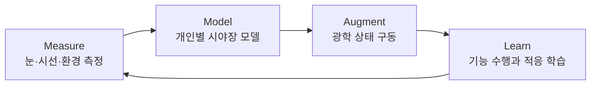
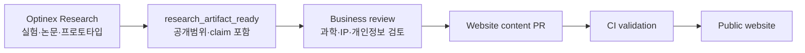

# Optinex 광학·시각증강 회사 웹사이트 마스터 블루프린트

> 문서 버전: 0.9  
> 작성일: 2026-08-26  
> 기준 저장소: [`myoung906/MasVisio_Research`](https://github.com/myoung906/MasVisio_Research), `master@e1519d5`  
> 기준 공개 사이트: <https://myoung906.github.io/MasVisio_Research/ko/index.html?v=5.0>  
> 내부 연구 기반: `optinex-station:/home/jmseo/Documents/Optinex_Research`의 구조·운영 문서 및 사용자 인터뷰  
> 문서 성격: 회사 전략, 과학 커뮤니케이션, 정보구조, UX, 콘텐츠 모델, 개발 아키텍처를 하나로 묶은 구현 기준서

---

## 0. 이 문서가 내리는 핵심 결정

현재 사이트는 버릴 대상이 아니다. 실험 결과, 연구 사진, 논문·학술발표, 프로토타입, 주변부 시야에 관한 오랜 문제의식이 이미 축적되어 있다. 개편의 목적은 이 자산을 줄이는 것이 아니라 **하나의 회사 방향 아래 재배열하고, 각각의 근거 수준과 전략적 의미를 더 정확히 보여주는 것**이다.

이 문서가 제안하는 여섯 가지 결정은 다음과 같다.

1. **Optinex의 범주를 `Adaptive Vision Platform`으로 정의한다.** 단순 연구소, AI 안질환 진단회사, 안경 판매회사 중 하나로 좁히지 않는다.
2. **회사의 장기 목적을 “개인마다 다른 시야 전체를 측정하고, 모델링하고, 동적으로 증강하는 것”으로 고정한다.** 시력 회복은 출발점이며 최종 목적은 정상시력의 복제가 아니라 개인화된 시각 능력의 확장이다.
3. **`Optinex`와 `Optinex Research`를 구분한다.** Optinex는 회사·플랫폼 브랜드이고, Optinex Research는 그 주장을 만들어내고 검증하는 연구 엔진이다.
4. **기존 연구결과는 모두 보존한다.** 현재 데이터에 있는 59건의 논문·학술발표와 도전과제의 내부 실험, 장치, 원본 결과 이미지를 근거 데이터베이스로 이관한다. 단, 홈에 모두 펼치지 않고 프로그램·증거 단계·연도·유형으로 탐색하게 한다.
5. **연구결과와 제품성능을 혼동하지 않는다.** 직접 수행한 내부 연구는 `Investigator-conducted study`로 당당하게 공개하되, 탐색 연구의 AUC나 정밀도가 상용 의료기기의 확정 성능처럼 읽히지 않도록 표본·프로토콜·검증 범위를 붙인다.
6. **사이트를 정적 HTML 복제 구조에서 콘텐츠 중심 정적 사이트로 재구축한다.** Astro + TypeScript + MDX를 권장하며, 한국어·영어는 하나의 콘텐츠 ID를 공유한다.

---

## 1. 회사의 거시적 그림

### 1.1 한 문장 정의

**Optinex는 개인의 눈, 시선, 환경을 측정해 시야 전체에 필요한 광학 상태를 모델링하고, 이를 적응형 광학계로 구현하려는 시각증강 플랫폼 회사다.**

짧은 표현은 다음 중 하나를 사용한다.

- 한국어: **시야 전체를 위한 적응형 광학 플랫폼**
- 영어: **Adaptive optics for the whole visual field**
- 비전 문구: **Vision, beyond correction.**

`Vision OS`는 투자자·연구자에게 장기 아키텍처를 설명하는 비유로는 강력하지만, 현재 출시된 운영체제처럼 오해될 수 있다. 따라서 대외 카테고리는 `Adaptive Vision Platform`, 장기 비전 설명 안에서만 `a personalized vision operating layer`를 사용한다.

### 1.2 Optinex가 바꾸려는 문제의 정의

현재 일반적인 시력교정은 한 사람의 눈을 대체로 몇 개의 정적 숫자로 표현한다.

```text
SPH / CYL / AXIS / ADD
```

하지만 실제 시각은 다음 조건에 따라 계속 달라지는 시공간 함수다.

```text
필요 광학상태 P* = f(시야각 θ·φ, 주시거리 z, 동공 p, 파장 λ,
                    시간 t, 눈의 광학모델 E, 과제·사용자 의도 U)
```

Optinex가 제안하는 패러다임 전환은 다음과 같다.

| 기존 패러다임 | Optinex가 지향하는 패러다임 |
|---|---|
| 중심시 중심의 처방 | 중심과 주변부를 포함한 시야장 전체의 광학 프로파일 |
| 한 번 측정한 정적 도수 | 시간·주시거리·동공·과제에 적응하는 상태 |
| 평균 눈을 전제로 한 렌즈 | 개인별 형상과 수차를 반영한 눈 모델 |
| 선명도 하나의 최적화 | 대비, 탐지, 이동, 피로, 적응을 포함한 기능 최적화 |
| 장치 단품 | 측정–모델–구동–학습의 폐루프 플랫폼 |

### 1.3 회사의 핵심 루프



이 루프는 사이트의 가장 중요한 시각 문법이자 제품 아키텍처가 되어야 한다.

### 1.4 브랜드 구조

| 이름 | 역할 | 웹에서의 위치 |
|---|---|---|
| **Optinex** | 회사·플랫폼·장기 비전 | 최상위 브랜드와 도메인 |
| **Optinex Research** | 논문, 내부 실험, 프로토타입, 방법론을 만드는 연구 엔진 | `/research`, `/evidence` |
| **Measure** | 주변부 굴절, 망막 형상, 동공, 대비감도, 안축·생체계측 | 플랫폼 1층 |
| **Model** | 개인별 wide-field eye model, retinal conjugate map, optical profile | 플랫폼 2층 |
| **Augment** | 가변초점·공간가변 광학, 시선추적, 제어 | 플랫폼 3층 |
| **Learn** | 종단 데이터, 사용자 적응, 기능 성능 최적화 | 플랫폼 4층 |

제품명은 아직 확정하지 않는다. 문서·와이어프레임에서만 다음 작업명을 사용할 수 있다.

- `Optinex FieldScan` — 측정·프로파일링
- `Optinex Eye Model` — 개인별 시야장 모델
- `Optinex Adaptive Runtime` — 센싱과 광학 구동 제어
- `Optinex Vision Cloud` — 버전 관리, 종단 추적, 학습

---

## 2. 현재 GitHub 사이트 구현 감사

### 2.1 어떻게 만들어져 있는가

2026-08-26 확인 기준 GitHub `master`의 최신 커밋은 `e1519d5df680d74d7786c755e4cc690836228076`이다.

| 항목 | 현재 상태 |
|---|---|
| 호스팅 | GitHub Pages용 정적 파일 |
| 프레임워크 | 없음. HTML, CSS, JavaScript 직접 작성 |
| 개발 서버 | `python3 -m http.server 8080` |
| 주요 스타일 | `assets/css/main.css`, `responsive.css`, `components.css`, `v2.css` |
| 주요 스크립트 | `assets/js/main.js`, `assets/js/v2.js` |
| 콘텐츠 데이터 | `assets/data/content_v5.json` 약 178 KB |
| 페이지 | HTML 27개, 한국어·영어 파일 병렬 복제 |
| 인라인 구현 | HTML 내 `style=` 142회, `<script>` 33개 |
| 테스트 | 브라우저를 눈으로 확인하는 Playwright 스크립트 3개. 자동 assertion·CI 게이트 없음 |
| 버전 무효화 | `?v=4.0`, `?v=5.0`가 파일마다 혼재 |

현재 구조의 장점은 서버 없이 배포가 쉽고, 실제 연구자가 직접 빠르게 내용을 추가할 수 있다는 점이다. 단점은 같은 수정이 한국어·영어·여러 페이지에 반복되고, 데이터 JSON과 하드코딩 HTML 중 어느 쪽이 정본인지 불분명해졌다는 점이다.

### 2.2 현재 사이트의 강점

- 연구실·기기·실험 결과를 보여주는 실제 자산이 있다.
- 어두운 계측실, 망막 좌표, reticle, 모노스페이스 수치로 이어지는 시각 언어가 광학 회사와 잘 맞는다.
- 2009–2025년에 걸친 논문·학술발표 59건이 이미 구조화되어 있다.
- 주변부 망막, 대비감도, 동공반응, 안구 형상, 저시력 재활, 자동굴절계, 프로토타입이 한 연구자의 장기 궤적을 보여준다.
- 한국어와 영어를 모두 제공하고 기본 반응형 레이아웃이 있다.
- 단순 콘셉트 회사가 아니라 “직접 측정하고 장치를 만들어온 연구자”라는 진정성이 있다.

### 2.3 지금 가장 큰 구조적 문제

#### 문제 A — 하나의 큰 질문보다 프로젝트 목록이 먼저 보인다

현재 방문자는 정밀 계측, AI 바이오마커, 개인맞춤 솔루션을 각각 별도 사업으로 인식하기 쉽다. 사이트가 답해야 할 첫 질문은 “무엇을 많이 연구했는가?”가 아니라 “이 모든 연구가 어떤 하나의 미래를 만들기 위해 연결되는가?”다.

대비감도 연구는 주변부 기능 최적화의 기반이고, 동공 연구는 눈 상태 센싱의 기반이며, 망막 형상과 자동굴절계는 개인별 눈 모델의 기반이고, 시제품 연구는 광학 개입의 기반이다. 이 연결을 먼저 보여주어야 한다.

#### 문제 B — `연구 단계`와 `연구 프로그램`이 혼재한다

현재 도전과제의 “시각 신경과학 → 시광학 계측 → 시제품 → AI·소프트웨어”는 순차적인 Phase라기보다 병행되는 역량 축이다. 이를 네 개의 연구 프로그램으로 바꾸고, 각 프로그램 안에서 실제 성숙 단계를 별도로 표시해야 한다.

권장 성숙 단계:

```text
Concept → Bench → Simulation → Internal Study → External Replication
        → Clinical Study → Regulatory → Deployed
```

#### 문제 C — 직접 수행 연구와 상용 제품 주장의 경계가 약하다

사용자가 직접 수행한 연구결과는 삭제할 이유가 없다. 다만 다음과 같이 표현의 주어를 명확히 해야 한다.

- 좋은 표현: “성인 36명을 대상으로 수행한 내부 탐색 연구에서 이 프로토콜을 평가했다.”
- 좋은 표현: “이 연구에서는 47개의 후보 특징을 계산했다.”
- 좋은 표현: “내부 데이터셋의 해당 분석에서 AUC 0.92를 관찰했다.”
- 피해야 할 표현: “Optinex는 질환을 90% 이상 정확도로 진단한다.”

앞의 문장들은 실제 연구를 강하게 보여준다. 마지막 문장은 외부검증·임상 사용범위·규제 상태가 생략되어 제품 성능으로 읽힌다.

#### 문제 D — 연구결과 원본과 장식 이미지의 출처가 구분되지 않는다

사용자 확인에 따라 도전과제의 대비감도 등 결과 이미지는 직접 실험한 원본 자산이다. 따라서 전면 활용한다. 동시에 모든 이미지에 다음 메타데이터를 붙여 출처 혼동을 원천적으로 막는다.

```yaml
asset_id: result-motion-csf-2025-01
asset_type: experimental_result
study_id: study-motion-csf-2025
caption_ko: "속도 조건별 대비감도 결과"
caption_en: "Contrast sensitivity by motion condition"
created_by: "Optinex Research"
source_file: "..."
public_permission: true
personally_identifiable: false
alterations: "crop only"
```

허용 `asset_type`:

- `experimental_result`
- `apparatus_photo`
- `prototype_photo`
- `simulation_output`
- `scientific_diagram`
- `concept_illustration`

#### 문제 E — 유지보수와 품질 게이트가 약하다

- 한국어·영어 HTML이 중복되어 한쪽만 수정될 위험이 있다.
- 동일한 내비게이션과 footer가 여러 파일에 복사되어 있다.
- 스타일과 스크립트가 페이지 안에 많이 들어가 있다.
- 현재 테스트는 `headless: false`로 스크린샷과 로그를 확인하는 방식이며 실패를 자동 판정하지 않는다.
- route가 27개이고 dashboard v1/v2/v3가 공개 트리에 함께 남아 사용자·검색엔진이 어느 것이 정본인지 알기 어렵다.
- Google Fonts와 외부 파트너 로고 hotlink는 개인정보·성능·가용성 측면에서 불필요한 외부 의존성이다.

### 2.4 즉시 해결할 접근성 문제

`ko/research/overview.html`의 시간주파수 데모는 1–30 Hz를 자동 순환하며 `main.js`가 `requestAnimationFrame`으로 깜빡임을 계속 구동한다. 시각을 다루는 회사 사이트에서 자동 flicker는 특히 엄격하게 관리해야 한다.

조치:

1. 자동 실행을 즉시 중지한다.
2. 정적 썸네일과 `데모 시작` 버튼을 기본으로 둔다.
3. 사용자 시작 전 광과민성 경고를 제공한다.
4. 3 flashes 기준을 넘는 공개 데모는 웹에 직접 재생하지 않고 영상 설명·주파수 그래프로 대체한다.
5. `prefers-reduced-motion: reduce`에서 모든 비필수 애니메이션을 제거한다.
6. 접근성 floating widget보다 먼저 기본 HTML, 대비, 키보드 탐색, motion safety를 해결한다.

근거: [WCAG 2.2 Pause, Stop, Hide](https://www.w3.org/WAI/WCAG22/Understanding/pause-stop-hide), [WCAG 2.2 Three Flashes or Below Threshold](https://www.w3.org/WAI/WCAG22/Understanding/three-flashes.html).

---

## 3. 연구 자산 보존·재구성 원칙

### 3.1 “모두 포함”의 의미

모든 연구를 홈 화면에 같은 크기로 나열하는 것은 보존이 아니라 맥락 상실이다. 권장 방식은 다음과 같다.

- **홈:** 회사를 설명하는 대표 연구 4–6개
- **Research Programs:** 회사의 핵심 기술축으로 재배열한 연구
- **Evidence Library:** 현재 59건 전체와 내부 연구·프로토타입 전체
- **개별 Study 페이지:** 방법, 장치, 표본, 결과, 한계, 다음 실험
- **Journal:** 진행 과정과 실패·교정 기록

따라서 어떤 연구도 지우지 않되, “회사 핵심축과의 관련성”에 따라 노출 깊이를 달리한다.

### 3.2 기존 59건 연구성과의 이관 규칙

현재 `content_v5.json`에는 다음과 같은 자산이 있다.

- 동료심사·학술지 성과: 시각 정책, 임상 시기능, 저시력, 대비감도, 양안시, 콘택트렌즈, 시재활, 시제품 등
- 학술발표: 주변부 망막, 망막 곡률, 초평면, 근시교정, 동공반응, 대비감도, 안굴절계, 3D scanner, 반맹 재활 등
- 총 레코드: 59건

이관 시 단 한 건도 수작업 복사로 누락되지 않도록 JSON 스키마 변환 테스트를 둔다.

```text
Acceptance criterion:
old_publication_count == migrated_evidence_count_for_legacy_publications
59 == 59
```

같은 연구의 논문과 학술발표가 함께 있을 수 있으므로 “삭제”하지 않고 `study_id`로 연결한다.

### 3.3 네 개의 연구 프로그램으로 재배열

#### Program 1 — Wide-field Eye Modeling

개인별 망막 형상, 주변부 굴절, 경선별 곡률, 사광선의 초점, 안구 생체계측을 하나의 시야장 모델로 연결한다.

포함 자산:

- 전체망막 완전교정과 근시억제
- 굴절이상에 따른 주변부 망막의 경선별 변화
- 경선별 주변부 망막 교정을 위한 구면굴절력·각막곡률반경 연구
- 망막 초평면 profile 알고리즘
- 안광학계 광선추적
- 근시억제용 렌즈의 개인맞춤 가입도 설계
- 망막 곡률반경과 나이·굴절이상·각막굴절력 연구
- 공막 프로파일 3D scanner와 영상처리
- 자동안굴절계·검영법·기계학습 기반 측정

#### Program 2 — Visual Neuroperformance

광학적 선명도만이 아니라 실제 사람이 탐지하고 움직이고 적응하는 능력을 측정한다.

포함 자산:

- 좌우 시각경로의 모션 대비감도
- 주변시야 대비감도와 중심외주시 훈련
- 주변부 망막의 공간·시간 합산
- 입체시각의 시간 특성
- 버전스와 눈–손 협응
- 동체시각, 운동 자극, 반구·시각경로 비대칭
- 칼라필터·콘택트렌즈와 대비감도
- 저시력 환자의 기능·삶의 질·시보조기구

이 프로그램은 장기적으로 Adaptive Runtime의 목적함수를 정의한다. “PSF가 좋아졌는가?”만 묻지 않고 “주변부 탐지율, 보행, 대비, 반응시간, 피로가 좋아졌는가?”를 묻는다.

#### Program 3 — Adaptive Optical Systems

측정한 시야장 프로파일을 실제 광학 개입과 장치로 변환한다.

포함 자산:

- 동측성 반맹 재활용 시분할 장치와 shutter glasses
- 중심외주시 훈련 시스템
- 맞춤형 주변부 교정 렌즈 설계
- 근시억제용 광학 개입
- 자동안굴절계·LED 시각검사·구조화광 장치
- 향후 가변초점 렌즈, 시선·거리 추정, 공간가변 광학 제어

#### Program 4 — Longitudinal Eye Intelligence

동공·대비·행동·환경 데이터를 시간에 따라 분석해 눈의 상태와 기능 변화를 추적한다.

포함 자산:

- 동공 광반사 동역학
- 휘도·주시거리·조절랙·동공중심 이동
- 라이프스타일과 동공반응
- 통합 바이오메트릭 후보 특징 47개
- 내부 탐색 데이터의 질환·상태 분류 분석
- AI·소프트웨어 파이프라인과 대시보드

이 프로그램의 공개 표현은 `질환 진단 플랫폼`보다 `exploratory ocular signal research`와 `longitudinal eye-state modeling`을 우선한다. 진단 가능성을 숨기지는 않되, 임상 검증 단계와 연구 범위를 함께 표시한다.

### 3.4 개별 연구 페이지 표준

모든 Study 페이지는 같은 질문에 답해야 한다.

1. **Question** — 무엇을 알고 싶었는가?
2. **Why it matters** — Optinex의 장기 비전에 왜 필요한가?
3. **Study status** — 논문, 학술발표, 내부 연구, 파일럿, 시뮬레이션 중 무엇인가?
4. **Method** — 표본, 포함·제외, 장비, 자극, 프로토콜, 분석법
5. **Result** — 효과크기, 분산·신뢰구간, 통계, 원본 figure
6. **Interpretation** — 무엇을 의미하고 무엇을 의미하지 않는가?
7. **Limitations** — 표본·설계·외부타당도·재현성
8. **Next falsification test** — 다음에 어떤 조건이면 가설을 버리거나 수정할 것인가?
9. **Artifacts** — 논문, 초록, DOI, 데이터 사전, 코드, 장치 사진
10. **Contribution** — Measure / Model / Augment / Learn 중 어디에 연결되는가?

### 3.5 연구 상태 배지

| 배지 | 의미 | 사용 예 |
|---|---|---|
| `Peer-reviewed` | 동료심사 논문 출판 | DOI/KCI 링크 필수 |
| `Conference` | 학술대회 발표 | 학회·연도·초록 또는 프로그램 |
| `Investigator study` | 연구자가 직접 수행한 내부 연구 | 프로토콜·표본·분석 범위 공개 |
| `Validated prototype` | 정해진 시험을 통과한 프로토타입 | 시험 조건과 로그 |
| `Simulation` | 계산·광선추적·가상 실험 | 모델 가정과 파라미터 |
| `Hypothesis` | 아직 검증 전인 과학 가설 | 검증 계획 |
| `Roadmap` | 미래 제품·기능 | 현재 이용 불가 명시 |

`Internal`은 “가짜”나 “낮은 수준”을 뜻하지 않는다. 연구의 검증 범위와 재현 단계가 다르다는 뜻이다.

---

## 4. 과학·공학 기반과 웹사이트에서의 설명 방식

### 4.1 필요한 도메인 지식

| 영역 | 핵심 지식 | Optinex에서의 역할 | 사이트에 보여줄 증거 |
|---|---|---|---|
| 기하광학·안광학 | 사광선, 비점수차, field curvature, pupil, retinal conjugacy | wide-field prescription | ray trace, 경선별 맵, 광학식 |
| 파면광학 | Zernike, PSF, MTF, HOA, wavefront sensing | 개인 수차 모델과 보정 한계 | wavefront/MTF 비교 |
| 시각신경과학 | 주변부 샘플링, crowding, 대비감도, 시간주파수 | 기능 목적함수 | 직접 수행 대비감도 연구 |
| 검안·임상 | 굴절, 조절, 양안시, 저시력, 근시관리 | 프로토콜과 사용자 안전 | 논문·검사 흐름 |
| 생체계측 | 안축장, 각막, 동공, 망막 형상, eye tracking | 개인 모델 입력 | 장비·반복성·오차 |
| 계산광학 | inverse optics, optimization, differentiable rendering | 측정→모델→처방 | 시뮬레이션과 코드 산출 |
| 제어공학 | 상태추정, latency, stability, fail-safe | 가변 렌즈 폐루프 | 제어 블록도·응답시간 |
| 임베디드·웨어러블 | 센서 동기, 전력, 열, 무게, calibration | 실제 안경형 구현 | prototype·BOM·test |
| HCI·인간공학 | 적응, 멀미, 시선전환, 과제 의존성 | 증강이 방해가 되지 않게 함 | 사용자 과제·기능 평가 |
| 데이터·ML | personalized model, uncertainty, longitudinal learning | 개인화와 추적 | 데이터 흐름·불확실성 |
| 규제·품질 | 위험관리, 소프트웨어 생명주기, 광방사 안전 | 제품화 경계 | stage·governance |

### 4.2 과학적 가능성과 아직 남은 불확실성

사이트는 과학적 야심을 약화시키지 않으면서도 다음을 정직하게 설명해야 한다.

- 주변부 굴절·수차는 중심부와 다르고 개인차가 크며, wide-field 측정과 모델링은 분명한 연구 가치가 있다. [Peripheral ocular aberrations review](https://pmc.ncbi.nlm.nih.gov/articles/PMC6973144/)
- 주변부 고위수차 보정이 특정 조건에서 대비와 탐지 성능을 높였다는 연구가 있지만, 모든 과제·편심도·피험자에서 시력 향상이 보장되는 것은 아니다. [PubMed 31044955](https://pubmed.ncbi.nlm.nih.gov/31044955/)
- 주변부 굴절과 근시 진행의 인과 관계는 임상적으로 완전히 확정된 단일 메커니즘이 아니다. 따라서 “완전교정이 근시를 차단한다”는 제품 확정문보다 검증 중인 가설과 실험 로드맵으로 표현한다. [IMI Clinical Management Guidelines](https://myopiainstitute.org/wp-content/uploads/2020/09/Clinical-Management-Guidelines-IMI.pdf)
- eye tracking, depth sensing, focus-tunable lens를 결합한 autofocus eyewear는 이미 기술적으로 시연되었지만 지연, 시선오차, FOV, 무게, 적응이 실제 제품의 병목이다. [Autofocals prototype](https://pmc.ncbi.nlm.nih.gov/articles/PMC6598771/)
- 디지털 트윈은 안과에서 떠오르는 개념이지만 아직 표준화된 성숙 제품 범주가 아니다. 현재 단계에서는 `digital eye profile` 또는 `personalized eye model`을 쓰고, 종단 데이터로 지속 갱신되며 실제 시스템과 양방향 연결될 때만 `twin`이라 부른다. [Digital twins in ophthalmology](https://pubmed.ncbi.nlm.nih.gov/40378962/)
- 동공반응은 신경계 상태와 관련된 유망 신호지만 프로토콜 이질성, 약물·조도·나이·피로 등의 교란이 크다. 내부 연구는 이 가능성을 탐색한 중요한 자산이며, 외부 임상검증과는 구분한다. [PLR and Parkinson's systematic review](https://pmc.ncbi.nlm.nih.gov/articles/PMC12071770/), [Chromatic pupillometry meta-analysis](https://pubmed.ncbi.nlm.nih.gov/38443213/)

### 4.3 기능 성능을 최종 목표로 둔다

Optinex의 성능 계층은 다음 순서를 따라야 한다.

```text
광학 성능     PSF / MTF / RMS wavefront error
    ↓
지각 성능     contrast threshold / detection / crowding / motion
    ↓
행동 성능     reading / search / mobility / reaction time
    ↓
경험 성능     comfort / fatigue / adaptation / preference
    ↓
생활 성능     safety / participation / task success
```

웹사이트도 광학 맵만 아름답게 보여주는 데서 끝나지 않고, 직접 수행한 대비감도·저시력·재활 연구가 왜 이 성능 사다리에 필요한지 설명해야 한다.

---

## 5. 타깃 방문자와 전환 목표

### 5.1 우선순위

| 우선 | 방문자 | 알고 싶은 것 | 기본 CTA |
|---:|---|---|---|
| 1 | 공동연구자·대학·병원 | 연구질문, 방법, 데이터, 저자의 역량 | `공동연구 제안` |
| 2 | 광학·센서·웨어러블 기업 | 어떤 기술축을 함께 검증할 수 있는가 | `기술 협력 문의` |
| 3 | 연구비·투자 파트너 | 장기 비전과 단계적 de-risking | `기술 로드맵 보기` |
| 4 | 인재·학생 | 무슨 문제를 어떻게 푸는가 | `연구 참여 문의` |
| 5 | 일반 대중·잠재 사용자 | 왜 시야 전체가 중요한가 | `비전 알아보기` |

현재 상용 의료제품이 없다면 환자 유입이나 진단 신청을 주요 CTA로 두지 않는다.

### 5.2 방문자가 30초 안에 이해해야 하는 것

1. Optinex는 시야 전체를 개인화해 다루는 회사다.
2. 주변부 시야는 장식적 배경이 아니라 핵심 연구대상이다.
3. 연구자는 수년간 대비감도·주변부 망막·동공·장치를 직접 연구했다.
4. 현재는 연구·프로토타입 단계이며 공동검증 파트너를 찾는다.
5. 장기적으로 측정–모델–동적광학–학습을 하나의 플랫폼으로 연결한다.

---

## 6. 권장 정보구조

```text
/
├── /ko/                         한국어 홈
├── /en/                         영어 홈
├── /[lang]/vision/              왜 시야 전체인가
├── /[lang]/platform/            Measure–Model–Augment–Learn
│   ├── /measure/
│   ├── /model/
│   ├── /augment/
│   └── /learn/
├── /[lang]/research/            4개 연구 프로그램
│   └── /[program-slug]/
├── /[lang]/evidence/            전체 근거 라이브러리
│   └── /[study-or-publication]/
├── /[lang]/collaborate/         공동연구·기술검증
├── /[lang]/company/             설립자·팀·연혁·원칙
├── /[lang]/journal/             실험·개발 노트
├── /[lang]/governance/          claims, privacy, research ethics
└── /[lang]/contact/
```

기존 `Research / Publications / Gallery / Services / Partners`를 단순히 이름만 바꾸지 않는다.

- Gallery의 연구사진은 해당 Study와 Program 안으로 이동한다.
- Publications는 Evidence Library가 흡수한다.
- Services는 현재 가능한 협력 범위와 미래 플랫폼을 분리한다.
- Partners는 법적·홍보 동의가 확인된 관계만 공개한다.
- dashboard v1/v2/v3는 Evidence의 prototype archive로 옮기거나 비공개 preview로 둔다.

---

## 7. 홈 페이지 상세 명세

### 7.1 Hero

권장 한국어 카피:

> **교정은 중심시에서 멈췄습니다.  
> 우리는 시야 전체를 모델링합니다.**
>
> Optinex는 개인의 눈·시선·환경을 측정하고, 주변부까지 필요한 광학 상태를 계산해 적응형 광학계로 연결하는 시각증강 플랫폼을 연구합니다.

영문:

> **Correction stops at central vision.  
> We model the whole visual field.**
>
> Optinex is building an adaptive vision platform that measures the eye, models the field, and explores how personalized optics can augment human vision.

CTA:

- Primary: `플랫폼 아키텍처 보기`
- Secondary: `공동연구 제안`
- Tertiary: `연구 근거 탐색`

상태 문구:

> Research-stage platform. No commercial medical product is currently available.

### 7.2 Hero 인터랙션

랜덤한 3D 눈이나 AI 신경망 대신, 실제 회사 가설을 설명하는 **시야장 광학 지도**를 사용한다.

세 가지 토글:

1. `Conventional` — 중심 처방만 적용된 단순 맵
2. `Personalized field` — 개인별 주변부 굴절·수차 분포
3. `Adaptive` — 주시거리와 시선에 따라 보정장이 변화

필수 표기:

- `Conceptual simulation` 또는 실제 데이터면 `De-identified study data`
- 색상 범례와 단위
- 키보드 조작
- 정적 대체 이미지
- 자동 애니메이션 금지

### 7.3 Paradigm section

짧은 문장:

> 안경은 하나의 도수입니다. 시각은 하나의 장(field)입니다.

두 열 비교로 중심처방과 wide-field profile을 설명한다. 이 섹션에서 회사의 기술범주가 결정된다.

### 7.4 Measure–Model–Augment–Learn

각 단계에 기존 연구자산을 연결한다.

| 단계 | 설명 | 연결할 실제 자산 |
|---|---|---|
| Measure | 눈의 형상·굴절·동공·기능을 측정 | 자동굴절계, 망막 형상, PLR, CSF |
| Model | 개인별 retinal optical field를 계산 | 초평면, 광선추적, 주변부 곡률 |
| Augment | 렌즈·디스플레이·장치가 상태를 구현 | 반맹 장치, 맞춤형 렌즈, 시제품 |
| Learn | 사용자의 성능과 적응으로 모델을 갱신 | 대비감도, 반응시간, 종단 데이터 |

### 7.5 Research lineage

현재 연구를 “서로 다른 네 분야”가 아니라 다음 계보로 보여준다.

```text
Peripheral vision & rehabilitation
        ↓
Contrast and motion performance
        ↓
Wide-field retinal measurement
        ↓
Personalized optical modeling
        ↓
Adaptive optical augmentation
```

여기서 2009–2025 연구 연혁의 대표 6–8개를 노출하고 `전체 59건 보기`로 연결한다.

### 7.6 Evidence spotlight

홈에는 다음 네 사례를 추천한다.

1. 주변부 망막 곡률·초평면 연구
2. 좌우 시각경로 모션 대비감도 연구
3. 중심외주시·반맹 재활 연구와 시분할 프로토타입
4. 동공 동역학·통합 바이오메트릭 탐색 연구

각 카드에는 수치보다 질문·방법·단계를 먼저 둔다.

### 7.7 Collaboration

공개 가능한 협력 유형:

- wide-field optical measurement 공동연구
- 특수렌즈·주변부 광학 설계 검증
- eye tracking·tunable lens 통합 prototype
- 대비감도·주변부 기능평가 프로토콜
- 비식별 연구데이터 분석과 시각화

`진단 API 판매`처럼 제품상태를 앞지르는 표현은 현재 제공 가능성과 분리한다.

---

## 8. 하위 페이지 상세 명세

### 8.1 Vision — 왜 시야 전체인가

목적: 일반인과 투자자에게 기술을 물리학부터 설명한다.

모듈:

1. 중심시 처방이 압축하는 정보
2. 주변부에서 달라지는 굴절·수차·신경 샘플링
3. “더 선명함”과 “더 잘 봄”의 차이
4. 직접 수행한 주변부 대비감도·재활 연구
5. 장기 시나리오: 작업·거리·시선에 맞는 개인화 시야
6. 과학적 불확실성과 검증 질문

### 8.2 Platform — Measure / Model / Augment / Learn

목적: 회사가 무엇을 만드는지 시스템으로 설명한다.

각 레이어는 반드시 다음을 가진다.

- Inputs
- Core computation
- Outputs
- Current assets
- Missing capability
- Validation metric
- Current stage

예:

| Layer | Inputs | Output | 현재 자산 | 다음 검증 |
|---|---|---|---|---|
| Measure | 경선별 굴절, pupil, eye geometry | field profile | 주변부·망막·굴절 연구 | 반복성·재현성 |
| Model | geometry + wavefront + gaze | personalized optical map | ray tracing·초평면 | 실측과 model error |
| Augment | map + target distance + task | lens/control command | prototype lineage | latency·stability·FOV |
| Learn | functional result + comfort | updated profile/policy | CSF·행동 연구 | longitudinal benefit |

### 8.3 Research

네 프로그램을 큰 카드로 보여주고, 각 페이지에는 관련 연구를 자동 집계한다. `Phase 1–4` 표기는 없앤다.

프로그램 페이지 구성:

- 대표 질문
- 핵심 가설
- 수행한 연구
- 현재 보유 장치·데이터
- 해결되지 않은 문제
- 12–24개월 실험 로드맵
- 협력 요청

### 8.4 Evidence Library

필터:

- Type: peer-reviewed / conference / investigator study / prototype / simulation
- Program: 4개 프로그램
- Contribution: Measure / Model / Augment / Learn
- Year
- Status
- Author
- 공개자료 유무: paper / figure / code / data dictionary / demo

리스트 카드에는 제목, 연도, 상태 배지, 한 문장 결과, 회사 아키텍처와의 연결, DOI를 표시한다.

### 8.5 Company

연구자의 이력 나열보다 “왜 이 문제를 10년 이상 따라왔는가”를 이야기한다.

권장 설립자 서사:

> 저시력과 주변시야 재활을 연구하면서, 중심시력 하나가 사람의 실제 시각 능력을 설명하지 못한다는 문제를 보았다. 대비감도와 운동시각, 동공반응, 주변부 망막 형상, 자동굴절계와 시제품을 차례로 연구한 이유는 서로 다른 주제를 수집하기 위해서가 아니었다. 개인이 실제로 보는 시야 전체를 측정하고, 필요한 광학 상태를 계산하고, 다시 장치로 구현하기 위한 기술 조각을 축적하기 위해서였다.

팀·파트너는 역할과 공개 동의를 확인한 사람·기관만 싣는다. 과거 협업은 `Past collaboration`, 현재 계약·공동과제는 `Active collaboration`으로 구분한다.

### 8.6 Governance

최소 네 페이지:

- `Evidence & claims policy`
- `Research ethics & participant privacy`
- `Product and regulatory status`
- `Privacy policy`

이 페이지는 약점을 고백하는 곳이 아니라 deep-tech 회사의 신뢰 인프라다.

---

## 9. 콘텐츠·주장 거버넌스

### 9.1 Claim registry

모든 정량 주장과 진단·치료·예측 표현을 중앙 레지스트리에서 관리한다.

```yaml
claim_id: CLM-PLR-001
statement_ko: "내부 탐색 연구에서 47개의 동공·대비 관련 후보 특징을 분석했다."
statement_en: "An investigator-conducted exploratory study analyzed 47 candidate pupil and contrast-related features."
status: approved_with_context
evidence_type: investigator_study
study_id: STUDY-PLR-2025-01
population: "20–30대 성인 36명"
validation: internal
allowed_pages:
  - evidence
  - research
not_allowed:
  - product_hero
required_context: "표본, 프로토콜, 내부검증임을 함께 표시"
owner: research_lead
last_reviewed: 2026-08-26
```

### 9.2 숫자를 지우는 대신 문맥을 추가한다

현재 사이트의 `47 biomarkers`, `90%+`, AUC 값, `±1 μm`, `100% correction` 같은 수치는 다음 절차로 다룬다.

1. 원 연구의 분석 코드·표·초록·발표자료와 연결한다.
2. 수치의 정확한 정의를 적는다.
3. 표본과 분석 단위를 적는다.
4. training / validation / test 구분을 적는다.
5. 내부·외부 검증 여부를 적는다.
6. 장비 사양인지 실제 시스템 반복성인지 구분한다.
7. 제품 페이지 사용 가능 여부를 승인한다.

근거가 확인된 수치는 Evidence 페이지에 그대로 남긴다. 홈·제품 페이지에서는 대표 수치만 맥락과 함께 사용한다.

### 9.3 피해야 할 표현

- `HIPAA certified`, `HIPAA secure` — HIPAA는 단순 제품 인증 배지가 아니다. 적용 주체·관계·BAA와 실제 통제가 필요하다. [HHS covered entities](https://www.hhs.gov/hipaa/for-professionals/covered-entities/index.html), [HHS self-certification FAQ](https://www.hhs.gov/hipaa/for-professionals/faq/237/can-business-associates-self-certify/index.html)
- `조기 진단` — 임상 진단 성능이 외부검증·규제 범위 없이 단정되는 경우
- `실시간` — end-to-end latency 측정 없이 사용
- `마이크로미터 정밀도` — 센서 픽셀·제조 스펙과 시스템 정확도·반복성을 혼동하는 경우
- `완전교정 100%` — 개념적 목표와 임상 결과를 혼동하는 경우
- `digital twin` — 종단 갱신·양방향 연결이 없는 정적 모델에 사용

### 9.4 Evidence page에 반드시 남길 것

- 실제 원본 figure
- 실험장치 사진
- sample size
- 실험 조건
- 주요 분석 방법
- effect size와 uncertainty
- preregistration 여부
- 발표·논문·DOI
- 한계
- 데이터·코드 공개 가능 범위

---

## 10. 특허·경쟁 지형과 웹 표현

> 아래는 2026-08-26 기준 예비 지형조사다. 특허 자유실시(FTO)나 법률의견이 아니며, 출원·제품 결정 전 변리사 검토가 필요하다.

### 10.1 경쟁 범주

| 범주 | 예 | 핵심 | Optinex가 달라야 하는 지점 |
|---|---|---|---|
| 정적 근시제어 렌즈 | DIMS/HAL/CARE 계열 | 주변부 defocus 구조 | 개인별 실측 field와 동적 업데이트 |
| Autofocus eyewear | [IXI](https://ixieyewear.com/), [Laclarée](https://www.laclaree-vision.com/) | 시선·거리 기반 초점 조정 | 단일 초점이 아닌 공간적 wide-field prescription |
| AR/varifocal | 대형 XR 기업 | vergence–accommodation, foveation | 실제 세계 시각과 개인 눈 모델의 폐루프 |
| 시각재활 디지털 장치 | field-loss assistive systems | 탐지·보행 보조 | 광학 모델과 기능훈련의 통합 |

Optinex의 백색공간은 `autofocus glasses`라는 말만으로는 확보되지 않는다. 다음 세 요소의 결합이 핵심이다.

1. 개인별 whole-field optical model
2. 주변부를 포함한 공간적 광학 제어
3. 기능 성능으로 다시 학습하는 longitudinal closed loop

### 10.2 관련 특허 예비 지도

| 권리자·문헌 | 관련 범위 | 전략적 의미 |
|---|---|---|
| Apple [US11086143B1](https://patents.google.com/patent/US11086143B1/en) | gaze area와 peripheral area, spatially varied optical power | foveated·공간가변 렌즈 청구가 혼잡함 |
| Dolby [US12326570B2](https://patents.google.com/patent/US12326570B2/en) | gaze/vergence와 focus-tunable lens | 시선+가변초점의 일반 결합은 차별화가 약함 |
| Focure [US20170123234A1](https://patents.google.com/patent/US20170123234A1/en) | structured light depth, gaze, tunable lens control | 거리추정 기반 autofocus 선행기술 |
| Hoya [US20240168313A1](https://patents.google.com/patent/US20240168313A1/en) | peripheral defocus region spectacle design | 주변부 영역 설계 자체도 혼잡함 |
| Zeiss [EP4006624B1](https://patents.google.com/patent/EP4006624B1/en) | ring-shaped focusing structures | 근시제어용 정적 구조와 구분 필요 |

### 10.3 특허 차별화 후보

- 개인별 처방장 `P(θ, φ, z, p, λ, t)`을 생성하는 측정·최적화 방법
- 주변부 retinal conjugate map과 실물 광학 구동기의 calibration
- 사카드·주시전환을 예측하는 지연 보상
- optical metric가 아니라 기능 metric로 제어 정책을 업데이트하는 방법
- 사용자의 적응 상태와 안전한 fallback을 포함한 제어
- 측정 불확실성을 반영해 보정량을 제한하는 방법
- 실험 프로토콜에서 wearable command로 이어지는 end-to-end traceability

웹사이트는 공개 전 특허 검토가 필요한 unpublished method를 자세히 설명하지 않는다. 원리는 공개하되 구현 파라미터·캘리브레이션 핵심은 `approval_required`로 관리한다.

---

## 11. 시각 디자인 시스템

### 11.1 디자인 원칙

1. **Instrument, not sci-fi.** 미래적이되 실제 계측기처럼 단위·범례·불확실성이 있어야 한다.
2. **Evidence before spectacle.** 장식용 눈보다 연구 figure가 더 중요한 시각 자산이다.
3. **Peripheral by design.** 화면 중심만 강조하지 않고 주변부에 정보의 흔적·field coordinate를 둔다.
4. **Darkroom with readable light.** 어두운 실험실 감성은 유지하되 본문 가독성과 대비를 희생하지 않는다.
5. **Motion must explain.** 움직임은 주시 이동·초점 변화·field update를 설명할 때만 쓴다.
6. **A vision company must be exemplary in accessibility.** 확대, 키보드, screen reader, motion safety를 기본 설계로 해결한다.

### 11.2 권장 시각 어휘

- retinal field map
- meridional contour
- wavefront phase map
- ray bundle and focal lines
- gaze vector
- confidence interval band
- calibration grid
- apparatus silhouette
- 실제 실험 figure와 장치 사진

피할 것:

- 출처 없는 뇌 신경망 렌더
- 가짜 실시간 숫자가 도는 HUD
- 임상 지표처럼 보이는 장식용 gauge
- 의미 없는 glowing particles
- 실제 연구결과처럼 보이는 AI 생성 chart

### 11.3 컬러 토큰 초안

```css
--surface-0: #071014;
--surface-1: #0b171d;
--surface-2: #11232b;
--text-strong: #f3f8fa;
--text-body: #c5d3d9;
--text-muted: #8fa4ad;
--line: #29414b;
--field-cyan: #62d6e8;
--optics-blue: #79aef8;
--retina-amber: #f1b35b;
--evidence-green: #72d49b;
--warning: #f3c56b;
--risk: #ef7d7d;
```

색만으로 상태를 표시하지 않는다. 모든 상태에는 텍스트·아이콘·패턴을 함께 쓴다.

### 11.4 타이포그래피

- 본문: 로컬 호스팅 가변 sans. 한국어는 Pretendard 또는 Noto Sans KR의 라이선스·용량을 검토해 subset 제공
- 수치·단위·좌표: IBM Plex Mono 또는 유사 mono
- display: 지나치게 SF풍인 폰트보다 기술문서와 연구기기의 중간
- 본문 최소 16 px, 기본 17–18 px 권장
- 긴 한국어 문단의 양쪽정렬 금지
- 영문 대문자 tracking 남용 금지

### 11.5 레이아웃

- 데스크톱: 최대 본문 1200–1320 px, 읽기 열은 680–760 px
- 모바일: 상단 compact header, 로고 높이 28–34 px
- 현재 280 px 고정 sidebar는 research tool 느낌은 강하지만 콘텐츠 사이트의 탐색과 모바일 일관성을 해친다. 상단 global nav + 페이지 내부 sticky subnav를 권장한다.
- 연구 figure는 작은 card thumbnail로만 소비하지 않고 확대, 캡션, 범례를 제공한다.

---

## 12. 기술 아키텍처

### 12.1 권장 스택

**Astro + TypeScript + MDX + Content Collections**를 권장한다.

이유:

- 대부분의 페이지는 정적 콘텐츠라 JavaScript를 거의 보내지 않아도 된다.
- field map 같은 인터랙션만 island로 분리할 수 있다.
- Markdown/MDX로 연구자가 내용을 수정하기 쉽다.
- 한국어·영어 스키마를 빌드 시 검증할 수 있다.
- GitHub Pages에 정적 출력이 가능하다.

Next.js는 로그인·대시보드·서버 액션이 핵심이 될 때 별도 app으로 사용한다. 회사 마케팅·연구 사이트까지 처음부터 서버 프레임워크로 만들 필요는 없다.

### 12.2 권장 디렉터리

```text
src/
├── components/
│   ├── global/
│   ├── evidence/
│   ├── optics/
│   └── accessibility/
├── content/
│   ├── studies/
│   ├── publications/
│   ├── prototypes/
│   ├── programs/
│   ├── people/
│   ├── partners/
│   ├── journal/
│   └── claims/
├── data/
│   ├── asset-manifest.yaml
│   └── navigation.yaml
├── layouts/
├── pages/
│   └── [lang]/
├── styles/
└── lib/
    ├── i18n.ts
    ├── evidence.ts
    ├── claims.ts
    └── seo.ts
public/
├── fonts/
├── images/
│   ├── studies/
│   ├── apparatus/
│   ├── prototypes/
│   └── brand/
└── downloads/
```

### 12.3 다국어 모델

한국어와 영어가 같은 `content_id`를 공유해야 한다.

```yaml
id: STUDY-MOTION-CSF-2025
slug: motion-contrast-visual-pathways
title:
  ko: 좌우 시각경로에서 모션 대비감도의 비교
  en: Motion contrast sensitivity across visual pathways
summary:
  ko: ...
  en: ...
```

번역이 없는 항목은 숨기지 말고 원문과 `Translation pending`을 표시할 수 있다. 내용이 다른 한국어·영어 페이지 두 벌을 유지하는 것보다 정직하다.

### 12.4 콘텐츠 스키마 예시

```yaml
id: STUDY-MOTION-CSF-2025
kind: investigator_study
programs: [visual-neuroperformance]
contributes_to: [learn, model]
stage: internal_study
year: 2025
authors: [seo-jaemyung]
question: ...
sample:
  n: 24
  population: 정상 시력 성인
method:
  stimulus: 1 cpd Gabor
  eccentricity_deg: 20
  speed_conditions_cm_s: [0, 10, 30]
results:
  - metric: contrast_sensitivity
    statement: 속도 증가에 따라 유의하게 감소
    p_value: "<.001"
limitations: ...
assets:
  - result-motion-csf-plot
links:
  conference: ...
publicability: public
last_reviewed: 2026-08-26
```

### 12.5 내부 Research → 공개 웹 흐름

스테이션 운영 경계를 유지한다.



Research 에이전트가 공개 사이트를 자동 수정하지 않는다. `public / teaser_only / approval_required / confidential` 등급을 전달하고, 사람이 승인한 콘텐츠만 PR로 들어간다.

### 12.6 폼·데이터·분석

- 연락 폼에는 환자정보·건강정보를 받지 않는다.
- 명시: `환자 또는 연구참여자의 개인정보·의료정보를 제출하지 마십시오.`
- 연구 참여 모집이 필요하면 별도의 IRB 승인된 시스템을 사용한다.
- 분석은 Plausible 또는 Cloudflare Web Analytics처럼 최소수집 도구를 우선한다.
- 세션 replay와 keystroke 수집은 사용하지 않는다.
- 이메일은 서버리스 relay 또는 별도 비즈니스 메일로 전달한다.
- 개발 preview에는 검색엔진 차단과 접근제어를 적용한다.

### 12.7 호스팅

- 1단계: GitHub Pages 유지 가능
- 권장: custom domain 연결
- 폼, preview auth, 보안 header가 필요하면 Cloudflare Pages 또는 Vercel 검토
- 대용량 연구 영상·데이터는 Git 저장소가 아니라 승인된 object storage 사용

---

## 13. SEO·구조화 데이터

### 13.1 검색 의도

핵심 주제 클러스터:

- peripheral vision optics
- wide-field eye model
- peripheral refraction measurement
- adaptive vision / tunable lens
- contrast sensitivity research
- pupil dynamics
- vision rehabilitation
- personalized optical correction

한국어에서도 “전체망막 완전교정”만 고유어로 밀지 말고 주변부 굴절, 시야장, 대비감도, 시재활 등 학술·산업 검색어와 연결한다.

### 13.2 구조화 데이터

- Organization
- Person
- ScholarlyArticle
- Dataset — 실제 공개 데이터가 있을 때만
- SoftwareSourceCode — 공개 repo가 있을 때
- BreadcrumbList

MedicalDevice/Product schema는 실제 제품 상태·판매 가능성이 갖춰지기 전 사용하지 않는다.

### 13.3 기본 SEO 요건

- 언어별 canonical과 hreflang 자동 생성
- sitemap에서 구버전 dashboard와 중복 publications 제외
- OpenGraph 이미지 로컬 제공
- favicon과 web manifest
- 모든 연구 figure에 의미 있는 alt와 긴 설명
- DOI·KCI 링크 유효성 정기 검사
- redirect map으로 기존 URL 보존

---

## 14. 접근성·안전·규제

### 14.1 웹 접근성 승인 기준

- WCAG 2.2 AA
- 키보드만으로 모든 인터랙션 사용
- 200% text zoom에서 기능 손실 없음
- 400% reflow에서 수평 스크롤 최소화
- focus indicator 명확
- canvas에는 동등한 텍스트·표 제공
- 색각 이상 시에도 field map 판독 가능
- `prefers-reduced-motion` 완전 지원
- 자동 깜빡임 금지
- 자동 음성안내 금지

### 14.2 미래 제품 개발에서 미리 추적할 표준

웹사이트가 인증을 주장할 필요는 없지만, 로드맵에는 다음을 반영한다.

- [ISO 14971:2019](https://www.iso.org/standard/72704.html) — 의료기기 위험관리
- [IEC 62304](https://committee.iso.org/standard/38421.html) — 의료기기 소프트웨어 생명주기
- [ISO 15004-1:2020](https://www.iso.org/standard/72616.html) — 안과기기 일반 요구사항
- ISO 15004-2:2024 — 광방사 안전

장치가 진단·치료 목적을 표방하는 순간 지역별 의료기기 규제 전략이 필요하다. 웹 카피는 intended use를 사실상 결정할 수 있으므로 제품팀·규제 담당 검토 없이 “diagnose, treat, prevent”를 쓰지 않는다.

---

## 15. 테스트·품질 게이트

### 15.1 CI 파이프라인

모든 PR에서 다음을 자동 실행한다.

```text
format
→ lint
→ typecheck
→ content schema validation
→ claim registry validation
→ build
→ broken-link/DOI check
→ Playwright functional tests
→ axe accessibility tests
→ visual regression
→ Lighthouse CI
```

### 15.2 필수 자동 테스트

- 한국어·영어 route가 모두 빌드되는가
- 언어 전환이 대응 페이지로 가는가
- 59개 기존 publication이 모두 이관되었는가
- Evidence filter가 키보드와 screen reader로 동작하는가
- 모든 image asset에 provenance와 alt가 있는가
- `experimental_result` figure가 `concept_illustration`으로 잘못 표시되지 않았는가
- 승인되지 않은 claim이 제품·홈 page에 등장하지 않는가
- `Roadmap` 항목에 현재 이용 불가 문구가 있는가
- 외부 hotlink가 없는가
- 320, 375, 768, 1024, 1440 px에서 navigation이 동작하는가
- reduced motion에서 animation loop가 실행되지 않는가
- flash 위험 패턴이 자동 시작하지 않는가

### 15.3 성능 예산

초기 권장 예산:

- 홈 initial JS: gzip 80 KB 이하 목표
- interactive island별 JS: gzip 40 KB 이하
- LCP image: 250 KB 이하 권장
- 페이지당 총 이미지: 일반 route 1.5 MB 이하, Evidence figure page는 예외 허용
- LCP < 2.5 s, INP < 200 ms, CLS < 0.1 목표
- 폰트는 필요한 subset만 로컬 제공

연구 figure는 정보가 우선이므로 원본 다운로드는 별도 링크로 제공하고, 화면 표시용 AVIF/WebP derivative를 생성한다.

---

## 16. 현재 사이트에서 바로 할 P0 수정

전체 재구축 전에도 다음은 먼저 처리한다.

1. 시간주파수 1–30 Hz 자동 flicker를 정지하고 사용자 시작형으로 변경
2. `prefers-reduced-motion` 적용
3. 직접 수행한 연구 이미지에 캡션·연구명·연도·출처 추가
4. 내부 연구 수치에 표본·검증범위·연구상태 표시
5. 제품처럼 읽히는 `HIPAA secure`, `ACTIVE`, `real-time diagnosis` 문구를 실제 상태에 맞게 수정
6. 팀과 파트너의 현재 역할·공개 동의 확인
7. 모바일 헤더 크기와 floating 접근성 컨트롤의 콘텐츠 가림 해결
8. favicon 추가
9. 외부 폰트·로고 hotlink 제거
10. `dashboard_v1/v2/v3`와 중복 publications route를 sitemap에서 제외
11. 모든 문의 폼에 의료·참여자 개인정보 제출 금지 문구 추가
12. 홈의 세 기둥을 Measure–Model–Augment–Learn으로 재서술

P0에서 연구 결과를 삭제하지 않는다. 맥락과 상태를 추가한다.

---

## 17. 재구축 로드맵

### Phase 0 — 사실관계 잠금, 1주

산출물:

- 연구 59건 migration inventory
- 도전과제 내부 연구 목록
- 이미지 provenance manifest
- team/partner consent matrix
- claim registry 초안
- unpublished·특허 민감 정보 목록

완료 조건:

- 모든 기존 연구 레코드가 ID를 가진다.
- 삭제·통합·비공개 결정은 이유와 승인자를 가진다.

### Phase 1 — 콘텐츠 모델과 IA, 1–2주

산출물:

- 4개 Research Program
- Measure–Model–Augment–Learn 페이지 원고
- 홈 카피 확정
- 연구 페이지 템플릿 3종 완성
- KO/EN 콘텐츠 스키마

### Phase 2 — 디자인 프로토타입, 2주

우선 제작 화면:

1. Home desktop/mobile
2. Platform
3. Research Program
4. Evidence Library
5. Study detail
6. Company/Founder

실제 모션 대비감도 연구와 주변부 망막 데이터를 샘플 콘텐츠로 사용한다. 가짜 placeholder chart를 만들지 않는다.

### Phase 3 — Astro 구현과 콘텐츠 이관, 3–4주

- 디자인 시스템
- 공통 layout과 i18n
- 59건 자동 이관
- Study·Program 관계 연결
- 시야장 hero island
- SEO·structured data
- 기존 URL redirect

### Phase 4 — 검증과 공개, 1–2주

- 과학·claim 리뷰
- IP·개인정보 리뷰
- WCAG·키보드·screen reader
- 성능·브라우저·모바일
- analytics consent와 contact flow
- staged release

### Phase 5 — 운영

월 1회:

- claim review
- DOI/link check
- 신규 research artifact review
- analytics에서 audience·CTA 확인

분기 1회:

- 연구 프로그램 우선순위
- competitor·patent landscape
- accessibility audit
- 오래된 roadmap 상태 갱신

---

## 18. 성공 지표

사이트 목적이 초기 판매가 아니라 신뢰와 협력이라면 KPI도 그에 맞아야 한다.

### 18.1 1차 KPI

- 적합한 공동연구·기술협력 문의 수
- Evidence → Contact 전환
- 연구 페이지에서 DOI·원문 클릭
- Platform 페이지 완독률
- 한국어·영어별 주요 CTA 전환
- 반복 방문하는 연구·산업 파트너

### 18.2 품질 KPI

- 공개 claim 중 근거 연결률 100%
- legacy 연구성과 이관률 100%
- provenance 없는 연구 이미지 0건
- 자동 flash/flicker 0건
- broken DOI/link 0건 또는 명시된 예외
- WCAG 2.2 AA 자동·수동 핵심 시나리오 통과
- KO/EN orphan translation 0건 또는 명시 상태

### 18.3 피해야 할 허영 지표

- 근거 없는 페이지 체류시간 300% 증가 예상
- 상용화 전 시장점유율·ROI 보장
- 진행률 95% 같은 주관적 bar
- 임상시험과 연결되지 않은 “clinical success rate”

---

## 19. 공개 전에 확인할 설립자 인터뷰 항목

이 항목은 문서 작성을 막지 않지만 실제 카피와 공개범위를 결정한다.

1. 최상위 회사명은 `Optinex`로 확정하는가, 법인·연구소 명칭은 무엇인가?
2. `MasVisio Research`라는 저장소명과 공개 URL은 역사명으로 남길 것인가?
3. 현재 외부에 제공 가능한 것은 공동연구, 검증, 자문, 소프트웨어 demo 중 어디까지인가?
4. 59건 중 각 성과에서 본인의 역할과 공동저자 표기 원칙은 무엇인가?
5. 내부 대비감도·동공·주변부 연구의 원 프로토콜, 분석표, 발표자료를 어디까지 공개할 수 있는가?
6. 47개 후보 특징과 AUC 결과의 training/validation 구조, 표본, 교차검증 방식은 무엇인가?
7. 원본 연구이미지 중 참여자 얼굴·눈 영상·식별정보가 포함된 것은 무엇인가?
8. 현재 공개 가능한 팀원과 파트너, active/past 관계는 무엇인가?
9. 아직 출원 전이어서 공개하면 안 되는 광학 설계·캘리브레이션은 무엇인가?
10. 첫 12개월 동안 가장 원하는 협력 3가지는 무엇인가?
11. 투자자, 연구자, 기업 파트너 중 첫 홈의 제1 독자는 누구인가?
12. custom domain과 공식 이메일을 언제 전환할 것인가?

---

## 20. 제안하는 최종 메시지 체계

### Level 1 — 5초

> **교정은 중심시에서 멈췄습니다. 우리는 시야 전체를 모델링합니다.**

### Level 2 — 20초

> Optinex는 눈과 주변부 시야를 측정하고, 개인별 광학 프로파일을 만들고, 이를 적응형 광학계로 구현하려는 회사입니다.

### Level 3 — 1분

> 이 비전은 갑자기 만들어진 슬로건이 아닙니다. 저시력과 주변시야 재활, 대비감도와 운동시각, 동공 동역학, 망막 형상과 주변부 굴절, 자동굴절계와 시제품 연구를 직접 수행하며 축적한 결과가 Measure–Model–Augment–Learn이라는 하나의 기술 루프로 연결되었습니다.

### Level 4 — 전문가

> 개인별 wide-field eye model을 구축하고 시야각, 주시거리, 동공, 시간, 사용자 과제에 따라 필요한 광학 상태를 계산하며, optical quality와 functional vision을 함께 최적화하는 closed-loop adaptive vision platform을 지향합니다.

---

## 21. 참고 근거

### 현재 구현

- [MasVisio Research GitHub repository](https://github.com/myoung906/MasVisio_Research)
- [현재 한국어 홈](https://myoung906.github.io/MasVisio_Research/ko/index.html?v=5.0)

### 과학·기술

- [Peripheral refraction and higher-order aberrations review](https://pmc.ncbi.nlm.nih.gov/articles/PMC6973144/)
- [Peripheral higher-order aberration correction and visual performance](https://pubmed.ncbi.nlm.nih.gov/31044955/)
- [IMI instrumentation for myopia management](https://pmc.ncbi.nlm.nih.gov/articles/PMC12227030/)
- [Autofocals: gaze- and depth-aware tunable-lens eyewear](https://pmc.ncbi.nlm.nih.gov/articles/PMC6598771/)
- [IlluminatedFocus: spatially varying real-world defocus](https://pubmed.ncbi.nlm.nih.gov/32078550/)
- [AR digital spectacles for peripheral visual field loss](https://pmc.ncbi.nlm.nih.gov/articles/PMC7556490/)
- [Personalized eye model](https://pmc.ncbi.nlm.nih.gov/articles/PMC6534604/)
- [Wide-field schematic eye model](https://doi.org/10.1364/OPTICA.2.000124)
- [Ocular wavefront tomography](https://pubmed.ncbi.nlm.nih.gov/19065188/)
- [Digital twins in ophthalmology](https://pubmed.ncbi.nlm.nih.gov/40378962/)
- [ipRGCs and refractive error](https://pmc.ncbi.nlm.nih.gov/articles/PMC9068560/)

### 공중보건·규제·접근성

- [WHO: Blindness and vision impairment](https://www.who.int/news-room/fact-sheets/detail/blindness-and-visual-impairment)
- [WHO: Refractive errors](https://www.who.int/news-room/questions-and-answers/item/blindness-and-vision-impairment-refractive-errors)
- [WCAG 2.2 Pause, Stop, Hide](https://www.w3.org/WAI/WCAG22/Understanding/pause-stop-hide)
- [WCAG 2.2 Three Flashes](https://www.w3.org/WAI/WCAG22/Understanding/three-flashes.html)
- [ISO 14971:2019](https://www.iso.org/standard/72704.html)
- [IEC 62304](https://committee.iso.org/standard/38421.html)
- [ISO 15004-1:2020](https://www.iso.org/standard/72616.html)

---

## 22. 부록 — 기존 연구성과 59건 전량 이관 레지스트리

아래 목록은 `assets/data/content_v5.json`의 한국어 연구성과 59건을 그대로 추출한 migration baseline이다. 분류상 정책 9건, 임상 11건, 시제품 2건, 학술발표 37건이다. 제목을 임의로 삭제·합치지 않고, 새 사이트에서 관련 `study_id`와 4개 Research Program을 추가로 연결한다. 오탈자·공식 영문명·중복 발표 여부는 원 발표자료와 대조한 뒤 정정하되 원 레코드도 보존한다.

| # | 연도 | 기존 분류 | 제목 |
|---:|---:|---|---|
| 1 | 2022 | 정책 | 경남 차상위계층의 시각적 삶의 실태 연구 |
| 2 | 2022 | 정책 | 해외 시교정 보정용구 전자상거래 현황과 한국의 정책적 방향성 고찰 (1) - 유럽연합과 영국을 중심으로 |
| 3 | 2021 | 정책 | 시력보정용안경의 온라인 판매를 위한 계획서의 문제점들에 대한 연구 |
| 4 | 2020 | 정책 | 우수한 안경사 교육과 양성을 위한 정책 제안 |
| 5 | 2020 | 정책 | 과학기술 발달에 따른 한국 안경계 미래에 관한 고찰 II: 4차 산업혁명 시대의 안경광학과 교과목의 발전 방향에 대한 예비 연구 |
| 6 | 2019 | 정책 | 독일의 마이스터와 검안사 교육시스템에 관한 연구 I |
| 7 | 2019 | 임상 | 습윤제가 흡착된 콘택트렌즈가 대비감도함수에 영향을 주는 효과 |
| 8 | 2018 | 임상 | 안구의 버전스 기능이 눈과 손 협응에 미치는 영향 |
| 9 | 2018 | 임상 | 입체시각의 시간적 특징 |
| 10 | 2018 | 임상 | 독일식과 영미식 주시시차에 대한 방법론적 분석 |
| 11 | 2017 | 정책 | 한국 안경사 양성기관의 교육과정에 관한 연구 |
| 12 | 2017 | 임상 | 저시력 환자용 광학적 시보조기구의 계산배율과 처방배율에 관한 연구 |
| 13 | 2016 | 임상 | 칼라필터 렌즈에 따른 대비감도의 변화 |
| 14 | 2015 | 정책 | 과학기술 발달에 따른 한국 안경계 미래에 관한 고찰 I: 안경 산업의 예측과 정책 제안 |
| 15 | 2015 | 정책 | 안경사제도의 변화 필요성에 대하여 |
| 16 | 2014 | 시제품 | 동측성 반맹시 환자의 재활치료용 시분할 장치 개발에 관한 연구 |
| 17 | 2014 | 시제품 | 아이트래커를 이용한 모니터 글자 색상에 따른 가독성에 대한 연구 |
| 18 | 2014 | 임상 | 중심외주시 훈련 후 망막 외망상층에서의 신경 재조직화 |
| 19 | 2014 | 임상 | 중심외주시 훈련 후 주변시야에서의 대비감도 변화 |
| 20 | 2013 | 임상 | 중심외주시 훈련용 주변부 망막의 생리적 가중에 관한 연구 |
| 21 | 2009 | 임상 | 대비감도를 사용한 캐나다 내 저시력 환자와 정상인의 시기능 분석 |
| 22 | 2009 | 임상 | 저시력 환자의 삶의 질과 일상에 영향을 주는 병인에 관한 연구 |
| 23 | 2025 | 학술발표 | 좌우 시각경로에서 모션 대비감도의 비교 연구 |
| 24 | 2025 | 학술발표 | 성적 지향성과 라이프스타일(커피, 흡연)이 동공반응에 미치는 영향 |
| 25 | 2025 | 학술발표 | 비침습적 동공 바이오마커를 활용한 다중 신경학적 질환 조기 스크리팅 알고리즘 개발 |
| 26 | 2025 | 학술발표 | 굴절이상에 따른 주변부 망막의 경선별 변화 |
| 27 | 2024 | 학술발표 | 경선별 주변부 망막 교정을 위한 구면굴절력과 각막곡률반경의 상관관계 연구 |
| 28 | 2024 | 학술발표 | 망막 초평면 profile 알고리즘 설계를 위한 안광학계 광선추적에 관한 연구 |
| 29 | 2024 | 학술발표 | 근시억제용 망막 주변부 교정을 위한 방법 고찰 |
| 30 | 2023 | 학술발표 | 기계학습의 확률분포로 추정하는 구면굴절력 측정값의 타당성 검증 |
| 31 | 2023 | 학술발표 | 검영법을 기반으로 한 구면 자동안굴절계 설계에 관한 연구 |
| 32 | 2023 | 학술발표 | 기계학습 기반의 실시간 자동안굴절계 설계 연구 |
| 33 | 2023 | 학술발표 | 전체망막 완전교정을 위한 망막 초평면에 관한 pilot연구 |
| 34 | 2023 | 학술발표 | 근시억제용 소프트콘택트렌즈의 맞춤형 가입도 디자인 설계를 위한 전체망막 형상 계산에 관한 연구 |
| 35 | 2023 | 학술발표 | 동공간거리와 굴절이상이 입체시에 미치는 영향 |
| 36 | 2022 | 학술발표 | 경남 차상위계층의 시각적 삶의 실태 연구 |
| 37 | 2022 | 학술발표 | 황색필터에 대한 이측과 비측 망막의 동체시각 반응 |
| 38 | 2022 | 학술발표 | 우세안이 좌우 시각졍로의 시기능에 미치는 영향 |
| 39 | 2022 | 학술발표 | 축성근시의 Pattern VEP 변화에 대한 pilot 연구 |
| 40 | 2022 | 학술발표 | 축성근시에서 굴절이상과 주변부 망막만곡도의 상관관계에 대한 pilot연구 |
| 41 | 2022 | 학술발표 | 야간에 주시하는 전자매체의 휘도와 굴절이상이 홍채 순응시간에 미치는 영향 |
| 42 | 2022 | 학술발표 | 공막 프로파일 분석을 위한 실시간 3D scanner 제작 전 영상처리 기법 |
| 43 | 2021 | 학술발표 | 시기능 보정용구에 대한 해외의 온라인 판매 |
| 44 | 2021 | 학술발표 | 나이, 구면굴절도와 망막곡률반경의 상관관계 |
| 45 | 2021 | 학술발표 | 스포츠비젼에서 좌우 시각전달로의 질적 기능 연구 |
| 46 | 2021 | 학술발표 | 휘도와 주시거리가 동공반응에 미치는 영향 |
| 47 | 2021 | 학술발표 | 휘도와 주시거리가 조절랙에 미치는 영향 |
| 48 | 2021 | 학술발표 | 움직이는 사물과 정지된 사물에 대한 시각적 인지 비교 |
| 49 | 2021 | 학술발표 | 굴절성난시와 중심와난시의 상관관계 |
| 50 | 2020 | 학술발표 | 나이와 각막굴절력에 따른 동공중심의 이동량 분석 |
| 51 | 2020 | 학술발표 | 성별과 동공중심의 상관관계 분석 |
| 52 | 2020 | 학술발표 | 나이에 따른 각막 전면 형상 변화도 |
| 53 | 2020 | 학술발표 | 망막의 주경선별 곡률반경에 관한 pilot 연구 |
| 54 | 2018 | 학술발표 | Einfluss unterschiedlicher Kopfhaltung auf die Stabilisierung weicher torischen Kontaktlinsen bei kaukasischen und asiatischen Augen |
| 55 | 2017 | 학술발표 | A pilot study of alternating field device for homonymous hemianopia |
| 56 | 2016 | 학술발표 | Neural re-organisation of peripheral retina after eccentric viewing training |
| 57 | 2015 | 학술발표 | Use of shutter glasses as the rehabilitation for homonymous hemianopia |
| 58 | 2013 | 학술발표 | Spatial and temporal summation in peripheral retina |
| 59 | 2011 | 학술발표 | The association between visual function and perceived disability for near and distance tasks |

이 목록 외에 도전과제 페이지의 내부 실험, 장치, 시뮬레이션, 원본 figure는 별도 `Study/Asset Registry`로 추가한다. 즉 59건은 전체 자산 수가 아니라 현재 publications JSON에서 보장해야 하는 최소 이관 수다.

---

## 23. 결론

Optinex의 웹사이트는 “연구를 많이 한 사람의 포트폴리오”에서 멈추면 안 된다. 동시에 연구를 줄여 미래 비전만 외치는 콘셉트 사이트가 되어서도 안 된다.

가장 강한 구조는 다음과 같다.

```text
큰 질문: 시야 전체를 개인화하고 증강할 수 있는가?
    ↓
장기 시스템: Measure → Model → Augment → Learn
    ↓
실제 기반: 주변부 망막 · 대비감도 · 동공 · 시재활 · 계측 · 시제품
    ↓
증거: 논문 · 학술발표 · 직접 수행 내부 연구 · 원본 figure · prototype
    ↓
현재 요청: 공동검증할 연구자·기업·임상·광학 파트너
```

이 구조라면 기존 연구결과는 부속물이 아니라 회사의 기원과 기술적 해자를 증명한다. 그리고 아직 실현되지 않은 시각증강의 미래도 과장된 예언이 아니라, 오랜 연구 궤적에서 자연스럽게 도출되는 다음 단계로 보이게 된다.
