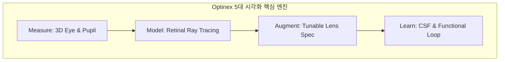
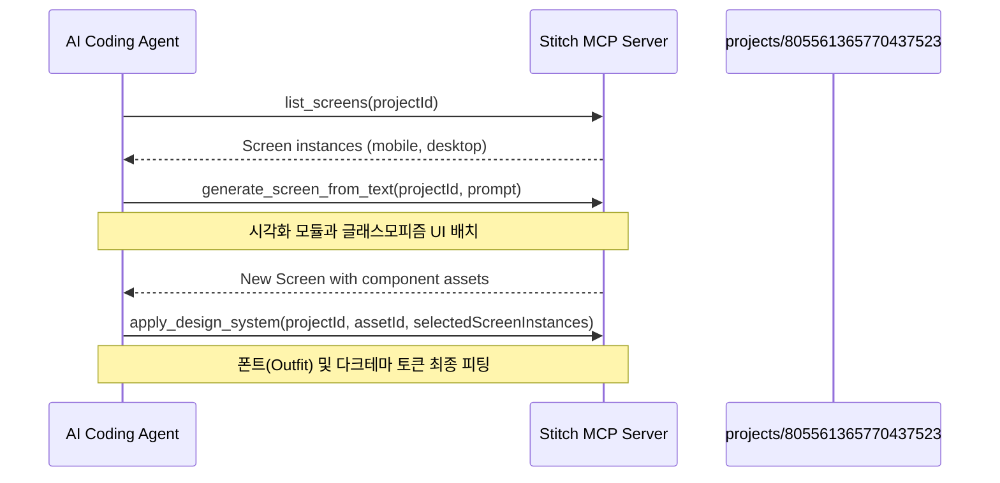

# Optinex 웹사이트 시각화 극대화 계획서 (Stitch & DeepMind Science Focus)

> **문서 버전:** 1.0  
> **작성일:** 2026-08-27  
> **성격:** 웹사이트의 과학적 정밀성 및 시각적 임팩트를 극대화하기 위한 2D/3D 인터랙티브 시각화 설계 계획서  
> **기준 디자인 시스템:** Stitch 프로젝트 `Retinal Profile Dashboard v2` (`projects/805561365770437523`)  

---

## 1. 디자인 시스템 및 시각 정체성 (Stitch 테마 연동)

Stitch 프로젝트 `Retinal Profile Dashboard v2`에 정의된 프리미엄 다크 테마와 글래스모피즘 스타일을 기본 뼈대로 삼아, 공학 계측기 느낌의 세련되고 정밀한 인터페이스를 구축합니다.

### 1.1 핵심 디자인 토큰
*   **배경색(Background)**: `--surface-0: #090d16` (깊고 정돈된 블랙에 가까운 네이비)
*   **주요 색상(Primary)**: `--primary: #8ed5ff` (스카이 블루, 핵심 조작 및 메인 브랜딩)
*   **보조 색상(Secondary)**: `--secondary: #cebdff` (바이올렛, 보조 데이터 라인)
*   **광학 특화 색상(Diagnostic Accent)**:
    *   **근시성 디포커스(Myopic Defocus)**: `--myopic-defocus: #3b82f6` (로열 블루)
    *   **원시성 디포커스(Hyperopic Defocus)**: `--hyperopic-defocus: #f97316` (오렌지)
*   **레이아웃 스타일**: 10px Backdrop Blur를 가진 반투명 카드 (`background: rgba(15, 23, 42, 0.6)`) 및 초정밀 1px 외곽선 (`rgba(255, 255, 255, 0.1)`). Hover 시 테두리 투명도를 `0.3`으로 올려 입체감 제공.
*   **타이포그래피**:
    *   헤드라인 및 대형 지표: **Outfit** (기하학적이고 테크니컬한 감성)
    *   본문 및 학술 요약: **Noto Sans KR** (한국어/영어 혼용성 및 뛰어난 가독성)
    *   수치, 좌표, 원본 데이터: **JetBrains Mono** (모노스페이스 폰트로 데이터 계측기 느낌 강조)

---

## 2. 5대 핵심 시각화 모듈 설계

단순한 SF풍의 가짜 그래픽을 배제하고, 실제 과학적 모델과 물리 방정식을 시각 기저로 삼는 5가지 인터랙티브 시각화 모듈을 제안합니다.

---

### 2.1 [Module 1] 3D Retinal/Eye Shell (망막 및 안구 3D 쉘)
*   **비주얼 콘셉트**: 
    *   DeepMind의 **AlphaFold 3D 뷰어(Mol*) 및 PyMOL의 구조적 렌더링 스타일**에서 영감을 얻은 고해상도 안구 3차원 투명 쉘.
    *   단순한 불투명 구체가 아닌, 각막-홍채-동공-수정체-망막이 층별로 분리되는 반투명 레이어 렌더링.
*   **시각화 요소**:
    *   **Retinal Curvature Heatmap**: 망막의 구면/비구면 편차 및 곡률 반경(Radius of Curvature)을 3D 표면 위에 등고선(Contour)과 그라데이션으로 투사.
    *   **Peripheral Ray Bundle**: 안구 외부에서 비스듬히 입사하는 광선 다발(Oblique Ray Bundle)이 수정체를 통과해 망막 주변부에 맺히는 기하광학적 선들을 얇은 발광 튜브 형태로 표현.
*   **인터랙티브 기능**:
    *   마우스 드래그를 통한 3D 회전 및 휠 줌인/줌아웃.
    *   특정 주변부 편심도(Eccentricity, 예: $20^\circ$, $30^\circ$, $40^\circ$)를 클릭하면 해당 단면의 2D 절개도가 확대되며 Zernike 수차 곡선이 동적으로 팝업.

---

### 2.2 [Module 2] Spatiotemporal Ray Tracing Simulator (시공간 광선 추적 시뮬레이터)
*   **비주얼 콘셉트**: 
    *   기하광학의 광선 추적(Ray Tracing) 알고리즘을 실시간 2D Canvas/SVG로 구현.
    *   안광학계 역설계 엔진 `ret_prof`의 수치적 검증 상태를 시각적으로 직접 증명.
*   **시각화 요소**:
    *   **Wavefront Aberration Map**: 파면 수차의 왜곡 상태를 위상 맵(Phase Map, Zernike 다항식 기반) 형태로 실시간 컬러 투사.
    *   **Focus/Defocus Indicator**: 초점이 망막 앞에 맺히는지(Myopic Defocus, `#3b82f6` 라인) 혹은 뒤에 맺히는지(Hyperopic Defocus, `#f97316` 라인)를 직관적인 광선 색 변화로 시각화.
*   **인터랙티브 기능**:
    *   **주시거리(Gaze Distance) 슬라이더**: 주시거리를 무한대(遠)에서 30cm(近)로 조작함에 따라 수정체의 두께 변화와 함께 광선의 굴절 경로와 초점 위치가 실시간 변경.
    *   **시선각도(Gaze Angle) 트리거**: 마우스 커서의 움직임에 따라 시선 벡터가 이동하고, 이에 맞춰 망막 주변부 수차가 실시간 재계산되며 맵이 갱신되는 마이크로 애니메이션.

---

### 2.3 [Module 3] Multi-dimensional Contrast Sensitivity Function (대비감도 다차원 차트)
*   **비주얼 콘셉트**: 
    *   단순한 단일 선 그래프가 아닌, 좌우 시각경로 및 편심도별 신뢰구간 밴드(Confidence Interval Band)를 포함한 정밀한 과학 연구 차트.
*   **시각화 요소**:
    *   **Confidence Band**: 실험 결과 데이터의 오차 범위와 통계적 신뢰구간(95% CI)을 연한 그라데이션 영역으로 렌더링하여 데이터의 투명성 제공.
    *   **Visual Distorter (실시간 체감 필터)**: 차트 하단 혹은 우측에 실제 사물 이미지(예: 보행 환경, 텍스트)를 배치하고, 대비감도 차트의 주파수(cpd)와 대비 레벨을 마우스로 조작함에 따라 실제 인간이 주변시로 느끼는 왜곡과 대비 저하를 필터링 효과로 실시간 시뮬레이션.
*   **인터랙티브 기능**:
    *   `Conventional` 안경 도수 처방 상태와 `Wide-field Correction` 교정 상태를 토글하여 대비감도 개선 폭을 시각적 영역 차이(Area delta)로 즉시 비교 체감.

---

### 2.4 [Module 4] Ocular Pupillometry Dynamics (동공 광반사 동역학 시뮬레이터)
*   **비주얼 콘셉트**:
    *   동공의 수축 및 이완 반응을 물리 법칙과 시계열 그래프의 이중 레이아웃으로 실시간 동기화하여 표현.
*   **시각화 요소**:
    *   **2D Pupil Aperture Rig**: 빛 자극의 파장(Wavelength)과 세기(Luminance)에 따라 동공이 오그라들고 풀리는 물리 기반 2D 애니메이션.
    *   **Time-series PLR Curve**: 빛이 조사되는 시점(Luminance Dose Peak)을 기준으로 동공 크기의 동역학 곡선(Latency, Constriction Velocity, Re-dilation)을 JetBrains Mono 수치와 함께 스크롤 연동.
*   **인터랙티브 기능**:
    *   **빛 파장 토글**: Melanopic 감도(청색광, $480\text{ nm}$)와 일반 백색광 조건을 선택하여 동공 반응 속도의 차이를 오버레이 곡선으로 비교 분석.

---

### 2.5 [Module 5] Interactive Lens Tuning Simulator (1호 탐사선 작동 시뮬레이션)
*   **비주얼 콘셉트**: 
    *   창업자가 확정한 1호 탐사선인 **'주변부 프로그래머블 튜닝블렌즈 안경'**의 링존(Ring Zone) 제어 메커니즘을 상세히 시각화.
*   **시각화 요소**:
    *   **Concentric Lens Zones**: 안경 렌즈 중심부(자동초점)와 주변부(동적 링존 가입도 제어)의 구역 분포를 보여주는 3D 투시 다이어그램.
    *   **Dynamic Prescription Profile**: 각 링존의 디옵터(Diopter) 가입도 값이 모바일 앱이나 주변 환경에 의해 동적으로 조율될 때, 변조전달함수(MTF) 그래프가 실시간으로 피팅되는 과정 시각화.
*   **인터랙티브 기능**:
    *   사용자가 안경 주변의 링존을 마우스 오버하면 가입도 제어 파라미터가 팝업되며, 망막 주변부에 가해지는 신호가 'Myopic Defocus(근시 억제)' 상태로 전환되는 시각 피드백 제공.

---

## 3. Stitch MCP를 통한 화면 구현 및 프롬프트 계획

Stitch MCP 도구를 활용해 위 시각화 요소들이 조화롭게 배치된 최상위 퀄리티의 화면 디자인을 생성하고 반복 편집하는 실무 계획입니다.

### 3.1 모바일/데스크톱 화면 인스턴스 확인
이미 존재하고 있는 `Retinal Profile Dashboard v2` 프로젝트의 화면 인스턴스 리스트를 활용합니다.
*   **데스크톱 뷰포트**: `e8d4acfcd46f4e52853d1128cf42ae29` (1280x1024)
*   **모바일 뷰포트**: `2432123298168343041` (390x884)

### 3.2 Stitch 생성용 정밀 프롬프트 가이드

위 5대 시각화 요소를 조화롭게 결합하기 위해 `generate_screen_from_text` 또는 `edit_screens`에 주입할 완성도 높은 UI 생성용 프롬프트 템플릿입니다.

#### 프롬프트 A: 데스크톱 메인 시각화 대시보드
> "Create a high-end ophthalmic research dashboard for 'Optinex Research' on a dark theme background (#090d16) with glassmorphism style. 
> 
> Left panel should contain patient biometry inputs and raw parameters (using JetBrains Mono font) such as Gaze Eccentricity, Pupil Size, and Oblique Refraction. 
> 
> Center panel must feature a premium, semi-transparent 3D Eyeball Shell showing the retinal curvature profile using soft gradient contours. Luminous light-ray bundles (using #8ed5ff and #3b82f6 colors) should be rendered entering the eye and focusing on the retina. 
> 
> Right panel displays the live Wavefront Aberration Map (Zernike phase map) and Pupil Dynamics time-series chart with a clean, grid-less layout. 
> 
> Ensure all UI elements use Outfit font for headings and Noto Sans KR for body labels, with an instrument-like precise aesthetic."

#### 프롬프트 B: 모바일 시선 적응 제어 시뮬레이션
> "Design a mobile interface (390x884) for 'Optinex Adaptive Controller'. 
> 
> A large visual interactive card at the top demonstrates the Concentric Ring Zones of the programmable tuning lens. Below the lens diagram, show a dynamic slider for Gaze Distance (from Infinity to 30cm) and a joystick for Gaze Angle. 
> 
> As the user interacts, visual indicators for 'Myopic Defocus' (#3b82f6) and 'Hyperopic Defocus' (#f97316) show live status. 
> 
> Use compact spacing (4px rhythm), glassmorphic card containers with 8px corner radiuses, and light-blue interactive glows on active states."

---

## 4. Google DeepMind 과학 시각화 스킬(Science Skills)의 융합 전략

*   **PyMOL/Mol\* 스타일 분할 뷰 포트**: 3D 단백질 구조의 특정 링(ring)이나 도메인을 하이라이트하여 돌려보는 기법을 안구 광학 모델에 적용합니다. 각막의 전면 형상(Anterior Cornea)과 공막(Sclera) 쉘을 3차원 투명도로 제어하며 Zernike 수차 곡면의 특정 고위수차 성분(예: Trefoil, Coma, Spherical Aberration)을 마우스 오버 시 영역별로 형광 하이라이트 처리합니다.
*   **통계적 신뢰성 시각화**: 과학 논문 수준의 정보 전달력을 지키기 위해 오차 범위(Error bar)와 신뢰 밴드(Confidence band)를 단순 흐릿한 선이 아닌 투명도가 조절된 물리적 데이터 영역으로 투사하여 '진짜 과학적 연구'를 보여주는 디자인 철학을 완성합니다.
*   **실제 저장소 코드와의 정합성 연동**: `GaborPatch` 엔진의 심리물리 측정 결과 데이터와 `ret_prof` 광선 추적 라이브러리의 계산 오차 버짓(Error Budget) 명세를 차트 팁에 Monospace 수치로 상시 표기함으로써, 사이트 방문자(오픈이노베이션 오픈 파트너)가 단순 디자인 콘셉트가 아닌 실제 동작하는 기술 인프라가 구현되어 있음을 눈으로 검증하게 합니다.

---

## 5. 결론 및 다음 단계 실행 계획

이 시각화 계획서는 단순한 외관 개선이 아닌, Optinex가 가진 독보적인 과학적 자산(직접 계측 데이터 및 동작하는 알고리즘 코드)을 오픈이노베이션 제조사 파트너에게 가장 설득력 있게 전달하기 위한 핵심 도구입니다.

1.  **변리사 자기공지 감사(§10.0)** 결과에 따라 미공개 영역의 광학 스펙 수준을 재정의합니다.
2.  Stitch MCP의 화면 인스턴스에 위의 프롬프트를 실행하여 2D/3D 프로토타입 시뮬레이션 화면을 렌더링하고 사용자 반응을 피드백합니다.
3.  확정된 시각화 로직을 Astro/MDX 기반의 정적 구성품(Astro Islands)으로 패키징하여 사이트에 올립니다.
